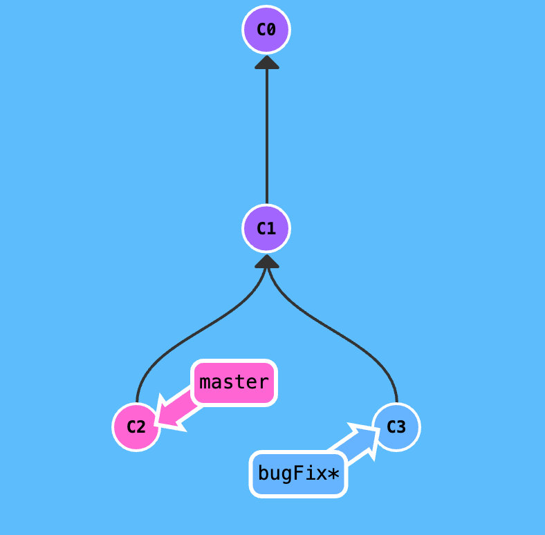
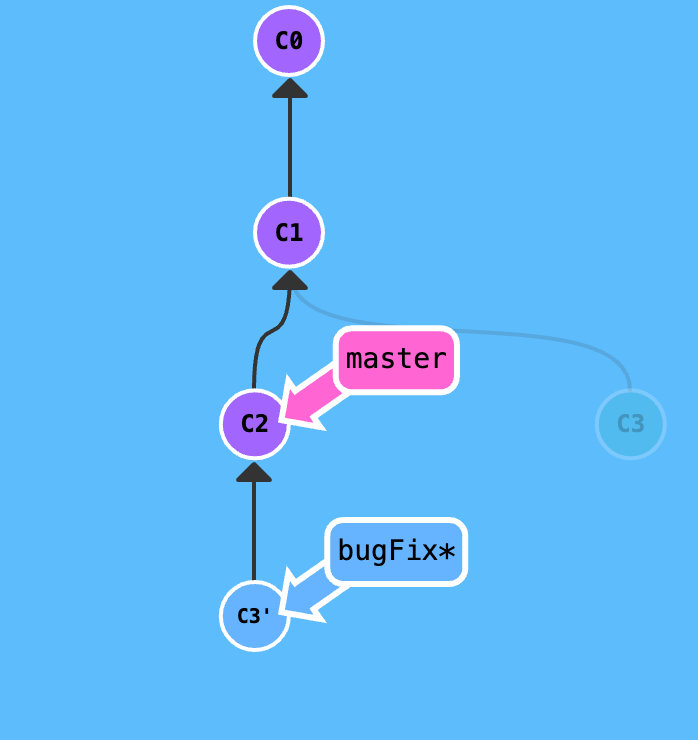
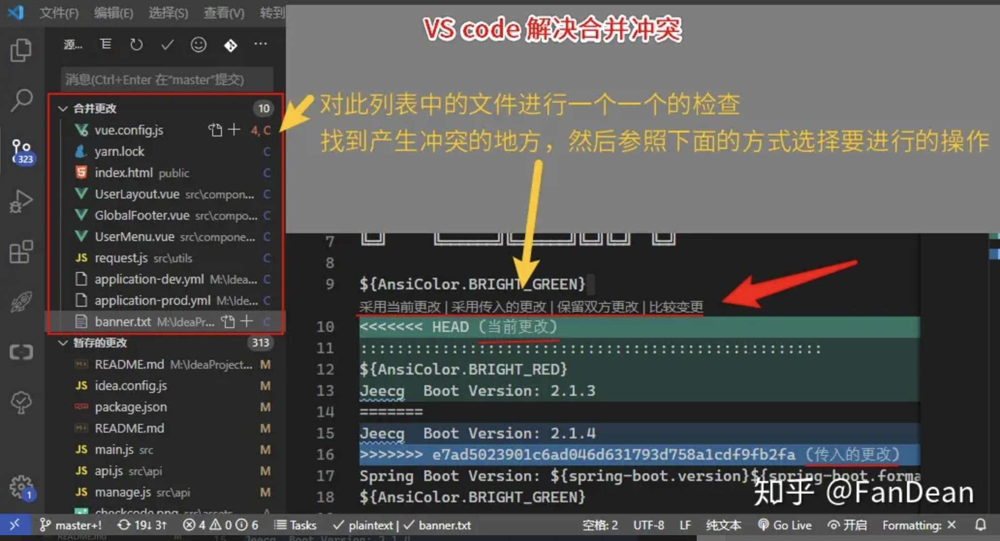

# git命令

## ssh秘钥

### 配置本地ssh秘钥

```bash
# 没有配置过用户名和邮箱需要设置一下
git config --global user.name "Your Name"
git config --global user.email your_email@gmail.com　
```

### 查看本地ssh公钥

```bash
# 进入.ssh目录
cd ~/.ssh
# 找到id_ras.pub文件
ls
# 查看公钥
cat id_rsa.pub 或 vim id_rsa.pub

# 直接输入命令
cat ~/.ssh/id_rsa.pub
```

## 查看本地分支与远程分支的对应关系

```js
// 查看设置的所有跟踪分支，可以使用 git branch 的 -vv 选项。 这会将所有的本地分支列出来并且包含更多的信息，如每一个分支正在跟踪哪个远程分支与本地分支是否是领先、落后或是都有。
git branch -vv

// 显示当前使用仓库的所有分支
git branch -v -a

// 查看本地分支与远程分支的对应关系 
git remote show origin
```

## 根据远程分支创建本地分支：

```javascript
// 如果远程新建了一个分支，本地没有该分支（得到本地和远程永远一样的分支名）
git checkout --track origin/branch_name

// 可以创建一个与远程分支不重名的本地分支（但是最好创建一样的名字）
git checkout -b new_branch_name branch_name
```

## 修改提交

```bash
# 和上次提交合并
git commit --amend

# 替换上一次提交
git commit --amend -m <信息>
```

## gitignore 文件夹失效

```bash
# 失效问题
git rm -r --cached <filename>

git add .
git commit -m "<描述>"

# 提交后，git就不在追踪此文件夹的内容了
```

## git 错误收集

### fatal: refusing to merge unrelated histories

```js
// git merge
git merge master --allow-unrelated-histories

// git pull 或者 git push
git pull origin master --allow-unrelated-histories
```

## 删除.git文件夹

```bash
# 在本地仓库的目录下调用命令行删除根目录下的.git文件夹
find . -name ".git" | xargs rm -Rf
# 或者手动删除.git文件


# 删除GitHub上的Git远程仓库
# 在命令行中输入rm -rf + github仓库地址
rm -rf https://github.com/NeroSolomon/VLearning.git
```

## 远程代码库迁移

```bash
# 删除的命令慎用
# 删除远程仓库， git remote remove origin
git remote remove <仓库名称>
# 删除远程仓库
# git remote rm 不会从服务器中删除远程仓库。 它只是从本地仓库中删除远程及其引用
git remote rm <仓库名称>

# 添加远程仓库
git remote add origin <代码库地址> 

# 查看远程仓库
git remote -v

# 修改远程仓库地址
git remote set-url origin <代码库地址>
```

## 克隆代码

```bash
# 克隆的项目只包含最近的一次commit的一个分支
git clone --depth <数字-克隆深度> <代码库地址>
```

### 代码回滚

```bash
# git reset -> 是回滚到某次提交,不会保留commit提交
# --hard -> 此次提交之后的修改不做任何保留，git status干净的工作区
git reset --hard <commitId>
# --soft -> 此次提交之后的修改会被退回到暂存区
git reset --soft <commitId>


# git revert 
# 放弃某次提交，之前的提交仍会保留在git log中，而此次撤销会做为一次新的提交
git revert -n <commitId>
# 合并多个
git revert -n <commitId> <commitId> ...
```

### git rebase（与merge功能一样，用于代码合并）

[彻底搞懂 Git-Rebase - Jartto&#39;s blog](http://jartto.wang/2018/12/11/git-rebase/)

```bash
# 变基
git rebase <目标分支>

# 合并提交
# 交互式 rebase -> -i
git rebase -i [start-commit] [end-commit]

# HEAD往前4个版本
git rebase -i HEAD~4
```

#### rebase-before:



#### rebase-after:



## git 解决冲突



## git 修改远程仓库名称

```bash
git remote set-url origin <新git仓库地址>
```
