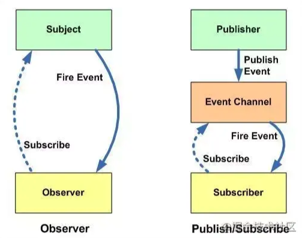

# 发布-订阅模式

## 什么是发布-订阅模式

### 定义

发布-订阅模式其实是一种对象间一对多的依赖关系，当一个对象的状态发送改变时，所有依赖于它的对象都将得到状态改变的通知。

订阅者（Subscriber）把自己想订阅的事件注册（Subscribe）到调度中心（Event Channel），当发布者（Publisher）发布该事件（Publish Event）到调度中心，也就是该事件触发时，由调度中心统一调度（Fire Event）订阅者注册到调度中心的处理代码。

### 例子🌰

比如我们很喜欢看某个公众号号的文章，但是我们不知道什么时候发布新文章，要不定时的去翻阅；这时候，我们可以关注该公众号，当有文章推送时，会有消息及时通知我们文章更新了。

上面一个看似简单的操作，其实是一个典型的发布订阅模式，公众号属于发布者，用户属于订阅者；用户将订阅公众号的事件注册到调度中心，公众号作为发布者，当有新文章发布时，公众号发布该事件到调度中心，调度中心会及时发消息告知用户。

## 实现发布-订阅模式

### 实现思路

- 创建一个对象
- 在该对象上创建一个缓存列表（调度中心）
- on 方法用来把函数 fn 都加到缓存列表中（订阅者注册事件到调度中心）
- emit 方法取到 arguments 里第一个当做 event，根据 event 值去执行对应缓存列表中的函数（发布者发布事件到调度中心，调度中心处理代码）
- off 方法可以根据 event 值取消订阅（取消订阅）
- once 方法只监听一次，调用完毕后删除缓存函数（订阅一次）

### demo1

```js
// 公众号对象
let eventEmitter = {};

// 缓存列表（调度中心），存放 event 及 fn
eventEmitter.list = {};

// 订阅
eventEmitter.on = function (event, fn) {
    let _this = this;

    // 如果对象中没有对应的 event 值，也就是说明没有订阅过，就给event创建个缓存列表
    // 如有对象中有相应的 event 值，把 fn 添加到对应 event 的缓存列表里
    (_this.list[event] || (_this.list[event] = [])).push(fn);

    return _this;
};

// 发布
eventEmitter.emit = function () {
    let _this = this;

    // 第一个参数是对应的 event 值，直接用数组的 shift 方法取出
    let event = [].shift.call(arguments)
    let fns = _this.list[event] ? [..._this.list[event]] : [];

    // 如果缓存列表里没有 fn 就返回 false
    if (!fns || fns.length === 0) {
        return false;
    }

    // 遍历 event 值对应的缓存列表，依次执行 fn
    fns.forEach(fn => {
        fn.apply(_this, arguments);
    });

    return _this;
};

function user1 (content) {
    console.log('用户1订阅了:', content);
};

function user2 (content) {
    console.log('用户2订阅了:', content);
};

// 订阅
eventEmitter.on('article', user1);
eventEmitter.on('article', user2);

// 发布
eventEmitter.emit('article', 'Javascript 发布-订阅模式');

/*
    用户1订阅了: Javascript 发布-订阅模式
    用户2订阅了: Javascript 发布-订阅模式
*/
```

### demo2

补充了 once 和 off 方法。

```js
let eventEmitter = {
    // 缓存列表
    list: {},

    // 订阅
    on (event, fn) {
        let _this = this;

        //如果对象中没有对应的event值，也就是说明没有订阅过，就给event创建个缓存列表
        // 如有对象中有相应的 event 值，把 fn 添加到对应 event 的缓存列表里
        (_this.list[event] || (_this.list[event] = [])).push(fn);

        return _this;
    },

    // 订阅 - 监听一次
    once (event, fn) {
        // 先绑定，调用后删除
        let _this = this;

        function on () {
            _this.off(event, on);

            // fn还是once传的参数fn
            fn.apply(_this, arguments);
        }

        // 为了可以删除，因为先订阅，再删除
        on.fn = fn;
        _this.on(event, on);

        return _this;
    },

    // 取消订阅
    off (event, fn) {
        let _this = this;
        let fns = _this.list[event];

        // 如果缓存列表中没有相应的 fn，返回false
        if (!fns) return false;

        if (!fn) {
            // 如果没有传 fn 的话，就会将 event 值对应缓存列表中的 fn 都清空
            fns && (fns.length = 0);
        } 
        else {
            // 若有 fn，遍历缓存列表，看看传入的 fn 与哪个函数相同，
            // 如果相同就直接从缓存列表中删掉即可
            let cb;

            for (let i = 0, cbLen = fns.length; i < cbLen; i++) {
                cb = fns[i];

                // cb === fn -> 针对正常的订阅
                // cb.fn === fn -> 针对once的订阅
                if (cb === fn || cb.fn === fn) {
                    fns.splice(i, 1);
                    break
                }
            }
        }

        return _this;
    },

    // 发布
    emit () {
        let _this = this;
        // 第一个参数是对应的 event 值，直接用数组的 shift 方法取出
        let event = [].shift.call(arguments);
        let fns = [..._this.list[event]];


        // 如果缓存列表里没有 fn 就返回 false
        if (!fns || fns.length === 0) {
            return false;
        }

        // 遍历 event 值对应的缓存列表，依次执行 fn
        fns.forEach(fn => {
            fn.apply(_this, arguments);
        });

        return _this;
    }
};

function user1 (content) {
    console.log('用户1订阅了:', content);
}

function user2 (content) {
    console.log('用户2订阅了:', content);
}

function user3 (content) {
    console.log('用户3订阅了:', content);
}

function user4 (content) {
    console.log('用户4订阅了:', content);
}

// 订阅
eventEmitter.on('article1', user1);
eventEmitter.on('article1', user2);
eventEmitter.on('article1', user3);

// 取消user2方法的订阅
eventEmitter.off('article1', user2);

eventEmitter.once('article2', user4)

// 发布
eventEmitter.emit('article1', 'Javascript 发布-订阅模式');
eventEmitter.emit('article1', 'Javascript 发布-订阅模式');
eventEmitter.emit('article2', 'Javascript 观察者模式');
eventEmitter.emit('article2', 'Javascript 观察者模式');

// eventEmitter.on('article1', user3).emit('article1', 'test111');

/*
    用户1订阅了: Javascript 发布-订阅模式
    用户3订阅了: Javascript 发布-订阅模式
    用户1订阅了: Javascript 发布-订阅模式
    用户3订阅了: Javascript 发布-订阅模式
    用户4订阅了: Javascript 观察者模式
*/
```

## Vue 中的实现

下 Vue 中怎么实现 `$on` 和 `$emit` 的方法：

```js
function eventsMixin (Vue) {
    var hookRE = /^hook:/;

    Vue.prototype.$on = function (event, fn) {
        var this$1 = this;

        var vm = this;
        // event 为数组时，循环执行 $on
        if (Array.isArray(event)) {
            for (var i = 0, l = event.length; i < l; i++) {
                this$1.$on(event[i], fn);
            }
        }
        else {
            (vm._events[event] || (vm._events[event] = [])).push(fn);
            // optimize hook:event cost by using a boolean 
            // flag marked at registration

            // instead of a hash lookup
            if (hookRE.test(event)) {
                vm._hasHookEvent = true;
            }
        }

        return vm
    };

    Vue.prototype.$once = function (event, fn) {
        var vm = this;
        // 先绑定，后删除
        function on () {
            vm.$off(event, on);
            fn.apply(vm, arguments);
        }

        on.fn = fn;
        vm.$on(event, on);

        return vm
    };

    Vue.prototype.$off = function (event, fn) {
        var this$1 = this;

        var vm = this;
        // all，若没有传参数，清空所有订阅
        if (!arguments.length) {
            vm._events = Object.create(null);
            return vm
        }

        // array of events，events 为数组时，循环执行 $off
        if (Array.isArray(event)) {
            for (var i = 0, l = event.length; i < l; i++) {
                this$1.$off(event[i], fn);
            }
            return vm
        }

        // specific event
        var cbs = vm._events[event];
        if (!cbs) {
            // 没有 cbs 直接 return this
            return vm
        }

        if (!fn) {
            // 若没有 handler，清空 event 对应的缓存列表
            vm._events[event] = null;
            return vm
        }

        if (fn) {
            // specific handler，删除相应的 handler
            var cb;
            var i$1 = cbs.length;
            while (i$1--) {
                cb = cbs[i$1];
                if (cb === fn || cb.fn === fn) {
                    cbs.splice(i$1, 1);
                    break
                }
            }
        }

        return vm
    };

    Vue.prototype.$emit = function (event) {
        var vm = this;
        {
            // 传入的 event 区分大小写，若不一致，有提示
            var lowerCaseEvent = event.toLowerCase();
            if (lowerCaseEvent !== event && vm._events[lowerCaseEvent]) {
                tip(
                    "Event \"" + lowerCaseEvent + "\" is emitted in component " +
                    (formatComponentName(vm)) + " but the handler is registered for \"" + event + "\". " +
                    "Note that HTML attributes are case-insensitive and you cannot use " +
                    "v-on to listen to camelCase events when using in-DOM templates. " +
                    "You should probably use \"" + (hyphenate(event)) + "\" instead of \"" + event + "\"."
                );
            }
        }

        var cbs = vm._events[event];
        if (cbs) {
            cbs = cbs.length > 1 ? toArray(cbs) : cbs;
            // 只取回调函数，不取 event
            var args = toArray(arguments, 1);
            for (var i = 0, l = cbs.length; i < l; i++) {
                try {
                    cbs[i].apply(vm, args);
                } catch (e) {
                    handleError(e, vm, ("event handler for \"" + event + "\""));
                }
            }
        }

        return vm
    };
}

/***
   * Convert an Array-like object to a real Array.
   */
function toArray (list, start) {
    start = start || 0;
    var i = list.length - start;
    var ret = new Array(i);
    while (i--) {
          ret[i] = list[i + start];
    }
    return ret
}
```

## 总结

### 优点

- 对象之间解耦
- 异步编程中，可以更松耦合的代码编写

### 缺点

- 创建订阅者本身要消耗一定的时间和内存
- 虽然可以弱化对象之间的联系，多个发布者和订阅者嵌套一起的时候，程序难以跟踪维护

## 扩展（发布-订阅模式与观察者模式的区别）



`观察者模式`：观察者（Observer）直接订阅（Subscribe）主题（Subject），而当主题被激活的时候，会触发（Fire Event）观察者里的事件。

`发布订阅模式`：订阅者（Subscriber）把自己想订阅的事件注册（Subscribe）到调度中心（Event Channel），当发布者（Publisher）发布该事件（Publish Event）到调度中心，也就是该事件触发时，由调度中心统一调度（Fire Event）订阅者注册到调度中心的处理代码。

`差异`：

- 在观察者模式中，观察者是知道 Subject 的，Subject 一直保持对观察者进行记录。然而，在发布订阅模式中，发布者和订阅者不知道对方的存在。它们只有通过消息代理进行通信。

- 在发布订阅模式中，组件是松散耦合的，正好和观察者模式相反。

- 观察者模式大多数时候是同步的，比如当事件触发，Subject 就会去调用观察者的方法。而发布-订阅模式大多数时候是异步的（使用消息队列）。

- 观察者模式需要在单个应用程序地址空间中实现，而发布-订阅更像交叉应用模式。
