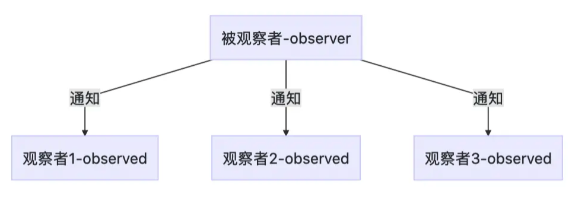

# 观察者模式

观察者模式中通常有两个模型，一个观察者（`observer`）和一个被观察者（`Observed`）。从字面意思上理解，即被观察者发生某些行为或者变化时，会通知观察者，观察者根据此行为或者变化做出处理。



## 观察者模式JS实现

```js
let observer_ids = 0;
let observed_ids = 0;

// 观察者类
class Observer {
   constructor() {
      this.id = observer_ids++;
   }

   // 观测到变化后的处理
   update(ob){
      console.log("观察者" + this.id + `-检测到被观察者${ob.id}变化`);
   }
}

// 被观察者列
class Observed {
   constructor() {
      this.observers = [];
      this.id = observed_ids++;
   }

   // 添加观察者
   addObserver(observer) {
      this.observers.push(observer);
   }

   // 删除观察者
   removeObserver(observer) {
      this.observers = this.observers.filter(o => {
         return o.id !== observer.id;
      });
   }

   // 通知所有的观察者
   notify() {
      this.observers.forEach(observer => {
         observer.update(this);
      });
   }
}

let mObserved = new Observed();
let mObserver1 = new Observer();
let mObserver2 = new Observer();

mObserved.addObserver(mObserver1);
mObserved.addObserver(mObserver2);

mObserved.notify();


/**
    观察者0-检测到被观察者0变化
    观察者1-检测到被观察者0变化
*/
```
