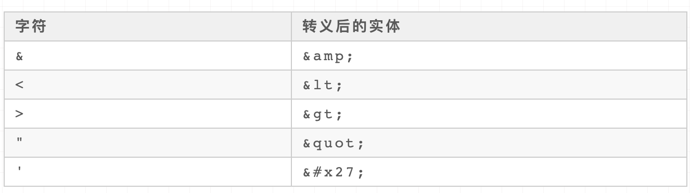

# 正则知识点

## 零宽断言

先行指的是向前看(lookahead)，断言的这个位置是为前面的规则服务的。

肯定是判断有什么，否定就是判断没有什么。

```js
// 先行 -> 匹配'x'仅仅当'x'后面跟着'y'.这种叫做先行断言。
x(?=y)

// 后行 -> 匹配'x'仅当'x'前面是'y'.这种叫做后行断言。
(?<=y)x

// 正向否定查找 -> 仅仅当'x'后面不跟着'y'时匹配'x'。
x(?!y)

// 反向否定查找 -> 仅仅当'x'前面不是'y'时匹配'x'。
(?<!y)x
```

### 零宽肯定先行断言

```js
// 语法很简单：圆括号内最左边加上`?=`标识。

'CoffeeScript JavaScript javascript'.match(/\b\w{4}(?=Script\b)/)
// ["Java", index: 13, input: "CoffeeScript JavaScript javascript", groups: undefined]
```

### 零宽肯定后行断言

```js
// 语法是圆括号内最左边加上?<=标识。

'演员高圆圆 将军霍去病 演员霍思燕'.match(/(?<=演员)霍\S+/);
// ['霍思燕', index: 14, input: '演员高圆圆 将军霍去病 演员霍思燕', groups: undefined]
```

### 零宽否定先行断言

```js
// 语法是圆括号内最左边加上?!标识。

'TypeScript Perl JavaScript'.match(/\b\w{4}(?!Script\b)/);
// ["Perl", index: 11, input: "TypeScript Perl JavaScript", groups: undefined]
```

### 零宽否定后行断言

```js
// 语法是圆括号最左边加上?<!标识。

'演员高圆圆 将军霍去病 演员霍思燕'.match(/(?<!演员)霍\S+/);
// ["霍去病", index: 8, input: "演员高圆圆 将军霍去病 演员霍思燕", groups: undefined]
```

## 非捕获括号

> 匹配 'x' 但是**不记住匹配项**。这种括号叫作*非捕获括号*，使得你能够定义与正则表达式运算符一起使用的子表达式。看看这个例子 `/(?:foo){1,2}/`。如果表达式是 `/foo{1,2}/`，`{1,2}` 将只应用于 'foo' 的最后一个字符 'o'。如果使用非捕获括号，则 `{1,2}` 会应用于整个 'foo' 单词。

```js
// 语法
(?:x)
```

## 问号(?)

> 匹配前面一个表达式 0 次或者 1 次。等价于 `{0,1}`。
> 
> 例如，`/e?le?/` 匹配 "angel" 中的 'el'、"angle" 中的 'le' 以及 "oslo' 中的 'l'。
> 
> 如果**紧跟在任何量词 *、 +、? 或 {} 的后面**，将会使量词变为**非贪婪**（匹配尽量少的字符），和缺省使用的**贪婪模式**（匹配尽可能多的字符）正好相反。例如，对 "123abc" 使用 `/\d+/` 将会匹配 "123"，而使用 `/\d+?/` 则只会匹配到 "1"。

```js
// 语法
?
```

## 常用的正则片段

### 脱敏处理

#### 手机号脱敏处理

```js
// 正则
phone.replace(/(\d{3})\d*(\d{4})/, '$1****$2')

// 效果
// 177****6717
```

#### 身份证号脱敏

```js
// 正则
card.replace(/^(.{4})(?:\w+)(.{4})$/, '$1****$2')

// 效果
// '5123****5645'
```

#### 只包含汉字，字母，数字

```js
// 只含有汉字、数字、字母
const reg = /[^\u4E00-\u9FA5a-zA-Z0-9]+$/
```

### 数字价格千分位分割

```js
// 123456789变成123,456,789

'123456789'.replace(/(?!^)(?=(\d{3})+$)/g, ',')
// 123,456,789


// 分析
// 1.尝试先把后面第一个逗号弄出来
// /(?=\d{3}$)/ -> 123456,789

// 2.把所有的逗号都弄出来
// /(?=(\d{3})+$)/g -> ,123,456,789

// 3.去掉首位的逗号，(?!^) -> ?!零宽否定先行断言
// /(?!^)(?=(\d{3})+$)/g
```

### 手机号3-4-4分割

```js
// 18379836654转化为183-7983-6654

let mobile = '18379836654' 
let mobileReg = /(?=(\d{4})+$)/g 
console.log(mobile.replace(mobileReg, '-'))
// 183-7983-6654
```

### 手机号3-4-4分割扩展

其实是我们经常遇到的用户输入手机号的过程中，需要不断格式化。

效果：

1. 123 => 123

2. 1234 => 123-4

3. 12345 => 123-45

4. 123456 => 123-456

5. 1234567 => 123-4567

6. 12345678 => 123-4567-8

7. 123456789 => 123-4567-89

8. 12345678911 => 123-4567-8911

```js
const formatMobile = (mobile) => {
  return String(mobile).slice(0,11)
      .replace(/(?<=\d{3})\d+/, ($0) => '-' + $0)
      .replace(/(?<=[\d-]{8})\d{1,4}/, ($0) => '-' + $0)
}

console.log(formatMobile(18379836654))
// 183-7983-6654

// 分析：
// 第一步
const formatMobile = (mobile) => {
  return String(mobile).slice(0,11)
      .replace(/(?<=\d{3})\d+/, ($0) => '-' + $0)
}
// 183-79836654

// 第二步
const formatMobile = (mobile) => {
  return String(mobile).slice(0,11)
      .replace(/(?<=\d{3})\d+/, ($0) => '-' + $0)
      .replace(/(?<=[\d-]{8})\d{1,4}/, ($0) => '-' + $0)
}
// console.log(formatMobile(123)) // 123
// console.log(formatMobile(1234)) // 123-4
// console.log(formatMobile(12345)) // 123-45
// console.log(formatMobile(123456)) // 123-456
// console.log(formatMobile(1234567)) // 123-4567
// console.log(formatMobile(12345678)) // 123-4567-8
// console.log(formatMobile(123456789)) // 123-4567-89
// console.log(formatMobile(12345678911)) // 123-4567-8911
```

### 验证密码的合法性

> （小数点）默认匹配除换行符之外的任何单个字符。
> 
> 例如，`/.n/` 将会匹配 "nay, an apple is on the tree" 中的 'an' 和 'on'，但是不会匹配 'nay'。

题目：密码长度是6-12位，由数字、小写字母和大写字母组成，但必须至少包括2种字符。

条件：

- 密码长度是6-12位

- 由数字、小写字符和大写字母组成

- 必须至少包括2种字符

```js
// let reg = /((?=.*\d)((?=.*[a-z])|(?=.*[A-Z])))
// |(?=.*[a-z])(?=.*[A-Z])^[a-zA-Z\d]{6,12}$/

let reg = new RegExp(
    // 数字和小写字母组合、数字和大写字母组合
    '((?=.*[0-9])((?=.*[a-z])|(?=.*[A-Z])))'
    +
    // 小写字母与大写字母组合
    '|(?=.*[a-z])(?=.*[A-Z])'
    +
    // 条件1、条件2
    '^[a-zA-Z0-9]{6,12}$'
)

// 测试
console.log(reg.test('123456')) // false
console.log(reg.test('aaaaaa')) // false
console.log(reg.test('AAAAAAA')) // false
console.log(reg.test('1a1a1a')) // true
console.log(reg.test('1A1A1A')) // true
console.log(reg.test('aAaAaA')) // true
console.log(reg.test('1aA1aA1aA')) // true

// 分析
// 必须包含两种字符，有下面四种排列组合方式:
// 1.数字和小写字母组合
// 2.数字和大写字母组合
// 3.小写字母与大写字母组合
// 4.数字、小写字母、大写字母一起组合（但其实前面三种已经覆盖了第四种了）
```

### 提取连续重复的字符

#### 反向引用：调用捕获到的值

反向引用的作用通常是用来查找或限定重复、查找或限定指定标识配对出现等等。

- \1：指向RegExp.$1

- \2：指向RegExp.$2

- \n：指向RegExp.$n

题目：将有重复的字符提取出来，例如12323454545666，提取[ '23', '45', '6' ]

思路：

- 连续重复的字符

- 连续重复的字符数的长度是不限的（如23、45是两位、6是一位）

```js
const collectRepeatStr = (str) => {
  const repeatStrs = []
  const repeatRe = /(.+)\1+/g

  str.replace(repeatRe, ($0, $1) => {
    $1 && repeatStrs.push($1)
  })

  return repeatStrs
}

// 分析
// 第一步，写出表示有一个字符重复的正则
// 这里的X可用.来表示，即所有的字符，并用括号进行引用，紧跟着反向引用\1，
// -> 也就是体现了连续重复的意思啦
let repeatRe = /(.)\1/

// 第二步，写出表示有n个字符重复的正则
let repeatRe = /(.+)\1+/

// 第三步，提取所有连续重复的字符
const collectRepeatStr = (str) => {
  let repeatStrs = []
  const repeatRe = /(.+)\1+/g
  // 很多时候replace并不是用来做替换，而是做数据提取用
  str.replace(repeatRe, ($0, $1) => {
    console.log('--',$0, $1)
    $1 && repeatStrs.push($1)
  })

  return repeatStrs
}

// 测试
console.log(collectRepeatStr('11')) // ["1"]
console.log(collectRepeatStr('12323')) // ["23"]
console.log(collectRepeatStr('12323454545666')) // ["23", "45", "6"]
```

### 实现一个trim函数

#### replace

```js
// 使用replace()方法来转换字符串中的单词。
// 在匹配到的替换文本中，脚本使用替代的$1, $2表示第一个和第二个括号的子字符串匹配。

var re = /(\w+)\s(\w+)/;
var str = "John Smith";
var newstr = str.replace(re, "$2, $1");
console.log(newstr);
// Smith, John
```

题目：去除字符串的首尾空格

```js
// 去除空格法
const trim = (str) => {
  return str.replace(/^\s*|\s*$/g, '')    
}

// 提取非空格法
const trim = (str) => {
  return str.replace(/^\s*(.*?)\s*$/g, '$1')    
}


// 测试
console.log(trim('  前端胖头鱼')) // 前端胖头鱼
console.log(trim('前端胖头鱼  ')) // 前端胖头鱼 
console.log(trim('  前端胖头鱼  ')) // 前端胖头鱼
console.log(trim('  前端 胖头鱼  ')) // 前端 胖头鱼
```

### HTML转义

> 防止XSS攻击的方式之一就是做HTML转义，转义规则如下，要求将对应字符转换成等值的实体。而反转义则是将转义后的实体转换为对应的字符。



```js
const escape = (string) => {
    const escapeMaps = {
        '&': 'amp',
        '<': 'lt',
        '>': 'gt',
        '"': 'quot',
        "'": '#39'
    }

    const escapeRegexp = new RegExp(
        `[${Object.keys(escapeMaps).join('')}]`,
        'g'
    )

    return string.replace(
        escapeRegexp,
        (match) => `&${escapeMaps[match]};`
    )
}

// 测试
console.log(escape(`
  <div>
    <p>hello world</p>
  </div>
`))
```

### HTML反转义

```js
const unescape = (string) => {
    const unescapeMaps = {
        'amp': '&',
        'lt': '<',
        'gt': '>',
        'quot': '"',
        '#39': "'"
    }

    const unescapeRegexp = /&([^;]+);/g

    return string.replace(unescapeRegexp, (match, unescapeKey) => {
        return unescapeMaps[ unescapeKey ] || match
    })
}

/*
console.log(unescape(`
  <div>
    <p>hello world</p>
  </div>
`))
*/
```

### 将字符串驼峰化

- 每个单词的前面都有 **0个或者多个** `-` `空格` `_` 如(`Foo`、`--foo`、`__FOO`、`_BAR`、`Bar`)

- `-` `空格` `_`后面有可能不跟任何东西 如(`__`、`--`)

```js
// 1. foo Bar => fooBar
// 2. foo-bar--- => fooBar
// 3. foo_bar__ => fooBar

const camelCase = (string) => {
    // 注意(.)?这里的?是为了满足条件2
    const camelCaseRegex = /[-_\s]+(.)?/g

    return string.replace(camelCaseRegex, (match, char) => {
        console.log('--', match, char)
        return char ? char.toUpperCase() : ''
    })
}

console.log(camelCase('foo Bar')) // fooBar
console.log(camelCase('foo-bar--')) // fooBar
console.log(camelCase('foo_bar__')) // fooBar
```

### 将字符串首字母转化为大写，剩下为小写

```js
// 例如 hello world 转为为Hello World

const capitalize = (string) => {
    const capitalizeRegex = /(?:^|\s+)\w/g

    return string.toLowerCase().replace(capitalizeRegex, (match) => {
        return match.toUpperCase()
    })
}

console.log(capitalize('hello world')) // Hello World
console.log(capitalize('hello WORLD')) // Hello World
```

### 获取网页中所有img标签的图片地址

>  例如 `https://xxx.juejin.com/a.jpg`、`http://xxx.juejin.com/a.jpg`、`//xxx.juejjin.com/a.jpg`

#### 题目中限定了

- 图片标签`img`

- 需要是在线链接形式，一些base64的图片需要过滤掉

#### 代码

```js
const matchImgs = (sHtml) => {
    const imgUrlRegex = /]+src="((?:https?:)?\/\/[^"]+)"[^>]*?>/gi
    let matchImgUrls = []

    sHtml.replace(imgUrlRegex, (match, $1) => {
        $1 && matchImgUrls.push($1)
    })

    return matchImgUrls
}
```

#### 分析

- img标签到src之间的部分，只要不是>，其他的啥都可以

- 括号内的部分，也就是我们要提取的url部分，作为一个捕获分组存在，方便直接获取
  
  - (?:https?:)? 表示支持协议头为http:或者https:
  
  - 括号外面的？，表示可以没有协议头，即支持`//xxx.juejjin.com/a.jpg`形式的链接
  
  - 接着是两个斜线
  
  - 因为src="" 双引号内的部分即为链接，所以`[^"]+` 表示除了"其他部分都行

- 接着就是"到img结束标签>之间的部分了，除了>之外，啥都可以 `[^>]*?`

### 通过name获取url query参数

#### 分析

> url query上的参数 `name=前端胖头鱼` 所处的位置可能是
> 
> 1. `紧跟着问号` ?name=前端胖头鱼&sex=boy
> 
> 2. `在最后的位置` ?sex=boy&name=前端胖头鱼
> 
> 3. `在1和2之间` ?sex=boy&name=前端胖头鱼&age=100

```js
// 正则
// 1.name前面只能是?或者&
// 2.value的值可以除了是&以为的任意东西
// 3.value后面只能是跟着&或者是结束位置

const getQueryByName = (name) => {
  const queryNameRegex = new RegExp(`[?&]${name}=([^&]*)(?:&|$)`)
  const queryNameMatch = window.location.search.match(queryNameRegex)

  // 一般都会通过decodeURIComponent解码处理
  return queryNameMatch ? decodeURIComponent(queryNameMatch[1]) : ''
}
// 1. name在最前面
// https://juejin.cn/?name=前端胖头鱼&sex=boy
console.log(getQueryByName('name')) // 前端胖头鱼

// 2. name在最后
// https://juejin.cn/?sex=boy&name=前端胖头鱼
console.log(getQueryByName('name')) // 前端胖头鱼


// 2. name在中间
// https://juejin.cn/?sex=boy&name=前端胖头鱼&age=100
console.log(getQueryByName('name')) // 前端胖头鱼
```

## 资料

[JavaScript 正则表达式的匹配规则](https://juejin.cn/post/6978401478201311240#heading-11)
