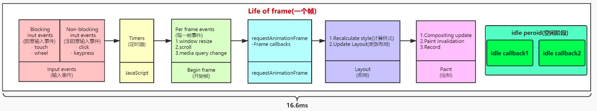
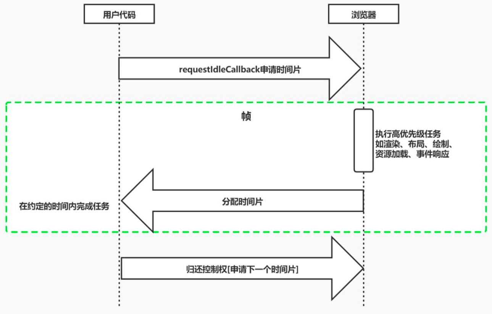
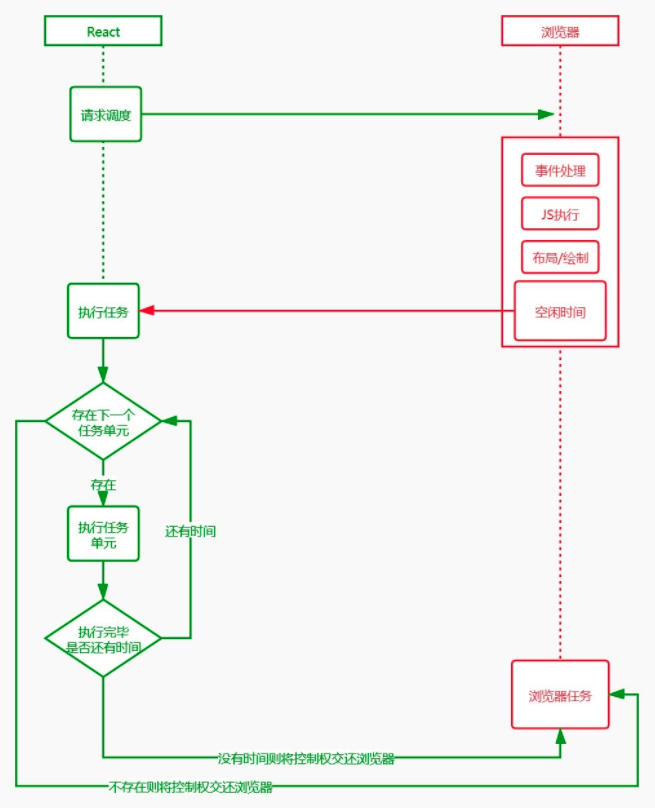
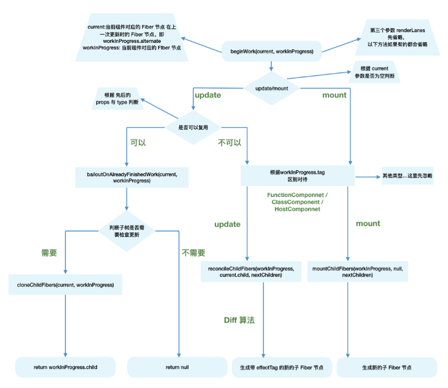
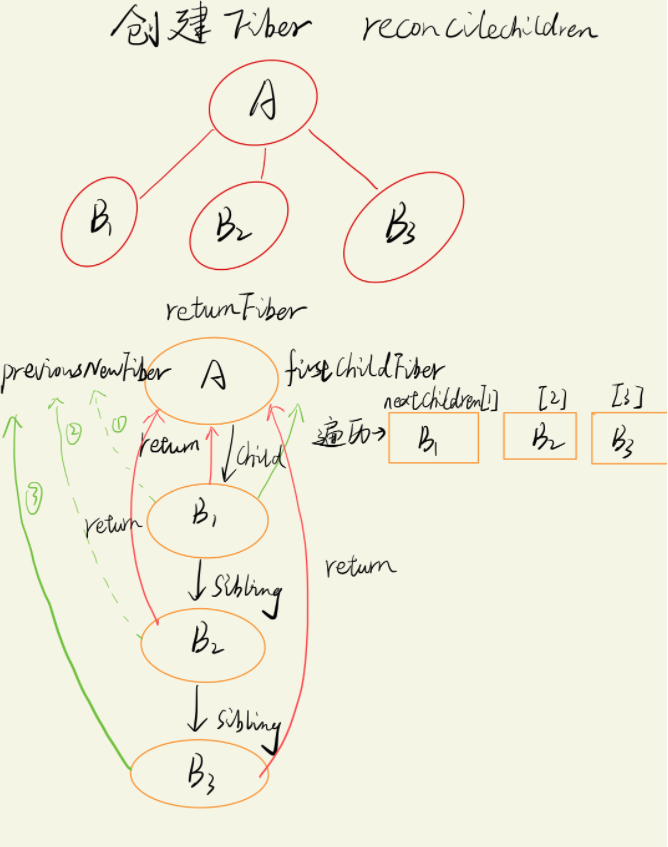
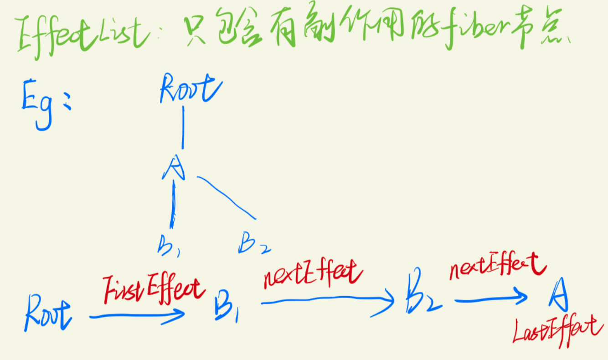
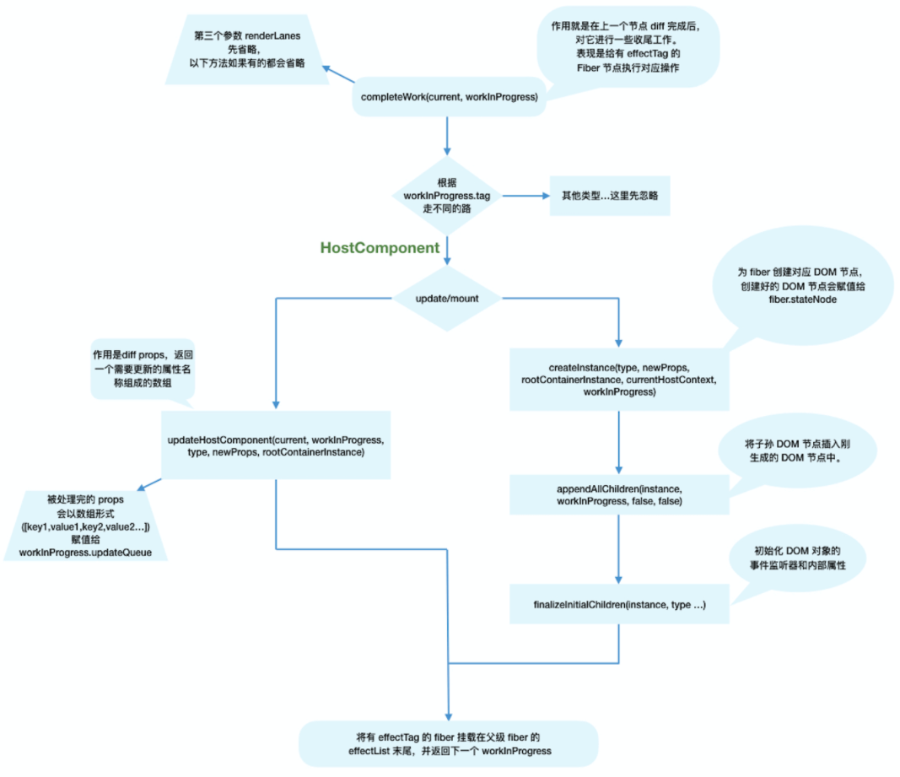

# 从react代码库的三种模式说起

目前React代码库(v17.0.2)已经全面使用 Fiber 架构重构，并同时存在三种模式：

- Legacy Mode（我们正在用的）, 使用 `ReactDOM.render(...)`
- Blocking Mode, 使用 `ReactDOM.createBlockingRoot(...).render(...)`
- Concurrent Mode, 使用 `ReactDOM.createRoot(...).render(...)`

但是源码编译后只会暴露出Legacy Mode的接口，因为并发模式现在还不是很稳定。

它们的特点如下：

- Legacy Mode：同步地进行Reconcile Fiber，Reconcile任务不能被打断，会执行到底
- Blocking Mode：同步地进行Reconcile Fiber，Reconcile任务不能被打断，会执行到底
- Concurrent Mode：“并发地”进行Reconcile Fiber，Reconcile任务可以被打断

更多细节请看?：[详细区别](https://zh-hans.reactjs.org/docs/concurrent-mode-adoption.html#migration-step-blocking-mode)

注意，[Concurrent Mode](https://zh-hans.reactjs.org/docs/concurrent-mode-intro.html) 所谓的并发，只是一种假象，跟多线程并发完全不一样。多线程并发是多个 Task 跑在多个线程中，这是真正意义上的并发。而 `Concurrent Mode` 的并发是指多个 Task 跑在同一个主线程（JS主线程）中，只不过每个 Task 都可以不断在“运行”和“暂停”两种状态之间切换，从而给用户造成了一种 Task 并发执行的假象。这其实跟 CPU 的执行原理一样，这就叫 时间分片（Time Slicing）。

因此，现在我们通过npm i react所安装的包使用ReactDOM.render(…)所创建的React应用的状态是这样的：

- Fiber：React的Reconcile过程的最小处理单元
- Sync：React的Reconcile过程不能被打断，是同步的
- unbatchedUpdates：在非React的事件中（比如setTimeout），setState无法被批处理
- Suspense：仅能用于加载异步组件

## React 设计理念

1. 使用虚拟 Dom 实现跨平台渲染
2. 使用异步可中断和增量更新实现快速响应

> 同步写法 现在的 cra 官方版本，默认还是同步  
> `ReactDOM.render(<App />, document.getElementById('root'));`  
> 异步写法，分成若干个时间片执行任务  
> `ReactDOM.unstable_createRoot(<App />, document.getElementById('root'));`  
> 最小化更新，只在之前的基础上更新

## 出现性能瓶颈

- JS任务执行时间过长
- 浏览器刷新频率为60Hz,大概16.6毫秒渲染一次，而JS线程和渲染线程是互斥的，所以如果JS线程执行任务时间超过16.6ms的话，就会导致掉帧，导致卡顿，解决方案就是 React 利用空闲的时间进行更新，不影响渲染进行的渲染
- 把一个耗时任务切分成一个个小任务，分布在每一帧里，这样的方式就叫时间切片

由于性能瓶颈的出现，出现了 `Fiber`，同时这也是 React 15 的 Stack Reconciler 所面临的问题

### 屏幕刷新率

- 目前大多数设备的屏幕刷新率为 `60 次/秒`
- 浏览器渲染动画或页面的每一帧的速率也需要跟设备屏幕的刷新率保持一致
- 页面是一帧一帧绘制出来的，当每秒绘制的帧数（FPS）达到 60 时，页面是流畅的,小于这个值时，用户会感觉到卡顿
- 每个帧的预算时间是 `16.66` 毫秒 (1秒/60)
- 1s 60帧，所以每一帧分到的时间是 `1000/60 ≈ 16 ms`,所以我们书写代码时力求不让一帧的工作量超过 `16ms`

### 帧

- 每个帧的开头包括样式计算、布局和绘制
- `JavaScript` 执行 `Javascript` 引擎和页面渲染引擎在同一个渲染线程，GUI渲染和 `Javascript` 执行两者是互斥的
- 如果某个任务执行时间过长，浏览器会推迟渲染



### requestIdleCallback

- 我们希望快速响应用户，让用户觉得够快，不能阻塞用户的交互
- `requestIdleCallback` 使开发者能够在主事件循环上执行后台和低优先级工作，而不会影响延迟关键事件，如动画和输入响应
- 正常帧任务完成后没超过 `16 ms`,说明时间有富余，此时就会执行 `requestIdleCallback` 里注册的任务

> 因为 requestIdleCallback 目前 safari 和 ie 都不支持，react 为了兼容，使用 messageChannel + requestAnimationFrame 模拟一个 requestIdleCallBack，MessageChannel 将帧长直接固定为5ms。也就是说，MessageChannel实现中，任务每次只会执行5ms，之后便会立即释放主线程，把剩余任务安排到下一次事件循环。



帧长稳定这样做有如下好处：

- 帧长稳定，rAF实现基于rAF回调的执行时间来计算帧长，是非常不稳定的，因为浏览器的帧数会因为各种因素产生波动，导致帧长存在很大误差。
- 更好地支持高刷新率设备，因为固定帧长5ms，其实就是假定浏览器帧率为5ms/1帧，也就是1000ms/200帧，也就是最高可以支持每秒200帧的帧率。

## Fiber是什么

1. Fiber是一个执行单元,每次执行完一个执行单元, React 就会检查现在还剩多少时间，如果没有时间就将控制权让出去。
   
   

2. 从编码角度来看，一个 fiber 就是一个 `JavaScript` 对象，是一种数据结构
   
   - React目前的做法是使用链表, 每个 VirtualDOM 节点内部表示为一个Fiber
   
   - 从顶点开始遍历
   
   - 如果有第一个儿子，先遍历第一个儿子
   
   - 如果没有第一个儿子，标志着此节点遍历完成
   
   - 如果有弟弟遍历弟弟
   
   - 如果有没有下一个弟弟，返回父节点标识完成父节点遍历，如果有叔叔遍历叔叔
   
   - 没有父节点遍历结束

```js
type Fiber = {
  // 用于标记fiber的WorkTag类型，主要表示当前fiber代表的组件类型如FunctionComponent、ClassComponent等
  tag: WorkTag,
  // ReactElement里面的key
  key: null | string,
  // ReactElement.type，调用`createElement`的第一个参数
  elementType: any,
  // The resolved function/class/ associated with this fiber.
  // 表示当前代表的节点类型
  type: any,
  // 表示当前FiberNode对应的element组件实例
  stateNode: any,

  // 指向他在Fiber节点树中的`parent`，用来在处理完这个节点之后向上返回
  return: Fiber | null,
  // 指向自己的第一个子节点
  child: Fiber | null,
  // 指向自己的兄弟结构，兄弟节点的return指向同一个父节点
  sibling: Fiber | null,
  index: number,

  ref: null | (((handle: mixed) => void) & { _stringRef: ?string }) | RefObject,

  // 当前处理过程中的组件props对象
  pendingProps: any,
  // 上一次渲染完成之后的props
  memoizedProps: any,

  // 该Fiber对应的组件产生的Update会存放在这个队列里面
  updateQueue: UpdateQueue<any> | null,

  // 上一次渲染的时候的state
  memoizedState: any,

  // 一个列表，存放这个Fiber依赖的context
  firstContextDependency: ContextDependency<mixed> | null,

  mode: TypeOfMode,

  // Effect
  // 用来记录Side Effect
  effectTag: SideEffectTag,

  // 单链表用来快速查找下一个side effect
  nextEffect: Fiber | null,

  // 子树中第一个side effect
  firstEffect: Fiber | null,
  // 子树中最后一个side effect
  lastEffect: Fiber | null,

  // 代表任务在未来的哪个时间点应该被完成，之后版本改名为 lanes
  expirationTime: ExpirationTime,

  // 快速确定子树中是否有不在等待的变化
  childExpirationTime: ExpirationTime,

  // fiber的版本池，即记录fiber更新过程，便于恢复
  alternate: Fiber | null,
}
```

## Fiber 如何解决问题的

Fiber 把一个渲染任务分解为多个渲染任务，而不是一次性完成，把每一个分割得很细的任务视作一个"执行单元"，React 就会检查现在还剩多少时间，如果没有时间就将控制权让出去，故任务会被分散到多个帧里面，中间可以返回至主进程控制执行其他任务，最终实现更流畅的用户体验。

即是实现了"增量渲染"，实现了可中断与恢复，恢复后也可以复用之前的中间状态，并给不同的任务赋予不同的优先级，其中每个任务更新单元为 React Element 对应的 Fiber 节点。

- 我们可以通过某些调度策略合理分配 CPU 资源，从而提高用户的响应速度
- 通过Fiber架构，让自己的调和过程变成可被中断。适时地让出CPU执行权，除了可以让浏览器及时地响应用户的交互

tips:

> 如何确定以一个任务的时长，一帧是 16.6 ms，你的任务肯定不能超过 16.6 ms，浏览器自己的工作时间需要大概 10 ms，所以 react 申请的时间片大概也只有 5ms。

## Fiber 实现原理

实现的方式是requestIdleCallback这一 API，但 React 团队 polyfill 了这个 API，使其对比原生的浏览器兼容性更好且拓展了特性。

> window.requestIdleCallback()方法将在浏览器的空闲时段内调用的函数排队。这使开发者能够在主事件循环上执行后台和低优先级工作，而不会影响延迟关键事件，如动画和输入响应。函数一般会按先进先调用的顺序执行，然而，如果回调函数指定了执行超时时间 timeout，则有可能为了在超时前执行函数而打乱执行顺序。

requestIdleCallback回调的执行的前提条件是当前浏览器处于空闲状态。

即requestIdleCallback的作用是在浏览器一帧的剩余空闲时间内执行优先度相对较低的任务。首先 React 中任务切割为多个步骤，分批完成。在完成一部分任务之后，将控制权交回给浏览器，让浏览器有时间再进行页面的渲染。等浏览器忙完之后有剩余时间，再继续之前 React 未完成的任务，是一种合作式调度。

简而言之，由浏览器给我们分配执行时间片段，我们要按照约定在这个时间内执行完毕，并将控制权还给浏览器。

React 16 的Reconciler基于 Fiber 节点实现，被称为 Fiber Reconciler。

作为静态的数据结构来说，每个 Fiber 节点对应一个 React element，保存了该组件的类型（函数组件/类组件/原生组件等等）、对应的 DOM 节点等信息。

作为动态的工作单元来说，每个 Fiber 节点保存了本次更新中该组件改变的状态、要执行的工作。

每个 Fiber 节点有个对应的 React element，多个 Fiber 节点是如何连接形成树呢？靠如下三个属性:

```js
// 指向父级Fiber节点
this.return = null

// 指向子Fiber节点
this.child = null

// 指向右边第一个兄弟Fiber节点
this.sibling = null
```

## 渲染流程即Fiber架构核心

- `Scheduler` 调度任务的优先级，高优任务优先进入 Reconciler
- `Reconciler` 负责找出变化的组件
- `Renderer` 把变更的内容渲染到页面上

在新的架构模式下，工作流如下：

- 每个更新任务都会被赋予一个优先级。
- 当更新任务抵达调度器时，高优先级的更新任务（记为 A）会更快地被调度进 Reconciler 层； 
  -此时若有新的更新任务（记为 B）抵达调度器，调度器会检查它的优先级，若发现 B 的优先级高于当前任务 A，那么当前处于 Reconciler 层的 A 任务就会被中断，调度器会将 B 任务推入 Reconciler 层。
- 当 B 任务完成渲染后，新一轮的调度开始，之前被中断的 A 任务将会被重新推入 Reconciler 层，继续它的渲染之旅，即“可恢复”。

### Scheduler 调度器

这个需要上面提到的 requestIdleCallback，React 团队实现了功能更完备的 requestIdleCallback polyfill，这就是 Scheduler。除了在空闲时触发回调的功能外，Scheduler 还提供了多种调度优先级供任务设置。

### Reconciler 协调器

在 React 15 中是递归处理虚拟 DOM 的，React 16 则是变成了可以中断的循环过程，每次循环都会调用shouldYield判断当前是否有剩余时间。

```js
function workLoopConcurrent() {
  // Perform work until Scheduler asks us to yield
  while (workInProgress !== null && !shouldYield()) {
    // workInProgress表示当前工作进度的树。
    workInProgress = performUnitOfWork(workInProgress)
  }
}
```

React 16 是如何解决中断更新时 DOM 渲染不完全的问题呢？

在 React 16 中，Reconciler 与 Renderer 不再是交替工作。当 Scheduler 将任务交给 Reconciler 后，Reconciler 会为变化的虚拟 DOM 打上的标记。

```js
export const Placement = /*             */ 0b0000000000010  -->2
export const Update = /*                */ 0b0000000000100  -->4
export const PlacementAndUpdate = /*    */ 0b0000000000110  -->6
export const Deletion = /*              */ 0b0000000001000  -->8
```

- Placement 表示插入操作
- PlacementAndUpdate 表示替换操作
- Update 表示更新操作
- Deletion 表示删除操作  
  整个 Scheduler 与 Reconciler 的工作都在内存中进行，所以即使反复中断，用户也不会看见更新不完全的 DOM。只有当所有组件都完成Reconciler 的工作，才会统一交给 Renderer。

### Renderer 渲染器

Renderer根据Reconciler为虚拟 DOM 打的标记，同步执行对应的 DOM 操作。

## Fiber 更新过程

React 把组件更新分为两个阶段：

- render/reconciliation 协调阶段(可中断/异步)：通过 Diff 算法找出所有节点变更，例如节点新增、删除、属性变更等等, 获得需要更新的节点信息，对应早期版本的 Diff 过程。 `render阶段的工作是在内存中进行`，为什么要在内存中进行，[了解双缓冲](https://react.iamkasong.com/process/doubleBuffer.html#%E4%BB%80%E4%B9%88%E6%98%AF-%E5%8F%8C%E7%BC%93%E5%AD%98)
- commit 提交阶段(不可中断/同步)：将需要更新的节点一次过批量更新，对应早期版本的 patch 过程。

### 主要有以下几个方法

workLoop：performUnitOfWork( beginWork （reconcileChildren） + completeWork ) + commitRoot

beginWork: 传入当前Fiber节点，创建子Fiber节点

reconcileChildren：分两种情况：mount，update 下文细说。执行 DOM 操作的具体类型就保存在 fiber.effectTag 中

completeWork：在上一个节点完成后，对他进行一个收尾工作，给有 effectTag 的节点执行对应操作。

commitRoot：提交阶段执行

### reconciliation 阶段

1. 从 `workLoop` 开始生成 Fiber 树，每生成一个 Fiber 节点，都会把控制钱交给主线程，看看有没有优先级更高的任务，有的话先执行高优任务。 在 workLoop 中的 `performUnitOfWork` 展示一个工作单元的具体操作。
   
   ```js
   //循环执行工作 nextUnitWork
   function workLoop(deadline) {
       let shouldYield = false;//是否要让出时间片或者说控制权
       while (nextUnitOfWork && !shouldYield) {
           nextUnitOfWork = performUnitOfWork(nextUnitOfWork);//执行完一个任务后
           shouldYield = deadline.timeRemaining() < 1;//没有时间的话就要让出控制权
       }
       if (!nextUnitOfWork && workInProgressRoot) {//如果时间片到期后还有任务没有完成，就需要请求浏览器再次调度
           console.log('render阶段结束');
           commitRoot();
       }
       //不管有没有任务，都请求再次调度 每一帧都要执行一次workLoop
       requestIdleCallback(workLoop, { timeout: 500 });
   }
   ```

2. `beginWork` : 根据传入的 Fiber 节点，创建新的 Fiber 节点。
   
   ```js
   function performUnitOfWork(currentFiber) {
       // beginWork会沿着子树一直更新，每次都会返回当前节点的child。
       // 就算有多个child也只会返回第一个。那么沿着树的结构到达叶子节点的时候，
       // 已经没有child了，所以beginWork返回null。如果返回null的话，就会调用 completeUnitOfWork (这段是在另一篇博客中看到)
       beginWork(currentFiber);//开    // 调用beginWork()更新当前任务节点  ②
       if (currentFiber.child) {
           return currentFiber.child;
       }
   
       while (currentFiber) {
           completeUnitOfWork(currentFiber);//没有儿子让自己完成
           if (currentFiber.sibling) {//看有没有弟弟
               return currentFiber.sibling;//有弟弟返回弟弟
           }
           currentFiber = currentFiber.return;//找父亲然后让父亲完成
       }
   }
   ```
   
   > 流程图
   
   

3. 根据当前的父 Fiber 和虚拟 DOM 通过深度优先遍历（先序遍历）构建 Fiber树
   
   ```js
   function beginWork(workInProgress){
       let nextChildren = workInProgress.props.children;
       return reconcileChildren(workInProgress,nextChildren);
   }
   ```



4. completeUnitOfWork 中的 completeWork

本段引用自：[effectlist](https://react.iamkasong.com/process/completeWork.html#effectlist)

还有一个问题：作为DOM操作的依据，commit阶段需要找到所有有effectTag的Fiber节点并依次执行effectTag对应操作。难道需要在commit阶段再遍历一次Fiber树寻找effectTag !== null的Fiber节点么？

这显然是很低效的。

在 completeWork 的上层函数completeUnitOfWork中，每个执行完completeWork且存在effectTag的Fiber节点会被保存在一条被称为effectList的单向链表中。

effectList中第一个Fiber节点保存在fiber.firstEffect，最后一个元素保存在fiber.lastEffect。

类似 appendAllChildren，在“递归”阶段(对 fiber 树由下到上后序遍历)，所有有effectTag的Fiber节点都会被追加在effectList中，最终形成一条以rootFiber.firstEffect为起点的单向链表。

```js
                       nextEffect         nextEffect
rootFiber.firstEffect -----------> fiber -----------> fiber
```

这样，在commit阶段只需要遍历effectList就能执行所有effect了。

借用React团队成员Dan Abramov的话：effectList相较于Fiber树，就像圣诞树上挂的那一串彩灯。

5. 如果当前fiber树已经更新到叶子节点了，则调用 `completeUnitOfWork` 更新

一个 Fiber 节点在结束的时候要创建真实的 dom 元素，挂载到 stateNode 上面。

然后根据 workInProgress.tag，在完成工作的单元的时候要判断当前的fiber节点有没有对应的DOM操作，收集有副作用的 fiber，然后组成 `effect list`。

`effect list` 每个有副作用的 fiber 有两个属性 `firstEffect` 指向第一个有副作用的子 `fiber lastEffect` 指最后一个有副作用子Fiber

`effect list` 用来标识哪个节点需要 添加，修改，或删除操作。



```js
function completeUnitOfWork(workInProgress){
  console.log('completeUnitOfWork',workInProgress.key);
  let stateNode;// 真实DOM
  switch(workInProgress.tag){
      case TAG_HOST:
          stateNode = createStateNode(workInProgress);
          break;
  }
  makeEffectList(workInProgress);
}
```

> 流程图



至此，render阶段全部工作完成。在performSyncWorkOnRoot函数中fiberRootNode被传递给commitRoot方法，开启commit阶段工作流程。

### commit 阶段

commit 阶段的主要工作（即 Renderer 的工作流程）分为三部分：

- before mutation 阶段，这个阶段 DOM 节点还没有被渲染到界面上去，过程中会触发 getSnapshotBeforeUpdate，也会处理 useEffect 钩子相关的调度逻辑。
- mutation 阶段，这个阶段负责 DOM 节点的渲染。在渲染过程中，会遍历 effectList，根据 flags（effectTag）的不同，执行不同的 DOM 操作。
- layout 阶段，这个阶段处理 DOM 渲染完毕之后的收尾逻辑。比如调用 componentDidMount/componentDidUpdate，调用 useLayoutEffect 钩子函数的回调等。除了这些之外，它还会把 fiberRoot 的 current 指针指向 workInProgress Fiber 树。

## 双缓冲(Double buffering)

1. 什么是“双缓冲”

当我们用 `canvas` 绘制动画，每一帧绘制前都会调用 `ctx.clearRect` 清除上一帧的画面。

如果当前帧画面计算量比较大，导致清除上一帧画面到绘制当前帧画面之间有较长间隙，就会出现白屏。

为了解决这个问题，我们可以在内存中绘制当前帧动画，绘制完毕后直接用当前帧替换上一帧画面，由于省去了两帧替换间的计算时间，不会出现从白屏到出现画面的闪烁情况。

这种在内存中构建并直接替换的技术叫做双缓冲。

React使用“双缓冲”来完成Fiber树的构建与替换——对应着DOM树的创建与更新

2. 双缓冲 Fiber 树

在React中最多会同时存在两棵Fiber树。当前屏幕上显示内容对应的Fiber树称为current Fiber树，正在内存中构建的Fiber树称为workInProgress Fiber树。

current Fiber树中的Fiber节点被称为current fiber，workInProgress Fiber树中的Fiber节点被称为workInProgress fiber，他们通过alternate属性连接。

```js
currentFiber.alternate === workInProgressFiber;
workInProgressFiber.alternate === currentFiber;
```

React应用的根节点通过使current指针在不同Fiber树的rootFiber间切换来完成current Fiber树指向的切换。

即当workInProgress Fiber树构建完成交给Renderer渲染在页面上后，应用根节点的current指针指向workInProgress Fiber树，此时workInProgress Fiber树就变为current Fiber树。

每次状态更新都会产生新的 workInProgress Fiber树，通过current与workInProgress的替换，完成DOM更新。

## current Fiber 树和 workInProgress Fiber 树

**current Fiber Tree：当前渲染好的树**

**workInProgress Fiber Tree: 正在构建的树**

### 第一次渲染的期间

页面中还没有挂载任何 DOM，所以没有 current 树，

当进入 render 阶段 ，根据组件返回的 vdom 在内存中依次创建 Fiber 节点并连接在一起构建 Fiber 树，

被称为 workInProgress Fiber 树，然后在 commit 阶段渲染到页面，workInProgress Fiber 树替换为 current Fiber 树。

### 更新的时候

第二次渲染期间，又会经历新的 `render` 和 `commit` 阶段。并构建一棵新的 `workInProgress Fiber` 树

这一次，`workInProgress Fiber` 的创建可以复用 current Fiber 树对应的节点数据 。

(这个决定是否复用的过程就是 Diff 算法，下篇细述)

`workInProgress Fiber` 树在 `render` 阶段完成构建后进入commit阶段渲染到页面上。渲染完毕后，`workInProgress Fiber` 树变为current Fiber 树

`workInProgress.alternate` 指向 `current`

`workInProgressRoot` 的 `props.children` 是 vdom 元素

在 `reconcileChildren()` 中，通过 `current === null ? mount : update` 区分

- 第一次渲染对于 `mount` 的组件，他会创建新的子 `Fiber` 节点，方法名叫：`mountChildFibers`，（不生成 `effectTag`，那如何首次渲染？[答案](https://react.iamkasong.com/process/beginWork.html#effecttag))

- 更新的组件，对于 `update` 的组件，他会将当前组件与该组件在上次更新时对应的 `Fiber` 节点比较（也就是俗称的 `Diff` 算法），
  
  将比较的结果生成新 `Fiber` 节点，方法名叫：`reconcileChildFibers`，生成的Fiber节点带上 `effectTag` 属性。
  
  不论走哪个逻辑，最终他会生成新的子 `Fiber` 节点并赋值给 `workInProgress.child`，作为本次 `beginWork` 返回值。
  
  并作为下次 `performUnitOfWork` 执行时 `workInProgress` 的传参。

那已经渲染的 `current Fiber` 和 `workInProgress vdom` 做对比（diff），更新节点，然后把`vdom` 转化成 `fiber`，意思是一边 `diff` 一边构建新 `fiber`。

## 参考

[React Fiber 源码解析](https://segmentfault.com/a/1190000023573713)

[浅谈对 React Fiber 的理解](https://segmentfault.com/a/1190000039189408)

[React Fiber架构](http://kmanong.top/kmn/qxw/form/article?id=72482&cate=85)

[React 技术揭秘](https://react.iamkasong.com/)

[React-hooks 数据结构](https://juejin.cn/post/6968820472431509535)
