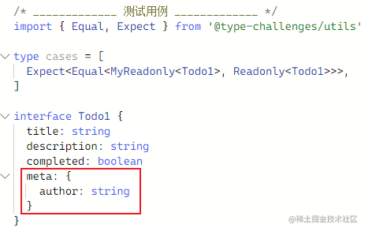

# ts 类型体操挑战 - 简单

## 实现 Pick

> [挑战要求](https://github.com/type-challenges/type-challenges/blob/main/questions/00004-easy-pick/README.zh-CN.md) 
> [在线示例](https://www.typescriptlang.org/play?#code/PQKgUABBAsELQUHnagG5wgBQJYGMDWl5yFH4BGAnhAIIB2ALgBYD21FAYgK4QAUAAgIZ0AZuwCUEAMSAA70CqyhPbUMzCSXYYANrTgZq+fOP0RAGRmA7t11QAfBEBE1oDn49ACUIgTlNA2-GBv-0CL0YApYwPOJgIAYzJFQAFQBlCEBQxUA7f0AQtwgAA0xcAB5ggBoIAGlzeMAYf8AxeUBYOUB75UBTuUB-eUAKV0Bg7QCofBAQQDm5QG8fQGj1BOD4iEBaOUBIBMBLo0AvxUA9HUByAwTMvMAQ80ACBMAEI0AAOUAqOUAG0xj2xrqIfEBo+UAgzUAsf8D409oAZ3xtWgBTACdBPiwbiGDGABNGCABvfChaDC0NQ3ABcEHOtDu2gA5n8IO8bucsFCAA4A5hgiFQ6iwqBQLCMAC2KOBt3eYJIjEYwIE+AAvoFaGQUS83p80HcbgA3DA3ADuEAAvBAALJkJI4VIfRgZADkAKBN1lEAAPhBZQTiaSbu9ZeZAgTqBCILRpWC2YwOdzeQLhb88XiFcCwbKAMI06gQO5UwmytJw-FEkk3Mlgx5qc43f1QBlQU7xQKWQAU6hAAOKA+jsEgQQBQcoBT80A0O6Hei0Wgo84g4DAC5YegAOgAVuc64w7tDgNBgAAvehwV0AOTAIGAYFHoAgAH0p9OZ9OIIADeRigGO5QCAHpPZxuJxBh6OmSzReLsJL0lkIDcAB63ajvc4QHA3MiMQSvSx2-AAbTQEG0WQAumDXk-X8AG4wDpUCxxAddNxnCBAGlbQBV6MqXZoJgqdtxHDBiVbWgfggABRABHdg+DUDJ8PPFksFwukIEEb1CXVHg9xuOBa1I4EcURYB2ABCNZV3ZkXiwPhI1vYV33wCiqNoZIiJItQ5Mom5qJ1ABGDIxQlKVPjlJ0lXMQzowI5TqLk4jSKUmSdQAJk0w8UgtPTAWBZU1Q1INtV1QzzGMqsIGY844AvGTgrub07nwLSjx0mV1X0tz1U1YMyUS2VtC5UiMG8-1f1Ha57keZ5XmlH58H0zFIRhfAESRVF0WoSrsVxCBkq8ikqQ9MD8roQqnheaSVLJNSyv+FzQXBKqcW6sACoefqTOs94bNGk1xqa6rAy1EMdQ66kblpBlRzAcc0NgwBoOUWQBTa1QtCMJO8ALAgQAwJUAarlF0AY8jABVvYtS3LStqyResmxbNsO2AARzj5e5u17Ad8EsQtvt+ssKyrGtgebVt207c5qV4xQjQRiBABezQAsTRMFH-vRoHGyxsGez7QcdzAIA)

### 题意

不使用 `Pick<T, K>` ，实现 TS 内置的 `Pick<T, K>` 的功能。

**从类型 `T` 中选出符合 `K` 的属性，构造一个新的类型**。

例如：

```ts
interface Todo {
  title: string
  description: string
  completed: boolean
}

type TodoPreview = MyPick<Todo, 'title' | 'completed'>

const todo: TodoPreview = {
    title: 'Clean room',
    completed: false,
}
```

### 题解

```ts
type MyPick<T, K extends keyof T> = {
  [P in K]: T[P];
};
```

- 首先使用`extends`来限制`K`的类型，这样可以确保使用的时候只能传入`T`的键类型
- 因为`K`可能是联合类型，使用`in`遍历`K`，获取到每个键类型，再通过`T[P]`就可以获取对应的值类型啦

## 实现 Readonly

> [挑战要求](https://github.com/type-challenges/type-challenges/tree/main/questions/00007-easy-readonly/README.zh-CN.md) 
> [在线示例](https://www.typescriptlang.org/play?#code/PQKgUABBDsELQUHnagG5wgJQKYEMAmB7AOwBsBPSeOSq8gIxIgEECAXAC0PoDEBXCACgACWFgDNuASggBiQAHegVWVpNbgEsizOMoLSATtnzF6UvDQBWGAMbqA1hhIBncuSnOIgDIzAd26OoAPgiAia0A5+IgABTQIQE5TQG34wG--QEXowApYwHnEwCAGLwhAWDlAQMjAf3lACldAUMVAO39AELcAA0xcQlIAHgAVb1LAGH-AK8DAR90UQAA5QCo5VKhyQFPoiHK9KpJSiEAseUBS40A2U26IAH1AbZtAaPVAIeVAB1MFxsA3PUAV+MA9tW7AGO1AC0UOwHYLYsBvHxXGwCvlQHozQAEjQEhzQD0dQHIDQF+EicBqiKGukqBnGz0Ad-KAB0zehByIB9OUAjDqPdKAe+VAKdygFjFQCf2v1MYBDGOKX0A0rGAHgVoeRANHygCDNQBY-2lSvTmA4oJpmBhtCIsOYMBBanh8BAAN7kKDMZTMIgYABcEDszG0mgA5sKIDgMHZzPKAA6iwjS2XyghKqAAXzS5kIsogzD5eGlAFkSBV9DVefhfABeQXK0XiqUQABEAAlbP6ADTK1XqrU6gjS-0iPDGLDaf3kU19EU2gB0PolEE9QYwRCIeH9EGAwAgAFFtNo8NppeZhAQ8MwIEC7HZlAqtFh2yMDBBNXXNWzmGRM-gs5GNcptcpCPmAzRk5xE2WK9Xa-XG83W-2sJ3u72D876MO8KPtOPyPTSmlfIAKdQgAHExaxuDQIIAoOUAp+aAaHdqVYZhmE1OxJQrRlzFYLMTDsLN6wVYBoGAAAvVg4AAYQAOTAEBgDAQjQEWBZSLI8jSIgQADeWKQBjuUAQA8SIo5iIHwwjx1HCAHSdUY6g9L0oCBM8IAAbWCCBNAgGwSDwEQeQAXWlWoxPkgBuMBTSIkAmOY8iIEAaVtAFXo3JyR03TKLY5QAFtNXrNsBWrABHbgsCIUNqwAD1HSwIGNCARDrKyIAAcgEDiMDgaDXIlQ01WAbhRSIOxgvYkhOKbOw1SXETyCrLyLGYaoq2c1zqm4gcXRtABGbx3J4gw6mq7xmvDeTCJZNkOS5HlqoEq0xQlPU5UVcgZ2jBdYxlYbDXIc0bIlVkcGlGhEwlYRyCsjBmCwaUhSgKAsAS9gGymg0jV8jTCK0szzIgQBoOQ6QBTaxu3TWII0ByF8QAwJUAarkaMAY8jABVvICQLAiDgCgmC4IQ7QkJQ4Q7AAdzZNCMJwz6IAAoGQdA8DIPVKH4MQ5DgDsPAiASiamQgXxABezQAsTQ8HGwfx6DYKJ2HUaw3C2LAIA)

### 题意

不要使用内置的`Readonly<T>`，自己实现一个。

泛型 `Readonly<T>` 会接收一个 *泛型参数*，并返回一个完全一样的类型，只是所有属性都会是只读 (readonly) 的。

也就是不可以再对该对象的属性赋值。

例如：

```ts
interface Todo {
  title: string
  description: string
}

const todo: MyReadonly<Todo> = {
  title: "Hey",
  description: "foobar"
}

todo.title = "Hello" // Error: cannot reassign a readonly property
todo.description = "barFoo" // Error: cannot reassign a readonly property
```

### 题解

```ts
type MyReadonly<T> = {
  readonly [P in keyof T]: T[P];
}
```

- 通过`in`遍历`T`对象，然后组成新的类型对象，主要是在键前面添加个`readonly`属性就好了

实现`Readonly`的时候，没有要求进行递归处理，挑战中定义的类型，还特意在其中定义一个字面量对象类型，想必是想让挑战者自己去发现补充吧：



为了确保`Todo1`类型下嵌套的对象类型的属性也是`readonly`的，那么可以这么进行改进：

```ts
type MyReadonly<T> = {
  readonly [P in keyof T]: T[P] extends object ? MyReadonly<T[P]> : T[P];
}
```

- 通过`extends`进行条件判断，从而进行递归处理，这样确保嵌套的对象和数组都能变为`readonly`了

## 元组转换为对象

> [挑战要求](https://github.com/type-challenges/type-challenges/blob/main/questions/00011-easy-tuple-to-object/README.zh-CN.md) 
> [在线示例](https://www.typescriptlang.org/play?#code/PQKgUABBCM0QtBQwoqBG-QNvGCNjQXHKE-tQhjGQLzEmEBGAnhAM4CWAdgPaP0QAUAAnUywJQQBiQAHegVWUIhQgKkRAGRmA7twlQAfBEBE1oDn4iAAUAShECcpoG34wN-+gRejAFLGB5xMBADIoiACeUCmioAA5QFRyqQN4+gaPVAMP+AwHUBN+PcUb0xcPG8fIPxvQBC3QDpU4EAeBUBfhMB6M0A5uVRAWjlAWQTAMOVAL8VAU3NbKEJAaPlAIM1ALH+7AANGgBdqQgBjFmomiCaAVwAHABsAUwgAXggAbQByJuHqQYBDaYAaCGmAW0YAE2HBiABmVfWt3f2ADWPNnb2IAE1pgF0IReoIDvouuyaKftGAJ3mvUG3QmABUBiMwYwAPJkABWwzaTQAPD8-owAGY9SHDFTAYAQYYADz+yOG2wgAG8evMlgAudZzBbLNbXM6HaaM9m3I5s063S7cgUXK4i+5ck43fYPAC+hEa9TsKkAFOoQADitCaAAtemQIIAoOUAp+aAaHcatqmk1+tR6QSWm1tQA6eHUR2Mf4Ac2AsGAAC9tfAAMIAOTAIGAYEjoAgAH04-GE-GIIADeVigGO5QCAHrHEzmYxBw5H0aMIUNhtC4YjkSiwUTiXN6Ns3oDFtsWIMqF1-gwPZNHioJlTCJMtBAGBAwZN6L0NmRhv9Ho9GVowPKoyBs7mExBANK2gFXowAUrhUN5u4-mI7QNv13d0aQBRACOvUWgzWt9JSO6sogmP+jA26w4It4AdZ8RnoD15mAXomloQZqGmSMPi6HFS3GKZZjpVkpQ5PlsMFMVpQlZ5XneTomkLX5RjaV55jQyZCDfMlUQfJ9BmrXFywRD80UorEUJGJQ1hpZkGSZTDpgAbjw-YjmFQijiknlRTkjlLkU8UHhU245SUQSwEeKNCUA6h4BJJjTP+X9-jAIsiUs900JLKFYS4qtJkmaA1gAJkeITZT7SM12PE8IEAaDlnEAU2tgs3M8wFAQgVEAMCVAGq5VNAGPIwAVb3NS1rVtYB7SdF03U9b1oGARZPgAdznP0AxDBKIFNTLsqtG07WoB1nVdd0vR9ahGEGaDaE6BrABezQAsTXkFrcvazqip62qg1DAsgA)

### 题意

将一个元组类型转换为对象类型，这个对象类型的键/值和元组中的元素对应。

例如：

```ts
const tuple = ['tesla', 'model 3', 'model X', 'model Y'] as const

type result = TupleToObject<typeof tuple> // expected { tesla: 'tesla', 'model 3': 'model 3', 'model X': 'model X', 'model Y': 'model Y'}
```

### 题解

```ts
type TupleToObject<T extends readonly string[]> = {
  [P in T[number]]: P
}
```

- 挑战中要求以下代码会报错：
  
  ```ts
  // @ts-expect-error
  type error = TupleToObject<[[1, 2], {}]>
  ```
  
  所以我们要限定`T`的类型为`string[]`。

- 使用索引访问类型可以获取到元组中的类型。也就是通过 `T[number]` 可以获取到联合类型：`"tesla" | "model 3" | "model X" | "model Y"`
  
  索引访问类型使用文档：[Indexed Access Types](https://www.typescriptlang.org/docs/handbook/2/indexed-access-types.html)

- 后面就是常规操作啦，通过`in`来迭代联合类型，然后进行组装了

## 第一个元素

> [挑战要求](https://github.com/type-challenges/type-challenges/blob/main/questions/00014-easy-first/README.zh-CN.md) 
> [在线示例](https://www.typescriptlang.org/play?#code/PQKgUABBCMAsEFoKBpvQAHKCo5QwoqAJfSiEGF4BGAnhAIIB2ALgBYD2V5AYgK4QAUAAgIa0AzNgEoIAYkAB3oFVlcbwBOc3qTx4xaiIAyMwHduKqAD4IgImtAc-EQACgCUIgTlNA2-GBv-0CL0YApYwPOJgIAZdEQHnagBucMgFgJgBSuAAYsAJZyAM40ADwAKnohgDD-gMHagKXGgOvKGIAOpoAjfiHxIYBueoAr8YB7aqmAIW5oWNhVgN4+gNHqnlB4gNHygEGagFj-XiH9NFF4NKQADgCmEPJy0BAAvBAA2gDkvMsANBDLxBtbAMbLALrDY5PTAEzzSwDMm+eb0MdtUCMTEHTjvAAmswsR0XFptADMBgBBxgAPCZ7GjjL4QGgMCDESarZYnN4fb6XP6RGKxC4gsGQ6Gw+GI5GTa54fohLwGQAU6hAAOLhehsYgQQBQcoBT80A0O7dOg0GijKIALlBgz2dAAdAArKIyhhyADmwDgwAAXnQEABhAByYBAwDAptAEAA+lbrTbrRBAAbyVUAx3KAQA9LbaPRaIMbTa9Jv98fFwRDYVQvlEpsxFocDAt4osqGwALYouSHYOh8MQKjjABu4zkEAA-Nm8wWIGKIPGAAzHM0gd2em0QQDStoBV6KC7UbTat3pN4STo2VNAgAG8IABRACObF4ABtNhOoeMYRAAL4QARyBhJrbcP0IaXzufjKgq8ZRYBsGjhOdRdFgP0QPa8KIXq6LPBL0mxaezuexAGcSLLcED3DAMabNceh6OsX7LjCv4zvOgF4sBnCiHMBjQOcoHjrwlYxHI4RnuukFcJh2G4TBcFQN+K5xH+KFAbE0awaW+ZyDR8E-kxAEsYsbBhuMAgkXC5FCV8IliV8MFgHWT4Ftu0QfngoIQPuUQICSDHaQoyp4CxyxUAwNAUAoSjLLBalgpp2kITQenKYZaGxOO1aVqsFmkAAMuEADW4zLOuejyaa9bdj2ECANByqCAKbWkVNn2YCgHgBiAGBKgDVco6gDHkYAKt6CsKooSsAUqygqSqquqsDAPwUQAO4FlqOoGmlED8vlhUiuKkpRNK8qKsqaoalEDBzte4RMEM+gQIAL2aAFia2hdcVvX9RVQ3NXqho+mAQA)

### 题意

实现一个`First<T>`泛型，它接受一个数组`T`并返回它的第一个元素的类型。

例如：

```ts
type arr1 = ['a', 'b', 'c']
type arr2 = [3, 2, 1]

type head1 = First<arr1> // 应推导出 'a'
type head2 = First<arr2> // 应推导出 3
```

### 题解

```ts
type First<T extends any[]> = T[number] extends never ? never : T[0]
```

- 如果是空数组类型，那么`T[number]`就会返回`never`类型的
- 而通过`T[0]`（索引类型访问）就可以获取到第一个元素的类型

在`Issues`看到一个👍比较多的答案，是通过`infer`来推断类型的：

```ts
type First<T extends any[]> = T extends [infer P, ...any[]] ? P : never
```

## 获取元组长度

> [挑战要求](https://github.com/type-challenges/type-challenges/blob/main/questions/00018-easy-tuple-length/README.zh-CN.md) 
> [在线示例](https://www.typescriptlang.org/play?#code/PQKgUABBCMAcEFoKHbgwa8qGFFQI36H9UwZXqUQSOIICMBPCAZwEsA7AewbogAoABWx5gSggGJAAd6BVZQEAXAK4AHADYBTAgX7KIgDIzAd26KoAPgiAia0Bz8RAAKAJQiBOU0Db8YG--QIvRgCljA84mAgBi0RA2EqAvvUAAcoCo5QCwEwApXQBC3AAMAGTk6AHMxAAswwBh-wFLjQHXlfzCAJzkAQwATZhlyMJDAB1NMJMAV+MA9tUBN+L8KkLw3KAJAaPlAIM1ALH-3MP6xKgIxcik5CDE5KhlciABeCABtAHJJ6dzlgBoIZYBbBny5GQgAZi2d-cPjgA1zvYOjiABNZYBdYdHxqilcgGM5a7zJbLABiAEEIgBhADyADkIABOO7gqFwiAACQAomCAGovbbLAAipjBAHE4XcAMoAFTBpkp6IAksY7uiAKoAWTB8MpxjBkMxIIijNJ6Opb3cIzGEymMyisQSQPlcXiAB41jNdMBgBA5AAPMa-Sb5CAAFg+0u+fwBysVC1taqt-2uWp1+sNxogAFYCP0wu5dIAKdQgpJoCQkpAggCg5QCn5oBod268TEYikVAAXNrBr94gA6ABWVBzDCyMWAcGAAC94ghIbCwCBgGAm6AIAB9dsdzsdiCAA3kQoBjuUAgB5truj1sQBtNqXjB2q6m6vWTOj5KgQHIFIqUXJ0ciLV66Bbz-VLlcQADeEHkCviaYg9AAZnIshBzABfCAAfhfEFvdDkADcnwAbibZsQBHMdOwgQBpW0AVeignaCDIPbCdGxoXYpGLMRzwgTEAEcJFyGRtkxA05CNCB33vLIGF2HZ2GnBBsyIq8YimYAJDEGgZCoZYm1+ZgqGwjVZgWFYRLuS5HjOAkpJuSSHmOF5XggXJVwEughLADShOoH5nSBFYURheEkQJYy0SxXF8R2YkyQpAkaTpBlmVZTluQgXl+UFYVRXFFS1IgHSxCnT4grUqZDIIUiPVVfDCJkVVZ2nBh7xldZtG2U1tEy6KyKNOKCKIpLohVdVPlSvTrRdbYvRyzYCG1CAGKoBB3XIsQ2qyGisgIWc6oaqAmpatr8s6p8er60qElVZZ4iOGQGAgAB3YsZHyZZcveUCW2QqDAGg5HxAFNrJDkNQsBQAIXRADAlQBquT7QBjyMAFW9E2TVMM2ALNcwLIsSzLWBgG3KhlqfStq1rK6IHjZ7XpTdNMyobN80LYtS3LKgGBkTiaEEyHABezQAsTQ0WH3oRpGftRsGazrScgA)

### 题意

创建一个`Length`泛型，这个泛型接受一个只读的元组，返回这个元组的长度。

例如：

```ts
type tesla = ['tesla', 'model 3', 'model X', 'model Y']
type spaceX = ['FALCON 9', 'FALCON HEAVY', 'DRAGON', 'STARSHIP', 'HUMAN SPACEFLIGHT']

type teslaLength = Length<tesla> // expected 4
type spaceXLength = Length<spaceX> // expected 5
```

### 题解

```ts
type Length<T extends readonly any[]> = T extends { length: infer R } ? R : never;
```

- 通过条件约束加上`infer`来推断长度的值类型，就可以准确返回数组的长度了
- 当然，数组得是不可变的，所以`T`也要加上约束

在官方文档中，有这么一句话，说`TS`是允许推断出最长的返回类型，所以说肯定是知道数组的长度的：

> [文档地址](https://www.typescriptlang.org/docs/handbook/2/functions.html#constraints)
> 
> There are a few interesting things to note in this example. We allowed TypeScript to infer the return type of longest. Return type inference also works on generic functions.

## Exclude

> [挑战要求](https://github.com/type-challenges/type-challenges/blob/master/questions/00043-easy-exclude/README.zh-CN.md)
> 
> [在线示例](https://www.typescriptlang.org/play?ssl=19&ssc=48&pln=19&pc=1#code/PQKgUABBAsDMEFoIFEAeBjANgVwCYFNJEETSiAjATwgC0ALfRgOwHMIAKAAQC8HmWAlBADEgAO9Aqsojy2AJaYALghlMiRYeoiAMjMB3bqqgA+CICJrQHPxEAAoAlCIE5TQNvxgb-9Ai9GAKWMDziYCAGPREB52oAbnQFDFQDt-QBC3NCw8fAgAHgAVQBh-gFV9QG8fQGj1eMAxeUBYOUBfgMAXt0BS40B-eUAKV0Bg7UAac0BquK8DQDm5QBUAwAgVdNjAWjlAJONAEzTEkPTABCNADRV4wFNzQBDzQAIEwAA5QCo5QAbTfrS6iCJDQAp1CABxGXk6bHIIQCg5QFPzQGh3QCx-unl5AAcAZwAuYGB5e-Q6ADoAK3vPgHsAE4sYBwYC8BAAYQAcmAQMAwIjQBAAPpo9EY9EQQAG8iFAMdygEAPVGYkkoiDwxHySi3KIAWUo4RwBDiABoIMkIABeCCxCD4VDyfBMXD3dkQAD8ECY+AAbvhARBHjyANyIsDI0kkiCAaVtAKvRpUA0fLEzVYikyAC2tyB8ggAG8UABHbAAQ0wbLQNPQNoAvhAAGaA-7miAAck4VJpCA+rswQpY+HuwGw8jk9xDlOpUXQzvuCa5EAA2kQoB78F7osgna7ovTGZFogAiZ0NiAAHwgDfILfbDfQDbZTYb+ndGCZ+EbzbbHa7U97-Y7zf0S5ZxZQqE98grVcwNYZo-rg9nM57fYHk57XeHa4izMPF+7HdPC4fnaHy9XpfLlZdO9r++Z9zyICyhsO2TDYOa5DylO7DsEInKGDK-wyLgAhsgAYtgTBejI-xMFedYAUBIFTuBkHQe2sHwYhyGoRhWE4XhS7DmAAC6arqiAxommSgDQctMgCm1txJrkgioBrBAgBgSoA1XK4oAx5GACreVw3A8zyvO8Xy-ACwKgrAwDOkw9wAO7yuCdBQrCBgQOcinKXcTwvG8Hw-H8QIgmC9z-DgKZ4fcEmAC9mgBYmjodmqY5GkudpIIQjCcIImAQA)

### 题意

实现内置的 `Exclude<T, U>` 类型，但不能直接使用它本身。

> 从联合类型 `T` 中排除 `U` 中的类型，来构造一个新的类型。

例如：

```ts
type Result = MyExclude<'a' | 'b' | 'c', 'a'> // 'b' | 'c'
```

### 题解

```ts
type MyExclude<T, U> = T extends U ? never : T;
```

当联合类型作用于泛型的时候，会将每一个类型都分布到该条件判断中。

例如：

```ts
type T = MyExclude<"a" | "b" | "c", "a">;

// 执行时大概是这样：
"a" extends "a" ? never : "a" |
"b" extends "a" ? never : "b" |
"c" extends "a" ? never : "c" 

// 所以最后 T 的类型就是
type T = "b" | "c"
```

查阅官方文档请参考[分配条件类型](https://www.typescriptlang.org/docs/handbook/2/conditional-types.html#distributive-conditional-types)。

## Awaited

> [挑战要求](https://github.com/type-challenges/type-challenges/blob/master/questions/00189-easy-awaited/README.zh-CN.md)
> 
> [在线示例](https://www.typescriptlang.org/play?#code/PQKgUABBCMAcCcEC0ECCB3AhgSwC4FMATSZJM8kgIwE8IBZTAY23wCsIBlbAawHsAnTBAAUAAQC2TFqwDOPAZgCUEAMSAA70CqyqoAO-XuOwz8qygFdsAG1xJsAOxIkVTiIAyMwHduDqIHEFQEGagRCNAG7lASHNAADlAKjkIAAU9AyMIQE-tQEMYwBh-wE34iOj9Q2MkwCx5QBX4wD21cMBvH0Bo9UAgBkAKdQgAFQ4IQFo5ZMDAClcomOyAHlqAPibAELc6iEBTc0B540AH+PSOrLiigfKKwHfowAN5QDztQAbnUrLkwHvlQFO5QHbgwDXldMXPCEAV6x9ALH+AA0zY-C6AUQAPTHFtC3xa6m18L07slVkUIO9Pt9fv9jOcoCR+ulAIjGgAwjEaAK8DAHFyEAA2hIpGw5HxBABdYQAC1wuG0MgAXMBgABzPDk0yUAB0jH0wEkzEJ8kEygGgHDTQAHXjccQJsMzbJgLBBMPxcNhGD8yZTqXSGYR8AA3dm4Xg8phEhTATCEXWYWyMIhIXAwmSMfjYbTWfBvfD8ZhGGRIACOpnwMmVvFsSGgSAALABWbhRxQXfo1ADiLLZEEAUHKAU-NANDuNw1NPpwFwTvJ7Nk7IEjOAcHgwAAXuSkABhAByYBAwDAPdAEAA+oOh8OhxAVgNAMdygEAPAcjuf9iBdnsOgH0agYHAEQg9foAXmGHoItkIMhmTy6dgAZl6IABVfoAfjXG7wRC694gtLqAG4e72QLO87DhAgDStoAq9GtIA0fKAUBg6Lt22BfAIuAQAA3uCgZygANOCbwAowKEAL4QJeMQQAA5KIK74EgjDknKPy2IywbAKYyoWDI5HLjCEAABoQPujzdCGLpMb0YDURAACaAlnt06GXiwFiEF+timOIlA3oR4mSQAWrJQlGF0hnPCJdiMhAAA+EBqRpXq9OJEk8YwmC+rJOIkO8+G4K8mEWF0dDrlgr7brxvQ4WZYnhZ5eH4ARvmmHKAVBZub5SeFaEkUpKk2epmn8BA2nRVAXlxT5Lx+clL5bl0ukZZFFnWbZ+UOVhYAkr2wAQFRfoet5SBeno-BOaug0CLJgXVW+zX2X+YB9rBwGANByISAKbWMGwfB83gFA-SAGBKgDVcuOgDHkYAKt4FlSRYMqWdEVjIVb8DWdbmrYMjoF6jbNu2CIQHmZ0XZqxY3eWlbVrWCDADIvAWGx2BhjIP2AC9mgBYmu4ANXSWZZ3Q9NZNq2HZLmAQA)

### 题意

假如我们有一个 Promise 对象，这个 Promise 对象会返回一个类型。在 TS 中，我们用 Promise 中的 T 来描述这个 Promise 返回的类型。请你实现一个类型，可以获取这个类型。

例如：`Promise<ExampleType>`，请你返回 ExampleType 类型。

```ts
type ExampleType = Promise<string>

type Result = MyAwaited<ExampleType> // string
```

### 题解

```ts
type MyAwaited<T> = T extends Promise<infer U> ? MyAwaited<U> : T;
```

- 这个没啥好说的，就是通过条件判断加`infer`去进行推断
- 需要注意下递归处理

## If

> [挑战要求](https://github.com/type-challenges/type-challenges/blob/master/questions/00268-easy-if/README.zh-CN.md)
> 
> [在线示例](https://www.typescriptlang.org/play?#code/PQKgUABBBMBsAcEC0ECSAzSyk91gRgJ4QAKAhgG4CmANhAOI0CuAzgBYDWA9hRABQABAA5l2TAC4cAlBADEgAO9AqspyJASxossWWToiAMjMB3blqiA87UANzoAA5QFRyEAAaoAYrYiBvH0DR6oBh-wMHagUuNAbKbWgIbmgG9y7nYAws4e1oAkSoC1poBccoD47oBvpoAhboAr8YB7amG2ACpRgKdygFPKsYmA4grp2blOgEAMEc6AV8qAvwGA9GZ24gBOTFTOgGhGgKABduhkGr0edgUQgDEqdk4QgPfKha2A33KA8IbutcYQgHxygNHyAFzbtifimlDihEJUEACCEAC8aOgAPF09ADQQAORk31-ffDfAB8UGAwAgVAAHtcAMbiKgAEwg4i4EHwN1+3ywl2uEAAQo9ni8RmMAX8AUDQeDITCqPCkSi0RifkCsCdbNtQYAKdQYqnEbCY+AggCg5QCn5oBod0AWP9scTiIQsA7gs6wtgAOgAViw1VxOgBzYBweDAABebCQ4QAcmAQMAwPbQBAAPou11u10QQAG8mlAMdygEAPZ3uoNOiC2+24m4YF7hWkIgB2iJY6K4XBoVDIca+eS+DlBTxj0PjiZR3RuAH4IHkIAcIA4ANz2sCO4NBiCAaVtAKvRgApXPaBlsesOqAC2Ql14ggAG8IABRACOTFGX2ndPhEAAvhB0J0uEOfgII0hVaM03G9VQWMA1BpsWAIxBYaJz0SANpYZdw8QvOcLmgvKPvKhyX+VkQSA4FgQ+N8V0-b9Rj-V5SRYQCfgpGAILQiCwAAXQdCF9xYJBoQ-QjOm3TpbyuG4qFI3UiSjOMmBoGggMpEFGybEA+37ENAGg5CxAFNrLj+1DO1QCwUFADAlQBquW9QBjyMAFW8ZTlBUlWAFV1S1HV9UNBBgAzFgAHdqNNc0rXEiBJQUpT5UVZUWFVTVtV1A0jWAFhUzULg43OCBQUAF7NACxNQxrJUuyHM05yTIta0wzAIA)

### 题意

实现一个 `IF` 类型，它接收一个条件类型 `C` ，一个判断为真时的返回类型 `T` ，以及一个判断为假时的返回类型 `F`。 `C` 只能是 `true` 或者 `false`， `T` 和 `F` 可以是任意类型。

例如：

```ts
type A = If<true, 'a', 'b'>  // expected to be 'a'
type B = If<false, 'a', 'b'> // expected to be 'b'
```

### 题解

```ts
type If<C extends boolean, T, F> = C extends true ? T : F;
```

## Concat

> [挑战要求](https://github.com/type-challenges/type-challenges/blob/master/questions/00533-easy-concat/README.zh-CN.md)
> 
> [在线示例](https://www.typescriptlang.org/play?ssl=22&ssc=62&pln=22&pc=1#code/PQKgUABBCsDMsQLQQMIHsB2BjAhgF0iUWJMICMBPCAQQwBMAnAUyoGkGcBnNAN04GsqACgACZZrAAM-DgDYAnFk4BKCAGJAAd6BVZXU4GHCoUJqTEQBkZgO7cjUQBTqgbx9A0eqBvn0D7foBnEwHnagBucIAKRw8OADKWAwAlgAOeBCAoYqAdv6AIW4QAAbU+jgUAHRYmLh4yRCAnaaAqzaAMP+Am-GAVHKOgKXGgOvKgCRylYBDyoAOpqWAK-GAe2oJgA2mrYAjfo6AKXqAp9GAkMaA5o6AyfGApoptgHNygGe6gAxKgM-KCYBeGYDxeoAQKoBueoBccoAAcpW9CYOAQAzWEIB8coDR8qU3yS94nIR4FBFMEABKTJwAK4AG2iAF5ULl8AAeADaAEYALoAGggsIATIiAHwQYDACBMAAe3yweCYdAgeDQEDIPwRqMxhBeyRuOJsEAA4mE8AALQFkCCAKDlAKfmgGh3QBY-zy8HgIpwAFx4t5YHmZABWnEyaAYAHNgHBYMAAF48xAoAByYBAwDANtAEAA+o6nc6nRBAAbyCUAx3KAQA8HS7-faIFabZ9vpDsDCACoEwlk+icCA4DAUWEoiAAVRjcboCaTKexEAhsMyJcjqJLmXTiIA3DawHaA-6IIBpW0Aq9GACld7n7G67g2EALYRLXRADeEAAogBHQE4YGo8fEpikiAAXwgADMGGh+xAAOQiUNMRDK2fApgYbUA4CAvBhYGcXchr4-XCcAGFtGEBckvDQqcz4FoXQCNf1TVFUyxcDsUgr9F1JP9p1nICoVAtMEWxcCkSxGCoG-Jdf3-JDgLyOF4QZNDYFRAAWDC0TIiB0VRSiIBo7DkVgn8EIA5CQLhXd4V3BlUV3WBdzQ9dZzfVEyDQNAzyTYSqLEyC0X4wSGOE0TUQk+8mGk2T5IwRTlJgxEnzDHAP2ImEwLo7FbRAbse0DQBoOWOQBTaycnsg2tUBCBxQAwJUAarkPUAY8jABVvSVpVlBVgCVFV1U1HU9XgYAk04AB3JgGCNE1zX8iAxQiqKZXlRVOGVNUNS1XV9WAbhgRvMJMHeKAcUAF7NACxNSwSpi8rKsSmrctNC1gzAIA)

### 题意

在类型系统里实现 JavaScript 内置的 `Array.concat` 方法，这个类型接受两个参数，返回的新数组类型应该按照输入参数从左到右的顺序合并为一个新的数组。

例如：

```ts
type Result = Concat<[1], [2]> // expected to be [1, 2]
```

### 题解

```ts
type Concat<T extends any[], U extends any[]> = [...T, ...U];
```

- 因为数组可以拥有`rest`元素，详情请看[官方文档](https://www.typescriptlang.org/play?ssl=22&ssc=62&pln=22&pc=1#code/PQKgUABBCsDMsQLQQMIHsB2BjAhgF0iUWJMICMBPCAQQwBMAnAUyoGkGcBnNAN04GsqACgACZZrAAM-DgDYAnFk4BKCAGJAAd6BVZXU4GHCoUJqTEQBkZgO7cjUQBTqgbx9A0eqBvn0D7foBnEwHnagBucIAKRw8OADKWAwAlgAOeBCAoYqAdv6AIW4QAAbU+jgUAHRYmLh4yRCAnaaAqzaAMP+Am-GAVHKOgKXGgOvKgCRylYBDyoAOpqWAK-GAe2oJgA2mrYAjfo6AKXqAp9GAkMaA5o6AyfGApoptgHNygGe6gAxKgM-KCYBeGYDxeoAQKoBueoBccoAAcpW9CYOAQAzWEIB8coDR8qU3yS94nIR4FBFMEABKTJwAK4AG2iAF5ULl8AAeADaAEYALoAGggsIATIiAHwQYDACBMAAe3yweCYdAgeDQEDIPwRqMxhBeyRuOJsEAA4mE8AALQFkCCAKDlAKfmgGh3QBY-zy8HgIpwAFx4t5YHmZABWnEyaAYAHNgHBYMAAF48xAoAByYBAwDANtAEAA+o6nc6nRBAAbyCUAx3KAQA8HS7-faIFabZ9vpDsDCACoEwlk+icCA4DAUWEoiAAVRjcboCaTKexEAhsMyJcjqJLmXTiIA3DawHaA-6IIBpW0Aq9GACld7n7G67g2EALYRLXRADeEAAogBHQE4YGo8fEpikiAAXwgADMGGh+xAAOQiUNMRDK2fApgYbUA4CAvBhYGcXchr4-XCcAGFtGEBckvDQqcz4FoXQCNf1TVFUyxcDsUgr9F1JP9p1nICoVAtMEWxcCkSxGCoG-Jdf3-JDgLyOF4QZNDYFRAAWDC0TIiB0VRSiIBo7DkVgn8EIA5CQLhXd4V3BlUV3WBdzQ9dZzfVEyDQNAzyTYSqLEyC0X4wSGOE0TUQk+8mGk2T5IwRTlJgxEnzDHAP2ImEwLo7FbRAbse0DQBoOWOQBTaycnsg2tUBCBxQAwJUAarkPUAY8jABVvSVpVlBVgCVFV1U1HU9XgYAk04AB3JgGCNE1zX8iAxQiqKZXlRVOGVNUNS1XV9WAbhgRvMJMHeKAcUAF7NACxNSwSpi8rKsSmrctNC1gzAIA)

## Includes

> [挑战要求](https://github.com/type-challenges/type-challenges/blob/master/questions/00898-easy-includes/README.zh-CN.md)
> 
> [在线示例](https://www.typescriptlang.org/play?#code/PQKgUABBAcCc0QLQQJIDsDGAbArgEwFMBnSJRci0gIwE8I0cssIAKAAQGsa0CAzHDgEoIAYkAB3oFVlUQEMATrOk1SpEaoiAMjMB3bsqiAKdUDePoGj1QN8+gfb9AM4mA87UANzhABS0gG7SAyhlkBLAA4AXCIBC3CAADAEF5RQA6D0xcQiIgiEBO00BVm0AYf8BN+MAqOSNAUuNAdeVAEjlMwCHlQAdTVMAV+MA9tX8jQEDIwAk5QHozYJ9ZHAIExpag3mksIk7AIAYdCEA+OUBo+UBTc0AX6NTRoMWfEigfGi8CCA8iAAUPJjkAWQI0CABeVBj8YgAeAG0AcgBpOSIHgBoIB4BRIg88bYeD5fADq0gAtjgcMCHi5pGgfPDpA8ALqfB4AEQ8AHsHgA+CDAYAQAgADw2GB8BDwEB82IgVE2vX6gyCpEWbKgpAJuggAHEPD4ABY4KgQQBQcoBT80A0O6ALH+hT4fF4iAAuInLDBCiIAKyIEWxsgA5sA4NBgAAvIWIADCADkwCBgGBnaAIAB9D2er2eiCAA3l-IBjuUAgB7u71ht0QR3OtYbCDfACOOBZNwAGp8AJoEi6kFg3AAqeJYwjOBLzJNJVLQeCIEBTEAA-BAAIwQFUQABMwjJlerrHzheLpfLPZr6YbzdbHcEpEbbQ6pDbfQGBAA3NH1pt0NhrkR88OTr3ZARpHhsWgsHR4TQ7miIABVLMQUhl7sHmt3aK8AiyCAAMU+ESAZ+34QAASiiT5QI2CZJgMNz-veBKvlWNZzgQpBQbS7SbG2W6xLcoGfA+C4QEugxrs6YCuuGYYQIA0raAKvRgAUrhMoY0T6UYeOCXgGn4ADecaJv0nzfOSBCUhAAC+pGyNi4JfGwMYEIgmr9FgJyGsQwA4D4+xvOusYYNIgw1hcdykKJFI+DcMH9DceE7vczyvDCvz-ICMJgpC0LonCCJIqi6IvLIbx4p8aF4mFFliZSNlCVg9lXHETnBW86JuQCfyeRCUIwn5iJoMit6Yji+KfGRBCRe80VWXFsGJduyV3E2nztp8ADMnwAKyfAAbJ8ADst4DWFWEdFVNXidZtkJQ5TUtR2HXdX1g23gALKNFUTVAllTXVdlzbczWtR1t7tqNEVRTtMXTfFDX4bux2LRA7W3k2F3YdtcY3fts1JUdfGSbeAnSG2DwhA8UmbSylVXd9tUzfdjl3FQ2LYup8InS9y0QP1EBDeVMPQ8uX27bFiOHY9aFY51EA9bjq2fKj6PHmgxODKTP0U-9j0VTTON4wTpFE+Fn1w2Tt31ZT9wg2DENScDEBHieZ4XhAoNfPLkns7D1XXQjd3S3cAnK6e56XnLkNA58sua1bOucwbUs8-cTZvRAAA+HYO+LXOGy7zWex2b0+3r8N7dzjVHQwTC3jgVZ8NE1Kh5N5P+1Hj3x4QvBJ3gt4x1gKcopRVEgGx7ERoA0HKAABygCm1uX7GRk6oDchAgBgSoA1XL+oAx5GACre8qKsqarABqWq6vqRomvAwDwkQADu34WladqtzKfcD0qqrqkQmo6nqBrGqawBEOjOk4mgKwQASgAvZoAWJpaBvQ-b7v48H0vNr2lGYBAA)

### 题意

在类型系统里实现 JavaScript 的 `Array.includes` 方法，这个类型接受两个参数，返回的类型要么是 `true` 要么是 `false`。

例如：

```ts
type isPillarMen = Includes<['Kars', 'Esidisi', 'Wamuu', 'Santana'], 'Dio'> // expected to be `false`
```

### 题解

```ts
// 判断两个类型是否相等
type Equals<X, Y> = 
  (<T>() => T extends X ? 1 : 2) extends (<T>() => T extends Y ? 1 : 2)
  ? true
  : false;

type Includes<T extends readonly any[], U> = 
  T extends [infer F, ...infer R] 
  ? Equals<F, U> extends true
    ? true : Includes<R, U>
  : false;
```

> `<T>() => T extends X ? 1 : 2` 
> 
> - `<T>` 表示这是一个泛型函数类型，并且 `T` 是一个类型参数。括号中的 `() => T` 表示该函数接受零个参数并返回一个类型为 `T` 的值。
> 
> - 在函数体中，`T extends X ? 1 : 2` 是一个条件类型（Conditional Type），它根据类型关系来选择两者中的一个类型。具体来说，如果类型 `T` 能够赋值给类型 `X`，则条件类型的结果是数字字面量类型 `1`；否则，条件类型的结果是数字字面量类型 `2`。
> 
> - 因此，该泛型函数类型可以表达为：“接受一个类型参数 `T`，如果 `T` 能够赋值给类型 `X`，则返回数字字面量类型 `1`，否则返回数字字面量类型 `2`”。

首先来看下`Equals`类型，可以这么来理解，我通过了一些步骤来演进代码：

- ```ts
  type Equals<X, Y> = X extends Y ? true : false;
  
  type T = Equals<true, boolean>;
  ```
  
  上面代码中，`T` 的类型会为 `true` ，因为 `boolean` 类型兼容 `true` 类型。

- ```ts
  type Equals<X, Y> = (() => X) extends (() => Y) ? true : false;
  
  type T = Equals<true, boolean>;
  ```
  
  上面代码中，`T` 的类型还是 `true`，函数的参数和返回值也是存在兼容的，道理和第一个一样的。

- 所以最后就成这样了：
  
  ```ts
  type Equals<X, Y> = 
    (<T>() => T extends X ? 1 : 2) extends (<T>() => T extends Y ? 1 : 2)
    ? true
    : false;
  ```

要把括号括起来的看做是一个整体，一个定义好的类型，例如 `(<T>() => T extends X ? 1 : 2)` ，所以这时使用 `extends` 进行判断的时候，检查会要求类型定义一致，所以就能判断出类型是否相等了。

挑战里测试用例用到的 `Equal` 也是这么来判断的。


这时来看看 `Includes` 类型，应该好理解很多了。

就是获取数组的第一个元素类型，然后对比是否相等，然后通过递归的方式，把数组中的每一个元素类型都对比了一遍。

## Push

> [挑战要求](https://github.com/type-challenges/type-challenges/blob/master/questions/03057-easy-push/README.zh-CN.md)
> 
> [在线示例](https://www.typescriptlang.org/play?ssl=25&ssc=82&pln=25&pc=1#code/PQKgUABBDMAMCsB2CBaCAFArgZwBaVRSOIICMBPCAKwEsBDAOwHM9GIAKAAVsZd0YC2AUwAudAJQQAxIADvQKrK0ugCcldcgQJStEQBkZgO7cNUQBTqgbx9A0eqBvn0D7foBnEwHnagBudAWAmAKV0AhbhAAG3gIIq1AHQADji43p4QgEAMhhCAfHKA0fKAQZqA0HKAMP8x4SLkQULYAMZKNEEiBFk5EABKuZgANiIQALwYoQA8ANoAjAA0EABMALo9AOTQQwB8EMDAEJ09vcOj-QThMRNGEADiNCK4mKQQgFBygKfmgNDugFj-uCIiQdgAXFMi+bgBVNgBAPZKTMBwSMAAXrgUABhAByYBAwDA0NAEAA+gjEUjERBAAbybkAx3KAQA94ci8XCIJCwGUhBAALJ0IJBGjMFoAFQgQgAHiIhAwACbYCCMchtfoTJoAbwIbXQEBpEDpbQYmAEpCESn6-VuGDAAF9oSTmnh6YyWWzORAlEI6Oz3gwapQeXyegBVAXkynU2l0sZtW39PWsjlc20QAD8kogKraATDdLt-QA3NCwLD8XiIIBpW0Aq9EueK4hMook0ARBT71QUQACiAEdMHQaj1i0ycnkRNXa0J6wAxSvYIQ9UHvERlis1CBqiAAMyU7wEECGnBJKDy-BqNTZTFywEwIhoNWwQ012VJeToHa5TTaBBrdZELT7lZaWB1NogHTGPU6-Kfp6b9cv5evt9w7W6fSDJOoxPjMAHzMBQyvl077nl+-Y3q0bRDB0QxzAsUE9KQ7zvIujCgchqHoZBWE4XhDDQbBzYXleNSIXeKFoX0GFASM4zPoxxFsZRSyxvGWYoskgAAcoAptaZgJhJQqABATIAYEqANVy6KAMeRgAq3hcVw3PcwCPHOLxvJ83y-IgwCMNgADuCoAkCYIyRApyqep1x3A8Tx6R8Xw-AgxnYLha40Oa2C2YAL2aAFia+iOZpLm6a87nfICILgkSYBAA)

### 题意

在类型系统里实现通用的 `Array.push` 。

例如：

```ts
type Result = Push<[1, 2], '3'> // [1, 2, '3']
```

### 题解

```ts
type Mapping<T extends any[]> = {
  [P in T[number]]: P
}

type Push<T extends readonly any[], U> = Mapping<T>[U] extends U ? T : [...T, U];
```

- 为数组创建一个类型映射对象 `Mapping` ，`key` 和 `value` 都是数组元素本身
- 这样就可以先判断元组中是否已经有该元素类型了没，然后再确定是否组装一个新的元组对象

## Unshift

> [挑战要求](https://github.com/type-challenges/type-challenges/blob/master/questions/03060-easy-unshift/README.zh-CN.md)
> 
> [在线示例](https://www.typescriptlang.org/play?#code/PQKgUABBDMAMBssIFoIFUB2BnAFgSwDMAXSFZci0gIwE8IArPAQwwHNcWIAKAAUZfY4WAWwCmRJgEoIAYkAB3oFVlWUwBOKpjVKkZOiIAyMwHduWqIDztQA3Ogbx9A0eqAJJ0A05oBC3CAANXAQTUaAdAFds+YldnQCAGYwhAPjlAaPlAGH+woKIaAAdRLABjFTxEkigE5IgAJRSfABsiCABedH9CIgAeAG0ARgAaCAAmAF1W2AA+CGBgCHrYVpb25o7SILC+wAp1CABxPCIcHyoIQCg5QFPzQGh3QCx-nCIiRKwALgGiNJwveiwvAHsVVmA4RGAALxxkAGEAOTAQMAwMDQBAAPoQyFQyEQQAG8g5AMdygEAPcHQtFgiCA4G5URVXA1WoAFQgogAHkRRBgACZYAqiJhU+4YYo0DzqGi1Fg0HqtNB9Sr1NCtLwiwkdADcwLAoPRaIggGlbQCr0YAKV0iqNlMKxeGEiUeZQA3hAAKIARx8TGKrSNpOSqSIVptojtADELVhRK1fvciKbzcUIABfCAEFT3YQQADkPBxyFSQmKxUprBSwB8RDwxSwEexSVxqSY7tpAtI1ttdV9FtqmHxxAaXQgjR5Q0aHR6PJLjrttQrxSr1VrTVanW6TeGoyHEzbzQ7Ze7Zsr1YCdXqEcaEYnkegEa6VHu90TLFHu-39IwrVX6-Gm+3U7AkylMo1MMA0HKAADlAKbW6qfmKBoFIfUAMCVAGq5eFAGPIwAVbwOI4TnOYBLjjG47keZ5XlgYAWCwAB3UQVA+L4-n-CBdggqDjjOC4rkQh4nheBA0Kwfc0zwJksEIwAXs0ALE1DFImCKIQ25qOeT4fn+LEwCAA)

### 题意

实现类型版本的 `Array.unshift`。

例如：

```ts
type Result = Unshift<[1, 2], 0> // [0, 1, 2,]
```

### 题解

```ts
type Unshift<T extends ReadonlyArray<any>, U> = [U, ...T];
```

- 这个就跟`Push`是一样的道理，就不多说啦

## Parameters

> [挑战要求](https://github.com/type-challenges/type-challenges/blob/master/questions/03312-easy-parameters/README.zh-CN.md)
> 
> [在线示例](https://www.typescriptlang.org/play?#code/PQKgUABBDM0IwCYIFoIAUCGAnDBbApgC75YDOkKyV1FARgJ4S4CWAJgPZbMBe+LEACgACLDl14sAlBADEgAO9AqsqzmAOwBmJWYQCuABwA2+WbW3N9hZKooUZtiIAyMwHdu1qIDztQA3OgUMVAdv6AQt3TYeEQkpAA8ACoAfBCA3j6A0eqAMP+AMAGAsHKA9GaAL26ApcaA-vKAFK6AwdoJgPfKgEPKgMABANrh9Lr4AMoAxly6hIAZ2oCdpoDhpoDGFgC6AgAWhIS6pABcwMAA7rMAdIS1+KTNzK36GCoA5nOcW8AcjaTAg5ustOzsANbA2oRmzIvIi3Wkc8O4+jK6gQTEZC98JJAEAMLgg0UAFOoQADij0G2loEEAUHKAU-NANDugCx-4ajCZTQgrQZzABWbz2wFgiGA3EGyAAwgA5MAgYBgVmgCAAfS53J53IggAN5XyAY7lAIAenN5Eo5EGZrMBEAAsvRMDg-iEIhB8AAPYgqVikQRzQ3YLYTCCbeiVPrSAC80XN0WtEHCGu1+F1+oEhrmxtNqg0WHQNrtKkYAH50BBxhAVPgAG4kADcrLZIHFkp5EEA0raAVei8oBo+TT6a50pZzFwuk4hAgAG8IABRACO2gw+gANPXNXVGoR23XO-huwAxFukfDt+nsQiN5v6CAAXwgaiw7FwEAA5EJAchGqd9IZtstbvd9KQ16zGuwVKQq2pLhBHQJjXAo9euNt28aEFGVNpcLQSJIUaxuwbD3tE1ZzmAF5XlWtDYPeghPlGFzsIYmwflgWxfjWGBRmuACCa5zoBEDAaBto1pB0HXhAcHcAhAgkWRrBgZRspLBAjQYKO+qOpUFB9l2hChNOLahIqypBP8YSAuwaiLpckTtpUr6qFs7Y-n+JB9JESkCf23YiU2YkSb8wRkKEsnyXBWBKRAlQoWhKjttWuHroRc46XpUCCQOwmifo4lKmZ0mWUscm0Rg3B2ZaumtmAfTJmA7JFhmgDQcoAAHKAKbWhZFiWyXgFA0SAGBKgDVcoKgDHkYAKt5YiMYyTMA+I7sSpKYeS8AIMAmykNMJBUjSDIUNE6LVbVOINU1hIkrsbUUp1pCoXczCXuQRUQIAL2aAFiaThjfVeIEi1M37NSdKMjKYBAA)

### 题意

实现内置的 Parameters 类型，而不是直接使用它，可参考[TypeScript官方文档](https://www.typescriptlang.org/docs/handbook/utility-types.html#parameterstype)。

例如：

```ts
const foo = (arg1: string, arg2: number): void => {}

type FunctionParamsType = MyParameters<typeof foo> // [arg1: string, arg2: number]
```

### 题解

```ts
type MyParameters<T extends (...args: any[]) => any> = T extends (...args: infer P) => any ? P : never;
```

- 主要就是利用 `extends` 和 `infer` 搭配使用，推断实际定义的类型