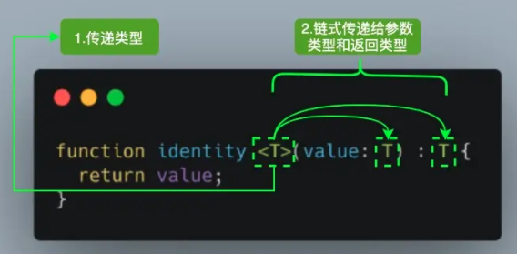
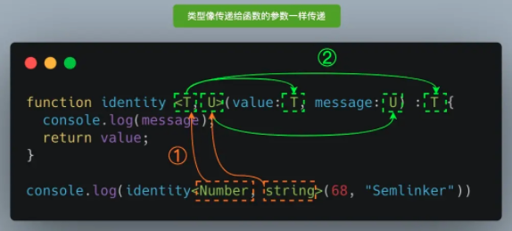

# typescript

## 安装

```bash
# 全局安装
npm i typescript -g

# 生成tsconfig.json
tsc --init
```

[命令](https://www.tslang.cn/docs/handbook/compiler-options.html)

### 编译配置表

```json
{
  "compilerOptions": {
    "incremental": true,                // 增量编译
    "tsBuildInfoFile": "./buildFile",   // 增量编译文件的存储位置
    "diagnostics": true,                // 打印编译信息

    "target": "es5",           // 目标语言的版本
    "module": "commonjs",      // 生成代码的模块标准
    "outFile": "./app.js",     // 将多个相互依赖的文件生成一个文件，可以用在 AMD 模块中

    "lib": [],                 // TS 需要引用的库，即声明文件，es5 默认 "dom", "es5", "scripthost"

    "allowJs": true,           // 允许编译 JS 文件（js、jsx）
    "checkJs": true,           // 允许在 JS 文件中报错，通常与 allowJS 一起使用
    "outDir": "./out",         // 指定输出目录
    "rootDir": "./",           // 指定输入文件目录（用于输出）

    "declaration": true,         // 生成声明文件
    "declarationDir": "./d",     // 声明文件的路径
    "emitDeclarationOnly": true, // 只生成声明文件
    "sourceMap": true,           // 生成目标文件的 sourceMap
    "inlineSourceMap": true,     // 生成目标文件的 inline sourceMap
    "declarationMap": true,      // 生成声明文件的 sourceMap
    "typeRoots": [],             // 声明文件目录，默认 node_modules/@types
    "types": [],                 // 声明文件包

    "removeComments": true,    // 删除注释

    "noEmit": true,            // 不输出文件
    "noEmitOnError": true,     // 发生错误时不输出文件

    "noEmitHelpers": true,     // 不生成 helper 函数，需额外安装 ts-helpers
    "importHelpers": true,     // 通过 tslib 引入 helper 函数，文件必须是模块

    "downlevelIteration": true,    // 降级遍历器的实现（es3/5）

    "strict": true,                        // 开启所有严格的类型检查
    "alwaysStrict": false,                 // 在代码中注入 "use strict";
    "noImplicitAny": false,                // 不允许隐式的 any 类型
    "strictNullChecks": false,             // 不允许把 null、undefined 赋值给其他类型变量
    "strictFunctionTypes": false,          // 不允许函数参数双向协变
    "strictPropertyInitialization": false, // 类的实例属性必须初始化
    "strictBindCallApply": false,          // 严格的 bind/call/apply 检查
    "noImplicitThis": false,               // 不允许 this 有隐式的 any 类型

    "noUnusedLocals": true,                // 检查只声明，未使用的局部变量
    "noUnusedParameters": true,            // 检查未使用的函数参数
    "noFallthroughCasesInSwitch": true,    // 防止 switch 语句贯穿
    "noImplicitReturns": true,             // 每个分支都要有返回值

    "esModuleInterop": true,               // 允许 export = 导出，由import from 导入
    "allowUmdGlobalAccess": true,          // 允许在模块中访问 UMD 全局变量
    "moduleResolution": "node",            // 模块解析策略
    "baseUrl": "./",                       // 解析非相对模块的基地址
    "paths": {                             // 路径映射，相对于 baseUrl
      "jquery": ["node_modules/jquery/dist/jquery.slim.min.js"]
    },
    "rootDirs": ["src", "util"],           // 将多个目录放在一个虚拟目录下，用于运行时

    "listEmittedFiles": true,        // 打印输出的文件
    "listFiles": true,               // 打印编译的文件（包括引用的声明文件）
  }
}
```

## 关键字

### extends

- 表示继承/拓展的含义

- 表示条件判断的含义

#### 继承/拓展

```ts
  interface T1 {
    name: string
  }

  interface T2 {
    sex: number
  }

  // 多重继承，逗号隔开
  interface T3 extends T1,T2 {
    age: number
  }

  // 合法
  const t3: T3 = {
    name: 'xiaoming',
    sex: 1,
    age: 18
  }
```

#### 条件判断

##### 普通用法

```ts
 // 示例1
  interface Animal {
    eat(): void
  }

  interface Dog extends Animal {
    bite(): void
  }

  // A的类型为string
  type A = Dog extends Animal ? string : number

  const a: A = 'this is string'
```

`extends`用来条件判断的语法和JS的三元表达是很相似，如果问号前面的判断为真，则将第一个类型string赋值给A，否则将第二个类型number赋值给A。

那么，接下来的问题就是，`extends`判断条件真假的逻辑是什么？

很简单，**如果extends前面的类型能够赋值给extends后面的类型，那么表达式判断为真，否则为假**。

上面的示例中，Dog是Animal的子类，父类比子类的限制更少，能满足子类，则一定能满足父类，Dog类型的值可以赋值给Animal类型的值，判断为真。

```ts
  // 示例2
  interface A1 {
    name: string
  }

  interface A2 {
    name: string
    age: number
  }
  // A的类型为string
  type A = A2 extends A1 ? string : number

  const a: A = 'this is string'
```

A1，A2两个接口，满足A2的接口一定可以满足A1，所以条件为真，A的类型取string

到目前为止，`extends`的用法，平平无奇

##### 泛型用法

###### 分配条件类型

```ts
  type A1 = 'x' extends 'x' ? string : number; // string
  type A2 = 'x' | 'y' extends 'x' ? string : number; // number

  type P<T> = T extends 'x' ? string : number;
  type A3 = P<'x' | 'y'> // ?
```

A1和A2是`extends`条件判断的普通用法，和上面的判断方法一样。

P是带参数T的泛型类型，其表达式和A1，A2的形式完全相同，A3是泛型类型P传入参数`'x' | 'y'`得到的类型，如果将`'x' | 'y'`带入泛型类的表达式，可以看到和A2类型的形式是完全一样的，那是不是说明，A3和A2的类型就是完全一样的呢？

```ts
  type P<T> = T extends 'x' ? string : number;
  type A3 = P<'x' | 'y'>  // A3的类型是 string | number
```

这个反直觉结果的原因就是所谓的**分配条件类型**（Distributive Conditional Types）

*对于使用extends关键字的条件类型（即上面的三元表达式类型），如果extends前面的参数是一个泛型类型，当传入该参数的是联合类型，则使用分配律计算最终的结果。分配律是指，将联合类型的联合项拆成单项，分别代入条件类型，然后将每个单项代入得到的结果再联合起来，得到最终的判断结果。*

```ts
  type P<T> = T extends 'x' ? string : number;
  type A3 = P<'x' | 'y'>  // A3的类型是 string | number
```

该例中，extends的前参为T，T是一个泛型参数。在A3的定义中，给T传入的是'x'和'y'的联合类型`'x' | 'y'`，满足分配律，于是'x'和'y'被拆开，分别代入`P<T>`

`P<'x' | 'y'> => P<'x'> | P<'y'>`

'x'代入得到

`'x' extends 'x' ? string : number => string`

'y'代入得到

`'y' extends 'x' ? string : number => number`

然后将每一项代入得到的结果联合起来，得到`string | number`

> 总之，满足两个要点即可适用分配律：第一，参数是泛型类型，第二，代入参数的是联合类型

###### 特殊的never

```ts
  // never是所有类型的子类型
  type A1 = never extends 'x' ? string : number; // string

  type P<T> = T extends 'x' ? string : number;
  type A2 = P<never> // never
```

上面的示例中，A2和A1的结果竟然不一样，看起来never并不是一个联合类型，所以直接代入条件类型的定义即可，获取的结果应该和A1一直才对啊？

实际上，这里还是条件分配类型在起作用。**never被认为是空的联合类型**，也就是说，没有联合项的联合类型，所以还是满足上面的分配律，然而因为没有联合项可以分配，所以`P<T>`的表达式其实根本就没有执行，所以A2的定义也就类似于永远没有返回的函数一样，是never类型的。

###### 防止条件判断中的分配

```ts
  type P<T> = [T] extends ['x'] ? string : number;
  type A1 = P<'x' | 'y'> // number
  type A2 = P<never> // string
```

在条件判断类型的定义中，将泛型参数使用`[]`括起来，即可阻断条件判断类型的分配，此时，传入参数T的类型将被当做一个整体，不再分配。

### typeof

> 在 TS 中用于类型表达时，`typeof` 可以用于从一个变量上获取它的类型。

```ts
const value: number = 10;
const value2: typeof value = 100; 
// const value2: number


const value = 10;
const value2: typeof value = 100;       
// const value2: 10
// ERROR: Type '100' is not assignable to type '10'
// 经测试，number string boolean 类型在没有声明而直接赋值的情况下，都会存在这个问题


// 对于对象，数组，函数类型来讲，这个还是有点用的。
const data = {
  value: 123,
  text: 'text',
  subData: {
    value: false
  }
};

type Data = typeof data;

// type Data = {
//   value: number;
//   text: string;
//   subData: {
//     value: boolean;
//   };
// }
```

### keyof

> `keyof` 是TS中的索引类型查询操作符。`keyof T` 会得到由 `T` 上已知的公共属性名组成的联合类型。

```ts
// 示例1
interface Person {
    name: string;
    age: number;
    phoneNum: number;
}

type PersonProperty = keyof Person;
// type PersonProperty = "name" | "age" | "phoneNum"


// 示例2
// T[K] 在TS里称作索引访问操作符（indexed access operator）。
// 它可以为我们准确解析目标对象上的对应属性的正确类型。
function getProperty<T, K extends keyof T>(obj: T, key: K): T[K] {
    return obj[key];
}
```

### typeof 和 keyof 一起使用

```ts
const COLORS = {
  red: 'red',
  blue: 'blue'
}

// 首先通过typeof操作符获取color变量的类型，然后通过keyof操作符获取该类型的所有键，
// 即字符串字面量联合类型 'red' | 'blue'
type Colors = keyof typeof COLORS 
let color: Colors;
color = 'red' // Ok
color = 'blue' // Ok

// Type '"yellow"' is not assignable to type '"red" | "blue"'.
color = 'yellow' // Error
```

如果直接 keyof 一个对象变量的话，获取到的并不是该对象的属性组成的联合类型，而会是该对象的方法及属性的联合类型，比如除了属性还会有 “valueOf” “toString” 等。

**思考：**

```ts
interface StringIndexArray {
  [index: string]: string;
}

interface NumberIndexArray {
  [index: number]: string;
}

type K1 = keyof StringIndexArray // type K1 = string | number
type K2 = keyof NumberIndexArray // type K2 = number
```

[typescript - Keyof inferring string | number when key is only a string - Stack Overflow](https://stackoverflow.com/questions/51808160/keyof-inferring-string-number-when-key-is-only-a-string)

### in

> `in` 操作符用于遍历目标类型的公开属性名。类似 `for .. in` 的机制。
> 
> 容易想到 `in` 可用于联合类型或者枚举类型。

#### 使用于枚举类型

```ts
enum Letter {
    A,
    B,
    C,
}

type LetterMap = {
    [key in Letter]: string;
}

// type LetterMap = {
//     0: string;
//     1: string;
//     2: string;
// }
```

#### 使用于联合类型

```ts
type Property = 'name' | 'age' | 'phoneNum';

type PropertyObject = {
    [key in Property]: string;
}

// type PropertyObject = {
//     name: string;
//     age: string;
//     phoneNum: string;
// }
```

#### 使用于基础类型

> TypeScript 的索引签名必须是 `string` 、 `number`、`symbol`。

```ts
type StringKey = {
    [key in string]: any;
}

// type StringKey = {
//     [x: string]: any;
// }


type NumberKey =  {
    [key in number]: any;
}

// type NumberKey = {
//     [x: number]: any;
// }


type SymbolKey = {
    [key in symbol]: any;
}


// type SymbolKey = {
//     [x: symbol]: any;
// }
```

### is

`is` 操作符用于TS的类型谓词中，是实现TS类型保护的一种方式。

```ts
/**
 * 此函数用于判断参数 value 是不是 string 类型
 * 
 * 由于返回类型声明了类型谓词
   可以帮助TS在代码分支中进行类型保护（默认返回 boolean 类型是没办法做到的）
 **/
function isString(value: any): value is string {
    return typeof value === 'string';
}

function doSometing(value: string | number) {
    if (isString(value)) {
        // TS 可以识别这个分支中 value 是 string 类型的参数（这就叫类型保护）
    } else {
        // TS 可以识别这个分支中 value 是 number 类型的参数
    }
}
```

### infer

表示在 `extends` 条件语句中待推断的类型变量。

```ts
type ParamType<T> = T extends (...args: infer P) => any ? P : T;

// 在这个条件语句 T extends (...args: infer P) => any ? P : T 中，
// infer P 表示待推断的函数参数。


// 整句表示为：如果 T 能赋值给 (...args: infer P) => any，
// 则结果是 (...args: infer P) => any 类型中的参数 P，否则返回为 T。
```

## 泛型

### 函数泛型

#### 例子1:

```ts
function identity <T>(value: T) : T {
  return value;
}

console.log(identity<Number>(1)) // 1
```



#### 例子2：

```ts
function identity <T, U>(value: T, message: U) : T {
  console.log(message);
  return value;
}

console.log(identity<Number, string>(68, "Semlinker"));
```



### 接口泛型

```ts
interface Identities<V, M> {
  value: V,
  message: M
}

// 函数
function identity<T, U> (value: T, message: U): Identities<T, U> {
  let identities: Identities<T, U> = {
    value,
    message
  };

  return identities;
}

console.log(identity(68, "Semlinker"));
```

### 泛型约束

通过 `keyof` 操作符，我们就可以获取指定类型的所有键，之后我们就可以结合前面介绍的 `extends` 约束，即限制输入的属性名包含在 `keyof` 返回的联合类型中。

```ts
function getProperty<T, K extends keyof T>(obj: T, key: K): T[K] {
  return obj[key];
}
```

### 泛型参数默认类型

泛型参数默认类型与普通函数默认值类似，即 `<T=Default Type>`。

```ts
interface A<T=string> {
  name: T;
}

const strA: A = { name: "Semlinker" };
const numB: A<number> = { name: 101 };
```

泛型参数的默认类型遵循以下规则：

- 有默认类型的类型参数被认为是可选的。
- 必选的类型参数不能在可选的类型参数后。
- 如果类型参数有约束，类型参数的默认类型必须满足这个约束。
- 当指定类型实参时，你只需要指定必选类型参数的类型实参。 未指定的类型参数会被解析为它们的默认类型。
- 如果指定了默认类型，且类型推断无法选择一个候选类型，那么将使用默认类型作为推断结果。
- 一个被现有类或接口合并的类或者接口的声明可以为现有类型参数引入默认类型。
- 一个被现有类或接口合并的类或者接口的声明可以引入新的类型参数，只要它指定了默认类型。

### 泛型条件类型

```ts
// 若 T 能够赋值给 U，那么类型是 X，否则为 Y。
// 在条件类型表达式中，我们通常还会结合 infer 关键字，
T extends U ? X : Y
```

## 操作符

### 非空断言操作符 (!)

它会排除掉变量中的 null 和 undefeind。

在变量后面添加一个 ! 就会忽略 undefined 和 null。

**赋值时忽略 `null` 和 `undefined`**

```ts
const fn = (name: string | null | undefined) => {
  const objName: string = name; // 报错
  const objName: string = name!; //正确
}
```

**函数调用时忽略 `null`和 `undefined`：**

```ts
type cbGenerator = () => string;

const fn = (cb: cbGenerator | null | undefined) => {
  cb() // 因为cb可能为null和undefined，所以直接执行会报错
  cb!() // 后面加上！ 可以排除null和undefined类型，可以正确编译
}
```

> 请注意：这个操作符只有在 `strictNullChecks` 打开的时候才会有效果。反之，编译器将不会检查 `undefined` 和 `null`

### 可选链操作符 (?.)

 3.7 实现了呼声最高的 ECMAScript 功能之一：可选链（Optional Chaining）。有了可选链后，我们编写代码时如果遇到 null 或 undefined 就可以立即停止某些表达式的运行,直接返回undefined，这也是我在ts使用中避免数据异常最常用的方法。可选链的核心是新的 ?. 运算符，它支持以下语法：

```ts
obj?.prop > obj?.[expr] > arr?.[index] > func?.(args)
```

举一个可选的属性访问的例子：

```ts
const obj = {
  foo: {
    bar: {
      baz: 42,
    },
  },
};

const baz = obj?.foo?.bar?.baz; // 42
const unSafe =  obj.qux.baz; //由于obj中没有qux属性，程序会停止执行并且抛出异常
const safe = obj?.qux?.baz; // 由于有可选链操作符，所以会返回undefined，程序正常执行
```

可选链除了支持可选属性的访问之外，它还支持可选元素的访问，它的行为类似于可选属性的访问，只是可选元素的访问允许我们访问非标识符的属性，比如任意字符串、数字索引和 `Symbol`：

```ts
function tryGetArrayElement<T>(arr?: T[], index: number = 0) {
  return arr?.[index];
}
```

当尝试调用一个可能不存在的方法时也可以使用可选链。在实际开发过程中，这是很有用的。系统中某个方法不可用，有可能是由于版本不一致或者用户设备兼容性问题导致的。函数调用时如果被调用的方法不存在，使用可选链可以使表达式自动返回 undefined 而不是抛出一个异常。

可选调用使用起来也很简单，比如:

```ts
let result = obj.customMethod?.();
```

### 空值合并运算符（??）-- 待继续深入学习??

当左侧操作数为 null 或 undefined 时，其返回右侧的操作数，否则返回左侧的操作数。。
与逻辑或 || 运算符不同，逻辑或会在左操作数为 falsy 值时返回右侧操作数。也就是说，如果你使⽤|| 来为某些变量设置默认的值时，你可能会遇到意料之外的⾏为。⽐如为 falsy 值（’'NaN 或 0）时。

```ts
const name = null ?? 'nordon'; // 返回nodedon
const age = 0 ?? 18; // 返回 0
const age2 = 0 || 18; // 返回 18
```

### 运算符（&）

在 TypeScript 中交叉类型是将多个类型合并为⼀个类型。通过 & 运算符可以将现有的多种类型叠加到⼀起成为⼀种类型，它包含了所需的所有类型的特性。

```ts
type PartialPointX = { x: number; };
type Point = PartialPointX & { y: number; };
let point: Point = {
  x: 1, 
  y: 1 
}
```

### 运算符（|）

在 TypeScript 中联合类型（Union Types）表示取值可以为多种类型中的⼀种，联合类型使⽤ | 分隔每个类型。联合类型通常与 null 或 undefined ⼀起使⽤。

```ts
const fn = (info: strong | null | undefined) => {}
```

## 数字分隔符（_）

对于⼀个数字字⾯量，现在可以通过把⼀个下划线作为它们之间的分隔符来分组数字

```ts
const num1 = 1_234_567;
// 等价
const num1 = 1234567;
```

## 其他

### type 与 interface 的区别

#### 类型别名 type

类型别名用来给一个类型起个新名字，使用 `type` 创建类型别名，类型别名不仅可以用来表示基本类型，还可以用来表示对象类型、联合类型、元组和交集。

```ts
type userName = string; // 基本类型
type userId = string | number; // 联合类型
type arr = number[]; 

// 对象类型
type Person = {
    id: userId; // 可以使用定义类型
    name: userName;
    age: number;
    gender: string;
    isWebDev: boolean;
};
// 范型
type Tree<T> = { value: T };

const user: Person = {
    id: "901",
    name: "椿",
    age: 22,
    gender: "女",
    isWebDev: false,
};

const numbers: arr = [1, 8, 9];
```

#### 接口 interface

接口是命名数据结构（例如对象）的另一种方式；与`type` 不同，`interface`仅限于描述对象类型。

接口的声明语法也不同于类型别名的声明语法。让我们将上面的类型别名 `Person` 重写为接口声明：

```ts
interface Person {
    id: userId;
    name: userName;
    age: number;
    gender: string;
    isWebDev: boolean;
}
```

#### interface和type的相似之处

##### 都可以描述 `Object`和`Function`

**type**

```ts
type Point = {
  x: number;
  y: number;
};

type SetPoint = (x: number, y: number) => void;
```

**interface**

```ts
interface Point {
  x: number;
  y: number;
}

interface SetPoint {
  (x: number, y: number): void;
}
```

##### 二者都可以被继承

`interface` 和 `type` 都可以继承。

另一个值得注意的是，接口和类型别名并不互斥。类型别名可以继承接口，反之亦然。只是在实现形式上，稍微有些差别。

**interface 继承 interface**

```ts
interface Person{
    name:string
}

interface Student extends Person { stuNo: number }
```

**interface 继承 type**

```ts
type Person{
    name:string
}

interface Student extends Person { stuNo: number }
```

**type 继承 type**

```ts
type Person{
    name:string
}

type Student = Person & { stuNo: number }
```

**type 继承 interface**

```ts
interface Person{
    name:string
}

type Student = Person & { stuNo: number }
```

##### 实现 implements

类可以实现`interface` 以及 `type`(除联合类型外)

```ts
interface ICat{
    setName(name:string): void;
}

class Cat implements ICat{
    setName(name:string):void{
        // todo
    }
}

// type 
type ICat = {
    setName(name:string): void;
}

class Cat implements ICat{
    setName(name:string):void{
        // todo
    }
}
```

上面提到了特殊情况，`类无法实现联合类型`, 是什么意思呢？

```ts
type Person = { name: string; } | { setName(name:string): void };

// 无法对联合类型Person进行实现
// error: A class can only implement an object type or intersection of object types with statically known members.
class Student implements Person {
  name= "张三";
  setName(name:string):void{
        // todo
    }
}
```

##### 二者区别

###### 1. 定义基本类型别名

`type`可以定义**基本类型别名**, 但是`interface`无法定义,如：

```ts
type userName = string
type stuNo = number
```

###### 2. 声明联合类型

`type`可以声明**联合类型**, 例如：

```ts
type Student = {stuNo: number} | {classId: number}
```

###### 3. 声明元组

type可以声明 **元组类型**：

```ts
type Data = [number, string];
```

以上都是 `type`能做到， 而`interface`做不到的， 接下来聊聊`type`做不到的。

###### 4. 声明合并

如果你多次声明一个同名的接口，TypeScript 会将它们合并到一个声明中，并将它们视为一个接口。这称为**声明合并**， 例如：

```ts
interface Person { name: string }
interface Person { age: number }

let user: Person = {
    name: "Tolu",
    age: 0,
};
```

这种情况下，如果是`type`的话，重复使用`Person`是会报错的：

```ts
type Person { name: string }; 

// Error: 标识符“Person”重复。ts(2300)
type Person { age: number }
```

###### 5. 索引签名问题

如果你经常使用TypeScript, 一定遇到过相似的错误：

> Type 'xxx' is not assignable to type 'yyy'
> 
> Index signature is missing in type 'xxx'.

```ts
interface propType{
    [key: string] : string
}

let props: propType

type dataType = {
    title: string
}
interface dataType1 {
    title: string
}
const data: dataType = {title: "订单页面"}
const data1: dataType1 = {title: "订单页面"}
props = data
// Error:类型“dataType1”不可分配给类型“propType”; 类型“dataType1”中缺少索引签名 
props = data1
```

我们发现`dataType`和`dataType1`对应的类型一样，但是`interface`定义的就赋值失败，是什么原因呢？刚开始百思不解，最后我在 stack overflow上找到了一个相似的问题：


翻译过来的大致意思就是：

> `Record<string,string>`与`{[key:string]：string}`相同。只有当该类型的所有属性都已知并且可以对照该索引签名进行检查时，才允许将子集分配给该索引签名类型。在您的例子中，从`exampleType`到`Record<string,string>`的所有内容都是可分配的。这只能针对对象字面量类型进行检查，因为一旦声明了对象字面量类型，就无法更改它们。因此，索引签名是已知的。
> 
> 相反，**在你使用interface去声明变量时，它们在那一刻类型并不是最终的类型**。由于interfac可以进行**声明合并**，所以总有可能将新成员添加到同一个interface定义的类型上。

再结合👆`第4点 声明合并`的讲解, 这样就很好理解了。就是说`interface`定义的类型是不确定的， 后面再来一个：

```ts
interface propType{
    title:number
}
```

这样`propType`类型就被改变了。

#### 总结

官方推荐用 `interface`，其他无法满足需求的情况下用 `type`。

但其实，因为 联合类型 和 交叉类型 是很常用的，所以避免不了大量使用 `type` 的场景，一些复杂类型也需要通过组装后形成类型别名来使用。

所以，如果想保持代码统一，还是可选择使用 `type`。通过上面的对比，类型别名 其实可涵盖 `interface` 的大部分场景。

对于 React 组件中 `props`及 `state`，使用 `type` ，这样能够保证使用组件的地方不能随意在上面添加属性。如果有自定义需求，可通过 HOC二次封装。

编写三方库时使用`interface`，其更加灵活自动的类型合并可应对未知的复杂使用场景。

### implements与extends的区别

#### implements与extends的定位

**implements**  
实现，一个新的类，从父类或者接口实现所有的属性和方法，同时可以重写属性和方法，包含一些新的功能

**extends**  
继承，一个新的接口或者类，从父类或者接口继承所有的属性和方法，不可以重写属性，但可以重写方法

```ts
interface IPerson {
  age: number;
  name: string;
}

interface IPeoPle extends IPerson {
  sex: string;
}

class User implements IPerson {
  age: number;
  name: string;
}
interface IRoles extends User{

}
class Roles extends User{

}
```

#### 注意点

- 接口不能实现接口或者类，所以实现只能用于类身上,即类可以实现接口或类
- 接口可以继承接口或类
- 类不可以继承接口，类只能继承类
- 可多继承或者多实现

### any、unknown、never、void


#### any

`any` 类型用于描述一个我们根本不知道类型的变量，或者说可以是任意类型的变量，不作任何约束，编译时会跳过对其的类型检查。

```ts
let notSure: any

// 可以被赋值任意类型
notSure = 'sisterAn!'
notSure = 512
notSure = { hello: () => 'Hello sisterAn!' }

// 它也兼容任何类型
let num: number = 12
notSure = num
num = notSure
```

#### unknown

`unknown` 表示未知类型，即写代码的时候还不知道具体会是怎样的数据类型，是 `typescript 3.0` 中引入的新类型， 与 `any` 类似，所有类型都可以分配给`unknown` 类型

```ts
let notSure: unknown = 'sisterAn!'

// 可以被赋值任意类型
notSure = 'sisterAn!'
notSure = 512
notSure = { hello: () => 'Hello sisterAn!' }
```

但与 `any` 不同的是， `unknown` 类型的变量不允许被 `any` 或 `unknown` 以外的变量赋值，也不允许执行 `unknown` 类型变量的方法

```ts
let notSure: unknown = 'sisterAn'
let notSure1: unknown = 'Hello'
let any1: any = 12
let num: number = 12

notSure = notSure1
notSure = any1

num = notSure
// error: Type 'unknown' is not assignable to type 'number'.

notSure.toLowerCase()
// error: Object is of type 'unknown'.
```

这种限制有很强的防御性，但如果我们要对未知类型执行某些操作，也不是没有办法

##### 方式一：使用类型断言缩小未知范围

```ts
let notSure: unknown = 'sisterAn'

console.log((notSure as string).toLowerCase())
```

##### 方式二：使用类型守卫进行类型收缩

```ts
let notSure: unknown = 'sisterAn'

if (typeof notSure === 'string') {
    console.log((notSure as string).toLowerCase())
}
// 或使用 instanceof 来缩小变量的类型
```

#### never

`never` ，永不存在的值的类型，是 typescript 2.0 中引入的新类型，那什么是永不存在的类型，我们知道变量一旦声明，都会默认初始化为 `undefined` ，也不是永不存在的值，但其实有一些场景，值会永不存在，例如，那些总是会抛出异常或函数中执行无限循环的代码（死循环）的函数返回值类型

```ts
// 抛出异常
function error(msg: string): never {
    throw new Error(msg);
} // 抛出异常会直接中断程序运行，这样程序就运行不到返回值那一步了，即具有不可达的终点，也就永不存在返回了

// 死循环
function loopForever(): never {
    while (true) {};
} //同样程序永远无法运行到函数返回值那一步，即永不存在返回
```

变量也可以声明为 `never` 类型，因为它是永不存在值的类型，所以任何类型都不能赋值给 `never` 类型（除了`never`本身之外）。即使 `any` 也不可以赋值给 `never`

```ts
let never1: never

// any 也不能分配给 never
let any1: any = 'sisterAn'
never1 = any1 // Error

// 作为函数返回类型的 never
let never2: never = (() => {
  throw new Error('Throw error');
})();

never1 = never2
```

#### void

`void` 某种程度上来说正好与 `any` 相反，表示无任何类型，没有类型，如果是函数则应没有返回值或者返回 `undefined` ：

```ts
function hello(): void {
    console.log("Hello sisterAn");
}
```

也可以声明一个 `void` 类型的变量，不过你只能为它赋予 `undefined` 、 `null` （注意，`"strictNullChecks": true` 时会报错）和 `void` 类型的值

```ts
let void1: void
let null1: null = null
let und1: undefined = undefined
let void2: void

void1 = void2
void1 = und1 
void1 = null1 // Type 'null' is not assignable to type 'void'.
```

#### any、unknown、never、void 区别

##### 1. 定义

- `any` ：用于描述任意类型的变量，不作任何约束，编译时会跳过对其的类型检查

- `unknown` ：表示未知类型，即写代码的时候还不知道具体会是怎样的数据类型

- `never` ：永不存在的值的类型，常用于表示永不能执行到终点的函数返回值，例如抛出异常或函数中执行无限循环的代码（死循环）的函数返回值类型

- `void` ：表示无任何类型，没有类型，例如没有返回值的函数的返回值类型

**any 与 unknown 的区别：**

`unknown` 与 `any` 类似，但使用前必须进行断言或守卫

**never 与 void 的区别：**

用于函数时， `never` 表示函数用于执行不到返回值那一步（抛出异常或死循环）的返回值类型，即永不存在的值的类型，而 `void` 则表示没有返回值，不返回或返回 `undefined`

##### 2. 使用

- `any` 类型导致问题太多了，如类型污染，使用不存在的属性或方法而不报错等，而且不不方便后期维护，所以，建议能不用 `any` 就不用 `any` ，但是如果声明时并不确定具体的类型，则可以使用 `unknown` 代替，在使用时用类型断言或类型守卫进行类型收缩

- `never` 类型用于表示永不存在的值的类型，所以常用于构造条件类型来组合出更灵活的类型定义

```ts
// never: 从未出现的值的类型
// 如果 T 是 U 的子类型的话，那么就会返回 X，否则返回 Y
// 构造条件类型 : T extends U ? X : Y

type Exclude<T, U> = T extends U ? never : T;

// 相当于: type A = 'a'
type A = Exclude<'x' | 'a', 'x' | 'y' | 'z'>
```

- `void` 常用于表示函数没有返回值

## 参考资料

[对比理解Typescript中的as、问号与叹号 - 掘金](https://juejin.cn/post/6844904068951834632)

https://mp.weixin.qq.com/s/VUUoUkQNt_3g6YOWJtTDDg

[type 与 interface 的区别，你真的懂了吗？](https://mp.weixin.qq.com/s/J6xHq9g91_TLgQLE6P_Teg)

[TypeScript中implements与extends的区别 - 掘金](https://juejin.cn/post/6914213447169376263)
