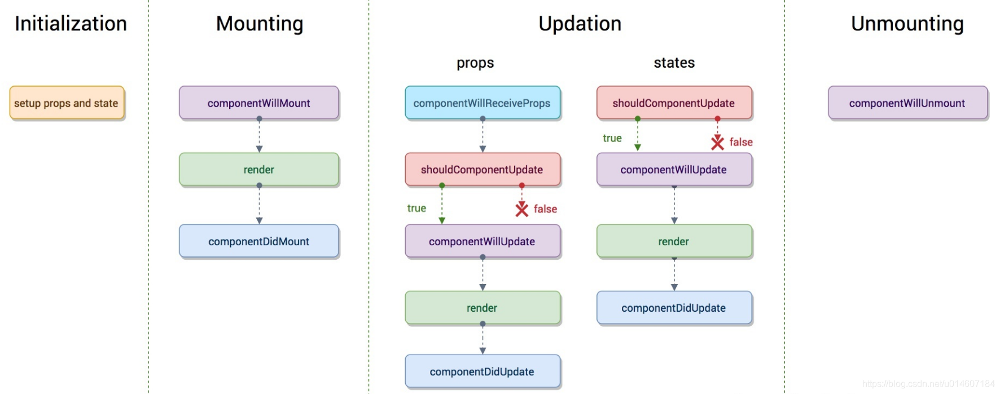
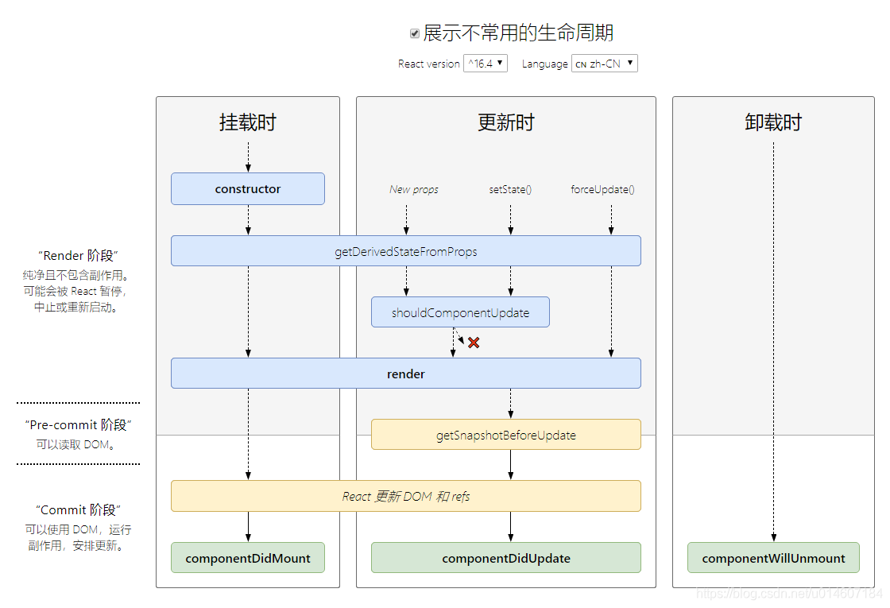
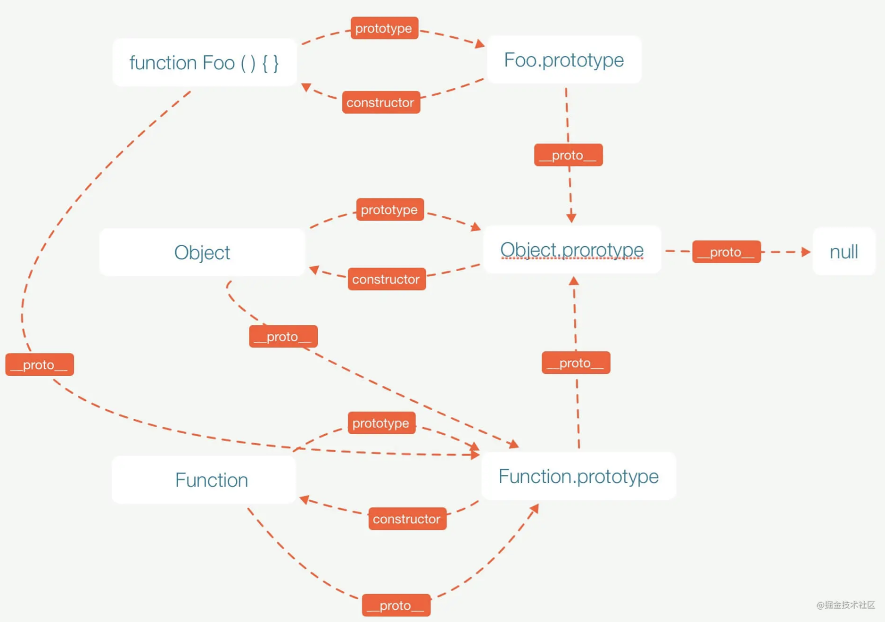
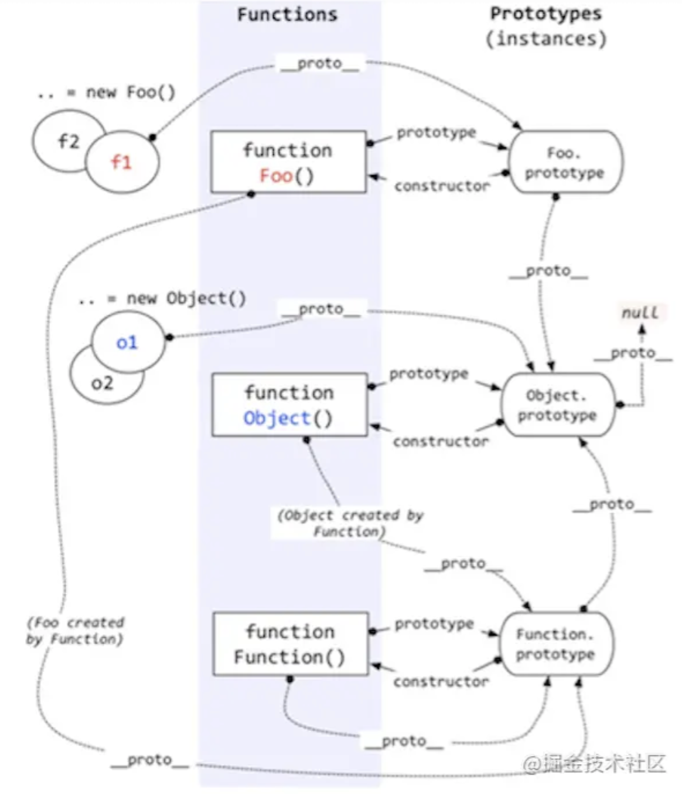

# 总结

## react setState是同步还是异步

setState只在合成事件和钩子函数中是“异步”的，在原生事件和setTimeout 中都是同步的。

### 原因

- 在React的setState函数实现中，会根据一个变量isBatchingUpdates判断是直接更新this.state还是放到队列中回头再说，而isBatchingUpdates默认是false，也就表示setState会同步更新this.state，但是，有一个函数batchedUpdates，这个函数会把isBatchingUpdates修改为true，而当React在调用事件处理函数之前就会调用这个batchedUpdates，造成的后果，就是由React控制的事件处理过程setState不会同步更新this.state 。

- 对于异步渲染，我们应在 getSnapshotBeforeUpdate 中读取 state、props, 而不是 componentWillUpdate。但调用forceUpdate() 强制 render 时，会导致组件跳过 shouldComponentUpdate(),直接调用 render()。

### 注意

- setState的“异步”并不是说内部由异步代码实现，其实本身执行的过程和代码都是同步的，只是合成事件和钩子函数的调用顺序在更新之前，导致在合成事件和钩子函数中没法立马拿到更新后的值，形式了所谓的“异步”，当然可以通过第二个参数 setState(partialState, callback) 中的callback拿到更新后的结果。
- setState 的批量更新优化也是建立在“异步”（合成事件、钩子函数）之上的，在原生事件和setTimeout 中不会批量更新，在“异步”中如果对同一个值进行多次setState，setState的批量更新策略会对其进行覆盖，取最后一次的执行，如果是同时setState多个不同的值，在更新时会对其进行合并批量更新。

### 例子

```js
// setState 参数是对象，如果同时执行多次，只有第一个是有效的（因为React会批处理机制中存储的多个 setState进行合并）
// setState 参数是函数，如果同时执行多次，则都有效（如果需要立马得到值，则可以在setSate传递第二个参数为函数）

class Example extends React.Component {
  constructor() {
    super();
    this.state = {
      val: 0
    };
  }

  componentDidMount() {
    this.setState({val: this.state.val + 1});
    console.log(this.state.val);    // 第 1 次 log

    this.setState({val: this.state.val + 1});
    console.log(this.state.val);    // 第 2 次 log

    setTimeout(() => {
      this.setState({val: this.state.val + 1});
      console.log(this.state.val);  // 第 3 次 log

      this.setState({val: this.state.val + 1});
      console.log(this.state.val);  // 第 4 次 log
    }, 0);
  }

  render() {
    return null;
  }

  // 0 0 2 3
};
```

### 生命周期对比

#### v16.3



#### v16.4-after



## 什么是高阶组件，请举例说明

高阶组件是参数为组件，返回值为新组件的函数。

## 解释一下原型链

### 资料

https://github.com/mqyqingfeng/Blog/issues/2

### 构造函数创建对象

```js
function Person() {

}
var person = new Person();
person.name = 'Kevin';
console.log(person.name) // Kevin
```

在这个例子中，Person 就是一个构造函数，我们使用 new 创建了一个实例对象 person。

### prototype

每个函数都有一个 prototype 属性，就是我们经常在各种例子中看到的那个 prototype ，比如：

```js
function Person() {

}
// 虽然写在注释里，但是你要注意：
// prototype是函数才会有的属性
Person.prototype.name = 'Kevin';
var person1 = new Person();
var person2 = new Person();
console.log(person1.name) // Kevin
console.log(person2.name) // Kevin
```

函数的 prototype 属性指向了一个对象，这个对象正是调用该构造函数而创建的**实例**的原型，也就是这个例子中的 person1 和 person2 的原型。

那什么是原型呢？你可以这样理解：每一个JavaScript对象(null除外)在创建的时候就会与之关联另一个对象，这个对象就是我们所说的原型，每一个对象都会从原型"继承"属性。

让我们用一张图表示构造函数和实例原型之间的关系：


在这张图中我们用 Object.prototype 表示实例原型。

那么我们该怎么表示实例与实例原型，也就是 person 和 Person.prototype 之间的关系呢，这时候我们就要讲到第二个属性：

### __proto__

这是每一个JavaScript对象(除了 null )都具有的一个属性，叫__proto__，这个属性会指向该对象的原型。

为了证明这一点,我们可以在火狐或者谷歌中输入：

```js
function Person() {

}
var person = new Person();
console.log(person.__proto__ === Person.prototype); // true
```

如图：


既然实例对象和构造函数都可以指向原型，那么原型是否有属性指向构造函数或者实例呢？

### Constructor

指向实例倒是没有，因为一个构造函数可以生成多个实例，但是原型指向构造函数倒是有的，这就要讲到第三个属性：constructor，每个原型都有一个 constructor 属性指向关联的构造函数。

```js
function Person() {

}
console.log(Person === Person.prototype.constructor); // true
```

如图：


综上我们已经得出：

```js
function Person() {

}

var person = new Person();

console.log(person.__proto__ == Person.prototype) // true
console.log(Person.prototype.constructor == Person) // true
// 顺便学习一个ES5的方法,可以获得对象的原型
console.log(Object.getPrototypeOf(person) === Person.prototype) // true
```

### 实例与原型

当读取实例的属性时，如果找不到，就会查找与对象关联的原型中的属性，如果还查不到，就去找原型的原型，一直找到最顶层为止。

例子：

```js
function Person() {

}

Person.prototype.name = 'Kevin';

var person = new Person();

person.name = 'Daisy';
console.log(person.name) // Daisy

delete person.name;
console.log(person.name) // Kevin
```

在这个例子中，我们给实例对象 person 添加了 name 属性，当我们打印 person.name 的时候，结果自然为 Daisy。

但是当我们删除了 person 的 name 属性时，读取 person.name，从 person 对象中找不到 name 属性就会从 person 的原型也就是 person.__proto__ ，也就是 Person.prototype中查找，幸运的是我们找到了 name 属性，结果为 Kevin。

### 原型的原型

我们已经讲了原型也是一个对象，既然是对象，我们就可以用最原始的方式创建它，那就是：

```js
var obj = new Object();
obj.name = 'Kevin'
console.log(obj.name) // Kevin
```

其实原型对象就是通过 Object 构造函数生成的，结合之前所讲，实例的 __proto__ 指向构造函数的 prototype ，所以我们再更新下关系图：


### 原型链

那 Object.prototype 的原型呢？null?

null 表示“没有对象”，即该处不应该有值。

```js
console.log(Object.prototype.__proto__ === null) // true
```

所以 Object.prototype.__proto__ 的值为 null 跟 Object.prototype 没有原型，其实表达了一个意思。

所以查找属性的时候查到 Object.prototype 就可以停止查找了。


图中由相互关联的原型组成的链状结构就是原型链，也就是蓝色的这条线。

### 总结



### 补充

#### constructor

```js
function Person() {

}
var person = new Person();
console.log(person.constructor === Person); // true
```

当获取 person.constructor 时，其实 person 中并没有 constructor 属性,当不能读取到constructor 属性时，会从 person 的原型也就是 Person.prototype 中读取，正好原型中有该属性，所以：

```js
person.constructor === Person.prototype.constructor
```

#### __proto__

其次是 __proto__ ，绝大部分浏览器都支持这个非标准的方法访问原型，然而它并不存在于 Person.prototype 中，实际上，它是来自于 Object.prototype ，与其说是一个属性，不如说是一个 getter/setter，当使用 obj.__proto__ 时，可以理解成返回了 Object.getPrototypeOf(obj)。

#### 真的是继承吗？

最后是关于继承，前面我们讲到“每一个对象都会从原型‘继承’属性”，实际上，继承是一个十分具有迷惑性的说法，引用《你不知道的JavaScript》中的话，就是：

继承意味着复制操作，然而 JavaScript 默认并不会复制对象的属性，相反，JavaScript 只是在两个对象之间创建一个关联，这样，一个对象就可以通过委托访问另一个对象的属性和函数，所以与其叫继承，委托的说法反而更准确些。

## instanceof原理

### typeof 实现原理

`typeof` 一般被用于判断一个变量的类型，我们可以利用 `typeof` 来判断`number`,  `string`,  `object`,  `boolean`,  `function`, `undefined`,  `symbol` 这七种类型，这种判断能帮助我们搞定一些问题，比如在判断不是 object 类型的数据的时候，`typeof`能比较清楚的告诉我们具体是哪一类的类型。但是，很遗憾的一点是，`typeof` 在判断一个 object的数据的时候只能告诉我们这个数据是 object, 而不能细致的具体到是哪一种 object, 比如👉

```js
let s = new String('abc');
typeof s === 'object'// true
s instanceof String // true
```

要想判断一个数据具体是哪一种 object 的时候，我们需要利用 `instanceof` 这个操作符来判断。

来谈谈关于 `typeof` 的原理吧，我们可以先想一个很有意思的问题，js 在底层是怎么存储数据的类型信息呢？或者说，一个 js 的变量，在它的底层实现中，它的类型信息是怎么实现的呢？

其实，js 在底层存储变量的时候，会在变量的机器码的低位1-3位存储其类型信息👉

- 000：对象
- 010：浮点数
- 100：字符串
- 110：布尔
- 1：整数

但是对于 `undefined` 和 `null` 来说，这两个值的信息存储是有点特殊的。

- `null`：所有机器码均为0
- `undefined`：用 −2^30 整数来表示

所以，`typeof` 在判断 `null` 的时候就出现问题了，由于 `null` 的所有机器码均为0，因此直接被当做了对象来看待。

用 `instanceof` 来判断的话👉

```js
null instanceof null // TypeError: Right-hand side of 'instanceof' is not an object
```

`null` 直接被判断为不是 object，这也是 JavaScript 的历史遗留bug，参考[typeof](https://link.juejin.cn/?target=https%3A%2F%2Fdeveloper.mozilla.org%2Fzh-CN%2Fdocs%2FWeb%2FJavaScript%2FReference%2FOperators%2Ftypeof)。

因此在用 `typeof` 来判断变量类型的时候，我们需要注意，最好是用 `typeof` 来判断基本数据类型（包括`symbol`），避免对 null 的判断。

还有一个不错的判断类型的方法，就是**Object.prototype.toString**，我们可以利用这个方法来对一个变量的类型来进行比较准确的判断

```js
Object.prototype.toString.call(1) // "[object Number]"

Object.prototype.toString.call('hi') // "[object String]"

Object.prototype.toString.call({a:'hi'}) // "[object Object]"

Object.prototype.toString.call([1,'a']) // "[object Array]"

Object.prototype.toString.call(true) // "[object Boolean]"

Object.prototype.toString.call(() => {}) // "[object Function]"

Object.prototype.toString.call(null) // "[object Null]"

Object.prototype.toString.call(undefined) // "[object Undefined]"

Object.prototype.toString.call(Symbol(1)) // "[object Symbol]"
```

### instanceof 操作符的实现原理

之前提到了 `instanceof` 来判断对象的具体类型，其实 `instanceof` 主要的作用就是判断**一个实例是否属于某种类型**。

```js
let person = function () {
}
let nicole = new person()
nicole instanceof person // true
```

当然，`instanceof` 也可以判断一个实例是否是其父类型或者祖先类型的实例。

```js
let person = function () {
}
let programmer = function () {
}
programmer.prototype = new person()
let nicole = new programmer()
nicole instanceof person // true
nicole instanceof programmer // true
```

这是 `instanceof` 的用法，但是 `instanceof` 的原理是什么呢？根据 ECMAScript 语言规范，我梳理了一下大概的思路，然后整理了一段代码如下:

```js
function new_instance_of(leftVaule, rightVaule) { 
      // 取右表达式的 prototype 值
    let rightProto = rightVaule.prototype;

      // 取左表达式的__proto__值
    leftVaule = leftVaule.__proto__; 

    while (true) {
        if (leftVaule === null) {
            return false;    
        }
        if (leftVaule === rightProto) {
            return true;    
        } 
        leftVaule = leftVaule.__proto__ 
    }
}
```

其实 `instanceof` 主要的实现原理**就是只要右边变量的 `prototype` 在左边变量的原型链上即可**。因此，`instanceof` 在查找的过程中会遍历左边变量的原型链，直到找到右边变量的 `prototype`，如果查找失败，则会返回 false，告诉我们左边变量并非是右边变量的实例。

举🌰

```js
function Foo() {
}

Object instanceof Object // true
Function instanceof Function // true
Function instanceof Object // true
Foo instanceof Foo // false
Foo instanceof Object // true
Foo instanceof Function // true
```

要想全部理解 `instanceof` 的原理，除了我们刚刚提到的实现原理，我们还需要知道 JavaScript 的原型继承原理。

关于原型继承的原理，如图：



我们知道每个 JavaScript 对象均有一个隐式的 `__proto__` 原型属性，而显式的原型属性是 `prototype`，只有 `Object.prototype.__proto__` 属性在未修改的情况下为 null 值。根据图上的原理，我们来梳理上面提到的几个有趣的 `instanceof` 使用的例子。

- Object instanceof Object
  
  由图可知，Object 的 `prototype` 属性是 `Object.prototype`, 而由于 Object 本身是一个函数，由 Function 所创建，所以 `Object.__proto__` 的值是 `Function.prototype`，而 `Function.prototype` 的 `__proto__` 属性是 `Object.prototype`，所以我们可以判断出，`Object instanceof Object` 的结果是 true 。
  
  ```js
  leftValue = Object.__proto__ = Function.prototype;
  rightValue = Object.prototype;
  // 第一次判断
  leftValue != rightValue
  leftValue = Function.prototype.__proto__ = Object.prototype
  // 第二次判断
  leftValue === rightValue
  // 返回 true
  ```

- Function instanceof Function
  
  ```js
  leftValue = Function.__proto__ = Function.prototype;
  rightValue = Function.prototype;
  // 第一次判断
  leftValue === rightValue
  // 返回 true
  ```

- Function instanceof Object
  
  ```js
  leftValue = Function.__proto__ = Function.prototype;
  rightValue = Object.prototype;
  // 第一次判断
  leftValue !== rightValue
  leftValue = Function.prototype.__proto__ = Object.prototype
  // 第二次判断
  leftValue === rightValue
  // 返回 true
  ```

- Foo instanceof Foo
  
  Foo 函数的 `prototype` 属性是 `Foo.prototype`，而 Foo 的 `__proto__` 属性是 `Function.prototype`，由图可知，Foo 的原型链上并没有 `Foo.prototype` ，因此 `Foo instanceof Foo` 也就返回 false 。
  
  ```js
  leftValue = Foo, rightValue = Foo
  leftValue = Foo.__proto = Function.prototype
  rightValue = Foo.prototype
  // 第一次判断
  leftValue != rightValue
  leftValue = Function.prototype.__proto__ = Object.prototype
  // 第二次判断
  leftValue != rightValue
  leftValue = Object.prototype.__proto__ = null
  // 第三次判断
  leftValue === null
  // 返回 false
  ```

- Foo instanceof Object
  
  ```js
  leftValue = Foo, rightValue = Object
  leftValue = Foo.__proto__ = Function.prototype
  rightValue = Object.prototype
  // 第一次判断
  leftValue != rightValue
  leftValue = Function.prototype.__proto__ = Object.prototype
  // 第二次判断
  leftValue === rightValue
  // 返回 true 
  ```

- Foo instanceof Function
  
  ```js
  leftValue = Foo, rightValue = Function
  leftValue = Foo.__proto__ = Function.prototype
  rightValue = Function.prototype
  // 第一次判断
  leftValue === rightValue
  // 返回 true 
  ```

### 总结

简单来说，我们使用 `typeof` 来判断基本数据类型是 ok 的，不过需要注意当用 `typeof` 来判断 `null` 类型时的问题，如果想要判断一个对象的具体类型可以考虑用 `instanceof`，但是 `instanceof` 也可能判断不准确，比如一个数组，他可以被 `instanceof` 判断为 Object。所以我们要想比较准确的判断对象实例的类型时，可以采取 `Object.prototype.toString.call` 方法。

## apply和call的作用及区别

作用都是改变函数执行时内部this的指向，不同点是函数的传参方式，call接受的是一个参数列表，apply接受的是一个包含多个参数的数组。

[资料](https://segmentfault.com/a/1190000018017796)

## position有哪些值，作用分别是什么

static(静态):html元素的默认值，不受top、bottom、left、right属性影响，元素出现在正常文档流中；

relative（相对）：相对定位

特点：不脱离文档流的布局，受 top、bottom、left、right属性影响，只改变自身的位置，在文档流原先的位置遗留空白区域。定位的起始位置为此元素原先在文档流的位置。

absolute（绝对）：绝对定位

特点：脱离文档流的布局，遗留下来的空间由后面的元素填充。定位的起始位置为最近的父元素（position不为static），否则为HTML文档本身。

fixed（固定）：固定定位

特点：类似于absolute，但不随着滚动条的移动而改变位置。元素的位置相对于浏览器窗口是固定位置。

## DOM树的理解

DOM（Document Object Model）即文档对象模型

- DOM树揭示了DOM对象之间的层次关系，这样就方便动态地对html文档进行增删改查。

- 增删改查必须要遵循层次关系

- 文本对象是最底层的节点

- 获取 对象的值 .value

[资料](https://blog.poetries.top/browser-working-principle/guide/part5/lesson22.html#%E4%BB%80%E4%B9%88%E6%98%AF-dom)

## 重排和重绘是什么，有什么区别

[资料](https://juejin.cn/post/6844904083212468238)

### 重绘不一定需要重排(回流)，重排必须会导致重绘

- 重排：当渲染树的一部分必须更新并且节点的尺寸发生了变化，浏览器会使渲染树中受到影响的部分失效，并重新构造渲染树。
  
  - 添加、删除可见的DOM；
  - 元素的位置改变；
  - 元素的尺寸改变（外边距、内边距、边框厚度、宽度等几何属性）；
  - 页面渲染初始化；
  - 浏览器窗口尺寸改变；

- 重绘：是在一个元素的外观被改变所触发的浏览器行为，浏览器会根据元素的新属性重新绘制，使元素呈现新的外观。
  
  - 比如background-color,这些属性只是影响元素的外观，风格，而不会影响布局。

### 减少reflow(重排/回流)，repaint(重绘)

- 不要一条一条的修改DOM样式，可以先定义好CSS的class，然后修改DOM的className。

- 不要把DOM节点的属性值放在一个循环里当成循环里的变量。

- 为动画的HTML元素适用fixed或absolute的position，那么修改它们的CSS是不会reflow（因为脱离文档流）。

### 回流

当render tree中的一部分（或全部）因为元素的规模尺寸，布局，隐藏等改变而需要重新构建。每个页面至少需要回流一次，在页面第一次加载的时候。完成回流后，浏览器会重新绘制受影响的部分到屏幕中 ，该过程称为重绘。

回流必将引起重绘，而重绘不一定会引起回流。eg: 只有颜色改变的时候就只会发生重绘而不会引起回流。

# js

## 继承

https://github.com/mqyqingfeng/Blog/issues/16

## 作用域

https://github.com/mqyqingfeng/Blog/issues/6

## 闭包

https://github.com/mqyqingfeng/Blog/issues/9

## 变量提升

https://github.com/mqyqingfeng/Blog/issues/5

变量对象会包括：

- 函数的所有形参 (如果是函数上下文)
  
  - 由名称和对应值组成的一个变量对象的属性被创建
  - 没有实参，属性值设为 undefined

- 函数声明
  
  - 由名称和对应值（函数对象(function-object)）组成一个变量对象的属性被创建
  - 如果变量对象已经存在相同名称的属性，则完全替换这个属性

- 变量声明
  
  - 由名称和对应值（undefined）组成一个变量对象的属性被创建；
  - 如果变量名称跟已经声明的形式参数或函数相同，则变量声明不会干扰已经存在的这类属性

## this指向

https://github.com/mqyqingfeng/Blog/issues/7

## 立即执行函数

https://segmentfault.com/a/1190000003985390

## instanceof 原理

https://juejin.cn/post/6844903613584654344

## bind 模拟实现

https://github.com/mqyqingfeng/Blog/issues/12

## new 模拟实现

https://github.com/mqyqingfeng/Blog/issues/13

## call和apply 模拟实现

https://github.com/mqyqingfeng/Blog/issues/11

- [ ] ## 柯里化

https://github.com/mqyqingfeng/Blog/issues/42

## v8垃圾回收机制

https://juejin.cn/post/6844904016325902344

## 浮点数精度

https://github.com/mqyqingfeng/Blog/issues/155

## 事件循环

https://zhuanlan.zhihu.com/p/33058983

## promise原理

https://juejin.cn/post/6844904063570542599

# css

## 盒子模型

https://segmentfault.com/a/1190000013069516

## css选择器

https://segmentfault.com/a/1190000013424772

### 伪类与伪元素的区别

https://juejin.cn/post/6844903810951806989

## BFC

https://zhuanlan.zhihu.com/p/25321647

## position

https://developer.mozilla.org/zh-CN/docs/Learn/CSS/CSS_layout/Positioning

## flex布局

https://developer.mozilla.org/zh-CN/docs/Web/CSS/CSS_Flexible_Box_Layout/Basic_Concepts_of_Flexbox

## css优先级

https://zhuanlan.zhihu.com/p/41604775

## 圣杯布局和双飞翼布局

https://juejin.cn/post/6844903817104850952

## css3新特性

https://segmentfault.com/a/1190000010780991

## css样式隔离

https://juejin.cn/post/6844904034281734151#heading-9

## css性能优化

https://blog.csdn.net/weixin_43883485/article/details/103504171

## 层叠上下文

https://www.zhangxinxu.com/wordpress/2016/01/understand-css-stacking-context-order-z-index/

## div居中

https://juejin.cn/post/6844903821529841671

## css吸顶吸底

https://segmentfault.com/a/1190000037641853

## 浮动

https://segmentfault.com/a/1190000012739764

# react

## useMemo和useEffect有什么区别？怎么使用useMemo?

useMemo， useCallback是在dom更新前触发的，

useEffect是在dom更新之后触发的。

- 相当于生命周期函数`componentDidMount`, `componentDidUpdate`, `componentWillUnmount`的组合。
- 可以返回一个函数(`cleanup`)用于清理。

https://www.jianshu.com/p/94ace269414d

## 合成事件

- 原生事件: 在 `componentDidMount生命周期`里边进行`addEventListener`绑定的事件
- 合成事件: 通过 JSX 方式绑定的事件，比如 `onClick={() => this.handle()}`

https://juejin.cn/post/6844903988794671117

## Virtual DOM

https://segmentfault.com/a/1190000019994425

## setState

https://juejin.cn/post/6844903781813993486

- [ ] ## fiber

https://zhuanlan.zhihu.com/p/57346388

https://github.com/HuJiaoHJ/blog/issues/7

- [ ] ## 高阶组件

https://zhuanlan.zhihu.com/p/24776678

- [ ] ## 错误处理

https://github.com/HuJiaoHJ/blog/issues/12

## 性能优化

https://github.com/brickspert/blog/issues/36

# html & 浏览器

## 跨标签页通信

https://juejin.cn/post/6844903811232825357

## hash模式和 history模式

https://blog.csdn.net/Charissa2017/article/details/104779412

## 缓存策略

https://juejin.cn/post/6844903593275817998

# 性能

https://github.com/zoro-web/blog/issues/11

## 前端性能优化指标RAIL

https://juejin.cn/post/6850037273312886797

## 前端性能优化手段

https://alienzhou.com/projects/fe-performance-journey/#%E5%89%8D%E7%AB%AF%E9%9C%80%E8%A6%81%E6%80%A7%E8%83%BD%E4%BC%98%E5%8C%96%E4%B9%88%EF%BC%9F


## 预渲染

https://tech.meituan.com/2018/11/15/first-contentful-paint-practice.html

- [ ] ## 从 URL 输入到页面展现到底发生了什么？

https://www.jianshu.com/p/d616d887953a

## 白屏

https://cloud.tencent.com/developer/article/1508941

- [ ] ## 大量图片加载优化

https://zhuanlan.zhihu.com/p/33370207

# 工程

## 模块化机制

https://segmentfault.com/a/1190000017466120

## tree shaking

https://juejin.cn/post/6844903544756109319

## uglify

https://www.h5w3.com/19480.html

## babel原理

https://bobi.ink/2019/10/01/babel/

## webpack工作流程

https://developer.aliyun.com/article/61047

## webpack-插件机制

https://juejin.cn/post/6844903789804126222
