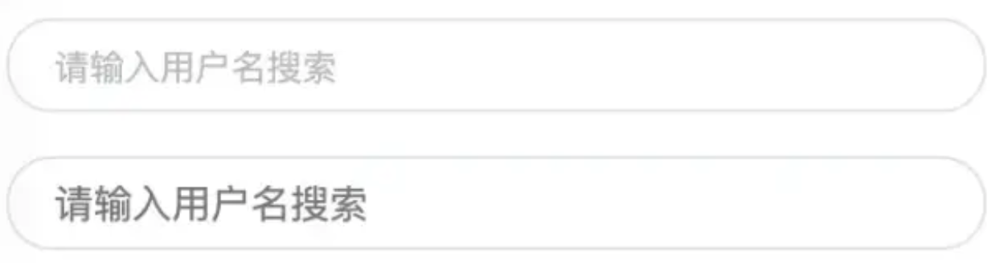
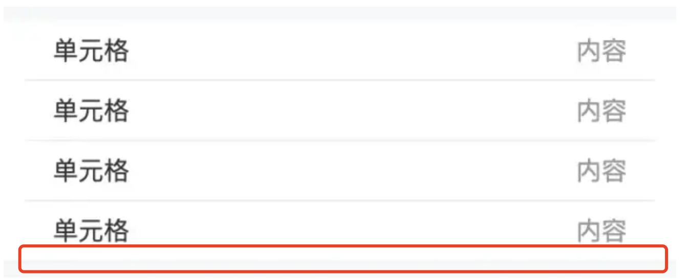
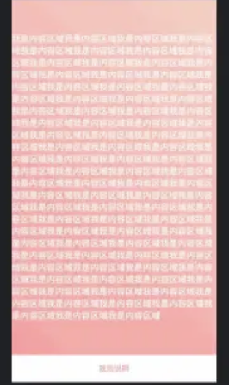
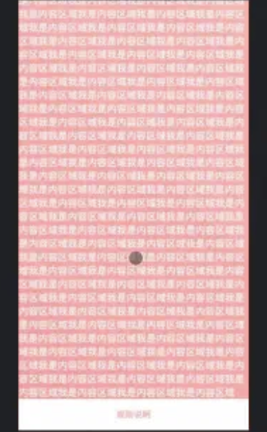
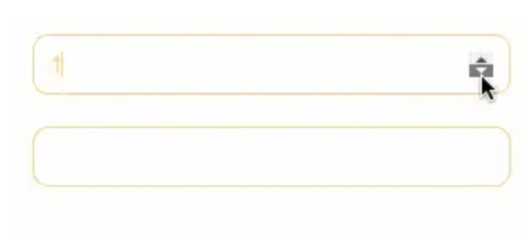

# 日常开发问题总结

## js

#### Date对象

#### 获取当前时间毫秒

```js
// 方式一
Date.now(); // 1606381881650

// 方式二
new Date() - 0; // 1606381881650

// 方式三
new Date().getTime() // 1606381881650
```

#### 创建`Date`对象的兼容性问题

```js
// window和安卓支持，ios和mac不支持
new Date('2020-11-26'); 

// window和安卓支持，ios和mac支持
new Date('2020/11/26');
```

#### 判断是不是工作日

```js
/**
 * 判断是不是工作日
 * getDay() 方法根据本地时间，返回一个具体日期中一周的第几天，
 * 0 表示星期天。对于某个月中的第几天，参考
 */
const isWeekday= (date) => {
    return date.getDay() % 6 !== 0
}

// false
console.log(isWeekday(new Date(2021, 11, 10)))
```

### 解决输入法与键盘事件冲突

```js
// 是否为输入法操作
const isOnCompositionRef = React.useRef<boolean>(false)

// 解决输入法与键盘事件冲突
const handleCompositionStart = () => {
  isOnCompositionRef.current = true
}
const handleCompositionEnd = () => {
  isOnCompositionRef.current = false
}

// 键盘事件
const handleKeyDown = React.useCallback((e: KeyboardEvent<HTMLInputElement>) => {
  // 解决输入法与键盘事件冲突
  if (isOnCompositionRef.current) {
    return
  }

  // ...
}

// 标签
<Input
  // 其他属性

  onCompositionStart={handleCompositionStart}
  onCompositionEnd={handleCompositionEnd}
/>
```

### 实现多行标签展开/收起(类似于淘宝和京东的浏览历史)

```tsx
import React from 'react';

const RowsTagsDemo = () => {
  const [originHistoryList, setOriginHistoryList] = React.useState<string[]>([]);
  const [historyList, setHistoryList] = React.useState<string[]>([]);
  const contentRef = React.useRef<HTMLDivElement>(null);
  const [showMore, setShowMore] = React.useState<boolean>(false);
  const [initNumber, setInitNumber] = React.useState<number>(0);

  React.useEffect(() => {
    const newList = getLocalStorage('NewSearchHistory');
    setOriginHistoryList(newList || []);
  }, []);

  // 计算高度
  React.useEffect(() => {
    if (contentRef && contentRef.current) {
      let idx = 0;
      let count = 0;
      const childNodes = contentRef.current?.childNodes || [];

      childNodes.forEach((item: any, index: number) => {
        if (item?.offsetLeft === 16) {
          count++;

          if (count === 3 && index !== childNodes.length - 1) {
            idx = index + 1;

            setInitNumber(idx);
            setShowMore(true);
          }
        }
      });

      if (idx > 0) {
        setHistoryList(originHistoryList.slice(0, idx));
      } else {
        setHistoryList(originHistoryList);
      }
    }
  }, [contentRef && contentRef.current, originHistoryList]);

  // ******** 操作 ********
  const handleDelete = () => {
    setOriginHistoryList([]);
  };

  const handleTriggle = () => {
    setShowMore(false);

    setHistoryList(originHistoryList);
  };

  // ******** 渲染 ********
  const renderTags = () => {
    return historyList.map((item: string, index: number) => {
      return (
        <div
          className={c(s.tag, {
            [s.tagSpecial]: index === initNumber - 1,
          })}
          key={`${item}-${index}`}
        >
          {item}
        </div>
      );
    });
  };

  const renderTriggleBtn = () => {
    if (!showMore) {
      return null;
    }

    return <div className={s.triggle} onClick={handleTriggle} />;
  };

  const renderHistory = () => {
    if (!originHistoryList.length) {
      return null;
    }

    return (
      <div className={s.historyWrap}>
        <div className={s.title}>
          <div className={s.titleText}>{'搜索历史'}</div>
          <div className={s.delete} onClick={handleDelete} />
        </div>

        <div className={s.content} ref={contentRef}>
          {renderTags()}

          {renderTriggleBtn()}
        </div>
      </div>
    );
  };

  return renderHistory();
};

export default RowsTagsDemo;
```

## css

### 隐藏滚动条

```scss
.demo::-webkit-scrollbar {
  width: 0;
  display: none;
}

.demo {
  scrollbar-width: none; /* firefox */
  -ms-overflow-style: none; /* IE 10+ */
  overflow-x: hidden;
  overflow-y: auto;
}
```

### flex省略号在ios手机失效处理

```scss
// 普通单行省略号
.ellipsis {
  overflow: hidden;
  white-space: nowrap;
  text-overflow: ellipsis;
}

// flex（自适应单行省略号）(手机端)
.ellipsis {
  flex: 1;
  // 很关键，否则省略号不生效
  width: 0;
  overflow: hidden;

  .ellipsis-text {
    display: -webkit-box;
    word-break: break-all;
    text-overflow: ellipsis;
    overflow: hidden;
    -webkit-box-orient: vertical;
    -webkit-line-clamp: 1;
  }
}
```

### 禁止复制(h5)

```scss
* {
  -webkit-touch-callout: none;
  -webkit-user-select: none;
  -khtml-user-select: none;
  -moz-user-select: none;
  -ms-user-select: none;
  user-select: none;
}

// 排除input与textarea, 否则ios不能输入
[contenteditable="true"], input, textarea {
  -webkit-user-select: auto!important;
  -khtml-user-select: auto!important;
  -moz-user-select: auto!important;
  -ms-user-select: auto!important;
  -o-user-select: auto!important;
  user-select: auto!important;
}
```

### 解决图片5px间距

```html
<div class="img-container">
  
</div>
```

```scss
html,body {
  margin: 0;
  padding: 0;
}

.img-container {
  background-color: lightblue;
}

img {
  width: 100%;
}

// 方法一：给父元素设置font-size: 0
.img-container {
  font-size: 0;
}

// 方法二：给img设置display: block
.img {
    display: block;
}


// 方法三：vertical-align: bottom
.img {
    vertical-align: bottom;
}

// 方法四：给父元素设置line-height: 5px;
.img-container {
  line-height: 5px;
```

### 元素高度跟随窗口

> 有时候希望某个元素的高度和窗口是一致的，如果用百分比设置，那html、body等元素也要跟着一顿设置`height: 100%`有没有更简单的方法呢？

```html
<div class="app"> 
  <div class="child"></div>
</div>
```

```scss
* { 
  margin: 0; 
  padding: 0;
}

.child { 
  width: 100%; 
  /*关键css*/ 
  height: 100vh; 
  background-image: linear-gradient(180deg, #2af598 0%, #009efd 100%);
}
```

### 修改input placeholder样式

效果：



```html
<input type="text" class="placehoder-custom" placeholder="请输入用户名搜索">
<input type="text" placeholder="请输入用户名搜索">
```

```scss
input{ 
  width: 300px; 
  height: 30px; 
  border: none; 
  outline: none; 
  display: block;
  margin: 15px; 
  border: solid 1px #dee0e9; 
  padding: 0 15px; 
  border-radius: 15px;
}

.placehoder-custom::-webkit-input-placeholder{ 
  color: #babbc1;  
  font-size: 12px;
}
```

### 巧用not选择器

效果：



```html
<ul> 
  <li>    
    <span>单元格</span>  
    <span>内容</span>  
  </li>  
  <li>    
    <span>单元格</span>   
    <span>内容</span>   
  </li>  
  <li>    
    <span>单元格</span>   
    <span>内容</span>  
  </li>  
  <li>   
    <span>单元格</span>   
    <span>内容</span>  
  </li>
</ul>
```

```scss
li:not(:last-child){
  border-bottom: 1px solid #ebedf0;
}
```

### 使用flex布局实现智能固定底部

效果：





```html
<div class="container"> 
  <div class="main">我是内容区域</div> 
  <div class="footer">规则说明</div>
</div>
```

```scss
 .container{ 
   height: 100vh; 
   /* 关键css处 */ 
   display: flex;
   flex-direction: column; 
   justify-content: space-between;
}

.main{ 
  /* 关键css处 */ 
  flex: 1; 
  background-image: linear-gradient(45deg, #ff9a9e 0%, #fad0c4 99%, #fad0c4 100%); 
  display: flex; 
  align-items: center; 
  justify-content: center; 
  color: #fff;
}

.footer{ 
  flex-shrink: 0;
  padding: 15px 0; 
  text-align: center; 
  color: #ff9a9e; 
  font-size: 14px;
}
```

### 使用caret-color改变光标颜色

> 在做表单相关需求的时候，有时候需要修改一闪一闪光标的颜色。`caret-color`属性完美支持这个需求。

```html
<input type="text" class="caret-color" />
```

```scss
.caret-color {
  /* 关键css */ 
  caret-color: #ffd476;
}
```

### 移除`type="number"`尾部的箭头

效果：



```html
<input type="number" />
<input type="number" class="no-arrow" />
```

```scss
/* 关键css */
.no-arrow::-webkit-inner-spin-button { 
  -webkit-appearance: none;
}
```

### `outline:none`移除input状态线

> 输入框选中时，默认会带蓝色状态线，使用`outline:none`一键移除

### 解决IOS滚动条卡顿

> 在IOS机器上，经常遇到元素滚动时卡顿的情况，只需要一行css即可让其支持弹性滚动

```scss
body,html{   
  -webkit-overflow-scrolling: touch;
}
```

### 画三角形

```html
<div class="box"> 
  <div class="box-inner">  
    <div class="triangle bottom"></div>  
    <div class="triangle right"></div>  
    <div class="triangle top"></div>   
    <div class="triangle left"></div> 
  </div>
</div>
```

```scss
.triangle {
  display: inline-block; 
  margin-right: 10px; 
  /* 基础样式 */ 
  border: solid 10px transparent;
}

/*下*/
.triangle.bottom { 
  border-top-color: #0097a7;
}

/*上*/
.triangle.top { 
  border-bottom-color: #b2ebf2;
}

/*左*/
.triangle.left { 
  border-right-color: #00bcd4;
}

/*右*/
.triangle.right { 
  border-left-color: #009688;
}
```

### 画小箭头

```html
<div class="box"> 
  <div class="box-inner">   
    <div class="arrow bottom"></div>  
    <div class="arrow top"></div> 
    <div class="arrow right"></div> 
    <div class="arrow left"></div> 
  </div>
</div>
```

```scss
.arrow {  
    display: inline-block; 
    margin-right: 10px;   
    /* 基础样式 */  
    width: 0;   
    height: 0; 
    /* 基础样式 */  
    border: 16px solid;  
    border-color: transparent #CDDC39 transparent transparent;   
    position: relative; 
} 

.arrow::after {  
  content: "";  
  position: absolute;   
  /* 通过位移覆盖背景 */  
  right: -20px;   
  top: -16px;  
  border: 16px solid;  
  border-color: transparent #fff transparent transparent; 
} 
/*下*/  
.arrow.bottom {   
  transform: rotate(270deg);
} 
/*上*/ 
.arrow.top {  
  transform: rotate(90deg); 
} 
/*左*/ 
.arrow.left {   
  transform: rotate(180deg); 
} 
/*右*/  
.arrow.right { 
  transform: rotate(0deg); 
}
```

### 图片尺寸自适应

```html
<div class="box"> 
  <div class="img-container">  
     
  </div>
</div>

<div class="box">  
  <div class="img-container">  
    
  </div>
</div>

<div class="box-vw"> 
  <div class="img-container">  
     
  </div>
</div>
```

```scss
.box, .box-vw{ 
  background-color: #f5f6f9; 
  border-radius: 10px; 
  overflow: hidden; 
  margin-bottom: 15px;
}

.box:nth-of-type(2){ 
  width: 260px;
}
/* vw方案 */
.box-vw .img-container{ 
  width: 100vw; 
  height: 66.620879vw; 
  padding-bottom: inherit;
}
/* padding方案 */
.img-container{ 
  width: 100%; 
  height: 0; 
  /* 图片的高宽比 */ 
  padding-bottom: 66.620879%;
}

img{
  width: 100%;
}
```

### 自定义文本选中的样式

```html
<div class="box">
  <p class="box-default">   
    昨天遇见小学同学，没有想到他混的这么差--只放了一块钱到我的碗里 
  </p> 
  <p class="box-custom"> 
    今年情人节，不出意外的话，一个人过，出意外的话--去医院过 
  </p>
</div>
```

```scss
.box-custom::selection { 
  color: #ffffff; 
  background-color: #ff4c9f;
}
```

### 单行文本溢出显示省略号

```scss
.one-line-ellipsis {
  overflow: hidden;
  white-space: nowrap;
  text-overflow: ellipsis;
  /* 非必须，只是为了制造一行放不下的效果 */
  max-width: 375px; 
}
```

### 多行文本溢出显示省略号

```scss
// 存在兼容性问题，只在chrome生效

.more-line-ellipsis { 
  overflow: hidden; 
  text-overflow: ellipsis; 
  display: -webkit-box; 
  /* 设置n行，也包括1 */ 
  -webkit-line-clamp: 2; 
  -webkit-box-orient: vertical;
}
```

### 使用filter:grayscale(1)使网页呈现哀悼模式

```scss
body {
  filter: grayscale(1);
}
```
