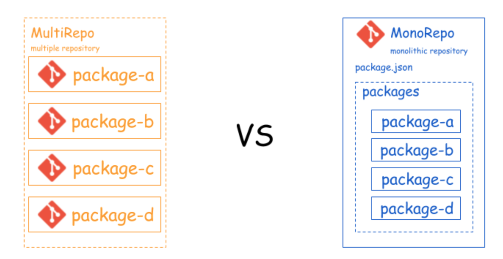

## lerna

Lerna 是一个管理工具，用于管理包含多个软件包（package）的 JavaScript 项目。

[官网](https://lernajs.bootcss.com/)

[概念 | Lerna](http://www.febeacon.com/lerna-docs-zh-cn/routes/basic/concepts.html)

## **Multirepo** 和 ***Monorepo***

- Multirepo - package是单独用一个仓库维护即**多项目多仓库**的形式。
- Monorepo - 使用一个项目仓库Repo中管理多个模块/包Package。

### 图谱



### Multirepo

- 优点
  
  - 各模块管理自由度较高，可自行选择构建工具，依赖管理，单元测试等配套设施。
  
  - 各模块体积一般不会太大。

- 缺点
  
  - 仓库分散不好找，当很多时，更加困难，分支管理混乱。
  - 版本更新繁琐，如果公共模块的版本发生了变化，需要对所有的模块进行依赖的更新。
  - CHANGELOG 梳理移除折腾，无法很好的自动关联各个模块的变动联系，基本靠口口相传。

### Monorepo

- 优点
  - 一个仓库维护多个模块，不用到处找仓库。
  - 方便版本管理和依赖管理，模块之间的引用，调试都非常方便，配合相应工具，可以一条命令全搞定。
  - 方便统一生产CHANGELOG，配合提交规范，可以在发布时自动生产CHANGELOG。
- 缺点
  - 统一构建工具，对构建工具提出了更高要求，要能构建各种相关模块。
  - 仓库体积会变大。

## Lerna 命令

```js
// 初始化项目
lerna init

// 创建包
// 创建 package
lerna create
// 安装依赖
lerna add
// 链接依赖
lerna link

// 开发和测试
// 执行 shell 脚本
lerna exec
// 执行 npm 命令
lerna run
// 清空依赖
lerna clean
// 重新安装依赖
lerna bootstrap

// 发布上线
// 修改版本号
lerna version
// 查看上个版本以来的所有变更
lerna changed
// 查看 diff
lerna diff
// 发布项目
lerna publish

// 列出当前 Lerna 仓库中的所有公共软件包（public packages）
lerna ls
```
