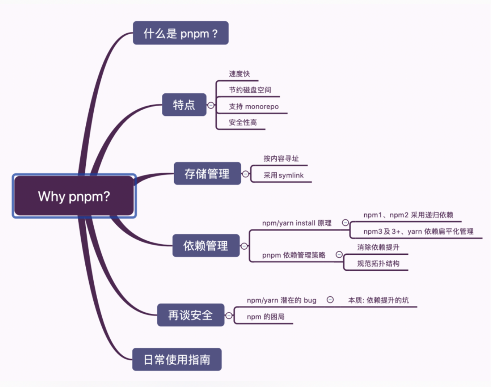

# nvm （node版本管理工具）

## nvm

[github](https://github.com/nvm-sh/nvm)

```bash
# 使用系统下载的node版本
nvm use system

# 使用具体的版本号
nvm use <version>

# 下载具体的版本号
nvm install <version>

# 查看nvm列表
nvm ls

# 设置node默认版本
nvm alias default <version>
```

## tnvm (不需要翻墙)

https://github.com/aliyun-node/tnvm

https://github.com/aliyun-node/tnvm/issues/38

```bash
curl https://raw.githubusercontent.com/aliyun-node/tnvm/master/install.sh | bash

~/.bash_profile 或 ~/.profile

source ~/.bash_profile
# 重新启动iterm
```

# npm、yarn、pnpm node包管理工具

## npm

全称Node Package Manager

### 使用：

```bash
# 查看 npm 的版本 
npm -v

# 查看各个命令的简单用法
npm -l

# 查看 npm 命令列表
npm help

# 查看 npm 的配置
npm config list -l
# 查看当前源
npm config get registry
# 切换npm源
npm config set registry <npm源>

# 创建模块 (初始化生成一个新的package.json文件)
# 尾缀带-f（代表force）、-y（代表yes），则跳过提问阶段，直接生成一个新的package.json文件，不带尾缀的话，默认有提问阶段。
npm init 

# 设置环境变量
npm set
# 🌰
npm set int-author-name 'my name jerry'
set init-author-email '12345@qq.com'
set init-author-url 'http://yourdomain.com'
npm set init-license 'MIT'
# 执行了以上的修改，此时 Package.json并没有发生变化
# npm init 设置后执行init才是真正修改成功

# 搜索模块(npm search命令用于搜索npm仓库，它后面可以跟字符串，也可以跟正则表达式)
npm search <搜索词> [-g]


# npm list 查看模块
# 当前项目安装的所有模块
npm list
# 列出全局安装的模块 带上[--depth 0] 不深入到包的支点 更简洁
npm list -g --depth 0


# npm install 安装模块
# 读取package.json里面的配置单安装  
npm install 或者 npm i

# 默认安装指定模块的最新(@latest)版本
npm install [<@scope>/]<name> 
# eg:npm install gulp

# 安装指定模块的指定版本
npm install [<@scope>/]<name>@<version>
# eg: npm install gulp@3.9.1

# 安装指定指定版本范围内的模块
npm install [<@scope>/]<name>@<version range>
# eg: npm install vue@">=1.0.28 < 2.0.0"

# 安装指定模块的指定标签 默认值为(@latest)
npm install [<@scope>/]<name>@<tag>
# eg:npm install sax@0.1.1

# 通过Github代码库地址安装
npm install <tarball url>
# eg:npm install git://github.com/package/path.git


# 配置选项说明:
# 全局安装 -g | -global 
# eg: npm i -g gulp 或者 npm i gulp -g
# 这是默认设置，除非-D或-O存在 #安装并将被添加到package.json的dependencies区

# -P | --save-prod （生产阶段的依赖）

# 安装并将被添加到package.json的dependencies区 -S | --save 
# eg: npm i gulp --save 或 npm i gulp -S （开发阶段的依赖）

# 安装并将被添加到package.json的devDependencies区。 -D | --save-dev 
# npm i gulp --save-dev 或 npm i gulp -D （可选阶段的依赖）

# 安装并将被添加到package.json的optionalDependencies区 -O | --save-optional

# 安装模块的确切版，而不是使用npm的默认semver range运算符 -E | --save-exact
# npm i gulp --save-exact 或 npm i gulp -E

# 安装并将被添加到`bundleDependencies`列表中 -B | --save-bundle

# 模块不管是否安装过，npm 都要强制重新安装 -f|--force 
# eg:npm install sax --force 

# 补充：所有模块都要强制重新安装，那就删除`node_modules`，重新执行`npm install` 
# 删除node_modules：rm -rf node_modules 或者手动去删除node_modules目录，npm install 
# 防止保存到`dependencies` --no-save 
# 报告安装状况而不是真的安装 --dry-run


# npm uninstall 卸载模块
# 卸载当前项目或全局模块 
npm uninstall <name> [-g] 
# eg: npm uninstall gulp --save-dev  
# 卸载后，你可以到 /node\_modules/ 目录下查看包是否还存在，
# 或者使用以下命令查看：npm ls 查看安装的模块


# npm update 更新模块
# 升级当前项目或全局的指定模块
npm update <name> [-g] 
# eg: npm update express 或 npm update express -g


# npm link 引用模块（用的少）
# 引用依赖 有些包是全局安装了，在项目里面只需要引用即可。
npm link [<@scope>/]<pkg>[@<version>]
# eg: 引用   npm link gulp gulp-ssh gulp-ftp
# eg: 解除引用 npm unlink gulp


# npm run 执行脚本
# package.json的scripts字段，可以用于指定脚本命令，供npm直接调用。npm run会创建一个Shell，执行指定的命令。
# 具体的有待补充


# npm publish 发布模块
# 未注册 申请注册一个用户 直接在https://www.npmjs.com/注册一样
npm adduser
# 执行后 填写几个问题 Username、Password、Email

#已注册
npm login 

#发布
npm publish

# 查看包的版本
npm view <包> versions
```

## yarn

Yarn 是 Facebook, Google, Exponent 和 Tilde 开发的一款新的 JavaScript 包管理工具。

### 使用：

```bash
# 安装
npm install -g yarn

# 查看全局安装路径
yarn global dir

# 检查版本号
yarn --version

# 安装package.json里的包依赖，并将包及它的所有依赖项保存进yarn.lock
# 安装所有依赖
yarn 或 yarn install
# 安装一个包的单一版本
yarn install --flat
# 强制重新下载所有包
yarn install --force
# 只安装生产环境依赖
yarn install --production


# 初始化一个新项目
yarn init

# 添加依赖包
yarn add [package]
yarn add [package]@[version]
yarn add [package]@[tag]

# 将依赖项添加到不同依赖项类别中
# dependencies、devDependencies、peerDependencies 和 optionalDependencies
yarn add [package] --save
yarn add [package] --dev
yarn add [package] --peer
yarn add [package] --optional

# 升级依赖包
yarn upgrade [package]
yarn upgrade [package]@[version]
yarn upgrade [package]@[tag]

# 移除依赖包
yarn remove [package]

# 发布包
yarn publish

# 运行脚本 (用来执行在 package.json 中 scripts 属性下定义的脚本)
yarn run 

# 显示某个包的信息
yarn info [package]  // 可以用来查看某个模块的最新版本信息

# 缓存
yarn cache
yarn cache list // 列出已缓存的每个包
yarn cache dir // 返回全局缓存位置
yarn cache clean // 清除缓存

# 列出已安装的软件包
# 命令通过引用所有包管理器元数据文件列出当前工作目录的所有依赖项，其中包括项目的依赖项
yarn list
# 限制依赖项的深度/过模式标志过滤依赖项列表
yarn list [--depth] [--pattern]
```

### 问题：

1. 在iterm2中无法下包问题
   
   资料：https://juejin.cn/post/6844903953675583496

```bash
# 添加一下配置，就能使用yarn下载包
open -e ~/.zshrc

export PATH = "$PATH:`yarn global bin`"
```

## pnpm

### 资料

[官网](https://pnpm.js.org/en/)

### 图谱



### 命令

```bash
# 全局安装
npm install pnpm -g

# 设置源
# 查看源
pnpm config get registry
# 切换淘宝源
pnpm config set registry http://registry.npm.taobao.org

# 使用
# 安装包
pnpm install 或 pnpm i
# -S 默认写入dependencies
pnpm add <包名>
# -D 默认写入devDependencies
pnpm add -D <包名>
# 全局安装
pnpm add -g

# 移除
# 移除包
pnpm remove <包>
# 移除全局包
pnpm remove <包> --global

# 更新
# 更新所有
pnpm up
# 更新具体的包
pnpm upgrade <包>
# 更新全局的包
pnpm upgrade <包> --global

# 设置储存路径
pnpm config set store-dir /path/to/.pnpm-store
```

# nrm

nrm(npm registry manager )是npm的镜像源管理工具，可用来快速的切换npm源。

.npmrc  => 来之指定npm源。

```bash
# install nrm
npm install -g nrm


# 使用
# 查看可使用镜像源
#   npm -------- https://registry.npmjs.org/
#   yarn ------- https://registry.yarnpkg.com/
#   cnpm ------- http://r.cnpmjs.org/
# * taobao ----- https://registry.npm.taobao.org/
#   nj --------- https://registry.nodejitsu.com/
#   npmMirror -- https://skimdb.npmjs.com/registry/
#   edunpm ----- http://registry.enpmjs.org/
nrm ls

# 切换镜像源
nrm use <url>

# 添加私有仓库链接
# 私有仓库链接
nrm add name http://registry.npm.tree.com/
# 使用本址的镜像地址 
nrm use name
```

## verdaccio (npm 私服)

verdaccio 是一个简单、零配置的本地私有化npm仓库。

### 资料

[官网](https://verdaccio.org/zh-cn/)

### 命令

```bash
# 安装
npm install verdaccio -g

# 创建用户（输入用户名、密码、邮箱）
npm adduser --registry http://localhost:4873/

# 账户
admin/admin qq邮箱
```

### 启动结果

```js
// 启动
verdaccio

info --- Creating default config file in /Users/.config/verdaccio/config.yaml
// 创建配置文件
warn --- config file  - /Users/.config/verdaccio/config.yaml

// 插件启动
warn --- Plugin successfully loaded: verdaccio-htpasswd
warn --- Plugin successfully loaded: verdaccio-audit

// 启动 http 服务器
warn --- http address - http://localhost:4873/ - verdaccio/5.1.3
```
