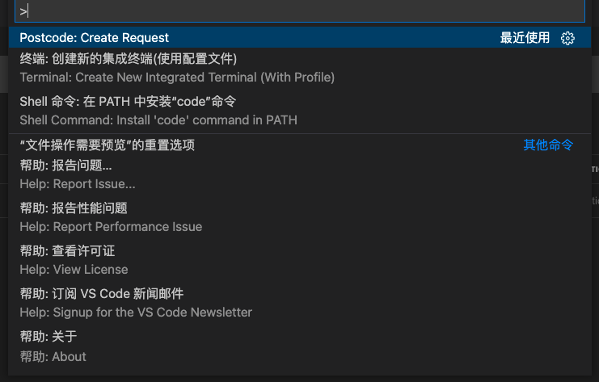
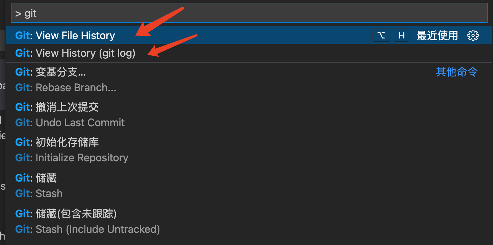
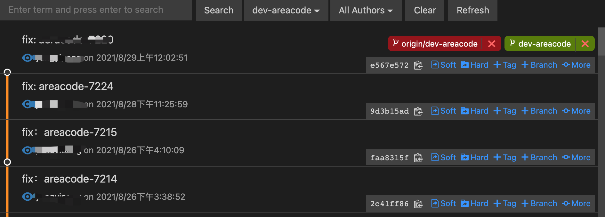

*创建代码块的快捷键 --> ```[语言名]*

## react模板 - (ES7)

```js
// rafce --> react arrow function component
// $1 默认是文件的名称

import React from 'react'

const $1 = () => {
  return <div>$0</div>
}

export default $1
```

## Postcode - vscode postman

```js
// 快捷键
command + p  --> 输入 >create  --> 选择如下图所示
```



## Markdown All in One

```js
// 在线编辑
```

## Draw.io Integration

```js
// 流程图
支持编辑 .drawio, .dio, .drawio.svg 或者 .drawio.png 文件
```

## Pretty JSON

```js
// 使用
格式化JSON文件，在JSON文件内打开右键菜单会发现多了一个选项【Format Document】快捷键为【ALT+SHILF+F】。这时就可以格式美化JSON数据啦。
```

## GitLens

```js
// 代码中每行自动会显示，Git提交的信息
```

## Git History

```js
// command + p --> 输入：> Git V 
// Git: View File History --> 显示文件夹的提交历史
// Git: View History(git log) --> 显示整体的提交记录
```



效果：



## Local History

```js
// 本地保存文件修改，会在项目根目录生成一个.history文件
```

## viscose-icons

### Material Icon Theme（更好）

```js
// 文件图标
```

## TODO Heighlight

```js
// todo 高亮
```

## open in browser

```js
// 打开浏览器
```

## Docker

```js
// docker 镜像服务器
```

## Debugger for Chrome

```js
// chrome 断点调试
```

## Code Runner

```js
// 本地运行代码
```

## Chinese (Simplified) Language

```js
// 汉语化
```

## Beautify

```js
// 代码格式化
```

## Auto Close Tag

```js
// 自动闭合标签
```

## px to rem & rpx (cssrem)

```js
// px 转化 rem和rpx
```

## Import Cost

```js
// 该插件会在行尾显示导入的包的大小。为了计算包大小，该插件要使用 Webpack 和 babili-webpack-plugin。
```

## Console helper

```js
// 帮助开发者更快的输入/移除 log，醒目的主题搭配，极大的提高开发效率
// 快捷键 macOS: cmd + shift + l
```

## JSON TS

```js
// json转为ts类型，转换接口返回的数据很有用
// Shift + Control + option + s

// eg
{
    "qq": "122",
    "bb": [
        "1",
        2,
        5
    ]
}

// 转后
interface RootObject {
  qq: string;
  bb: (number | string)[];
}
```

## Code Spell Checker

```js
// 检验单词是否书写错误
```

## mindmap

```bash
# 
```
