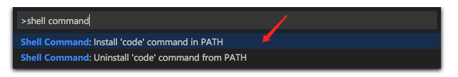

# 工具配置

## 在终端打开vscode

```bash
# 打开 vscode 编辑器

# 快捷键 Cmd+Shift+P

# 输入 Shell Command

# 如下图所示

# 在终端输入:
# 前提是：当前目录下的编辑器要是没有打开就是一下命令，要是打开了-都是打开已打开的编辑器
# 就会自动打开编辑器默认
code .

# 新建
code
```



## 在终端打开sourceTree

```bash
# 在~/.zshrc 任意地方配置 alias

# 打开默认的，不太好
# alias stree='open -a SourceTree .'

# 不加 . 则打开正常
# alias stree='open /Applications/SourceTree.app'
# alias stree='open -a SourceTree'

# 在终端打开sourceTree
# 在终端输入 stree (打开sourceTree目录）
# 在终端相应的目录下，输入 stree . (打开对应的代码库）
```
