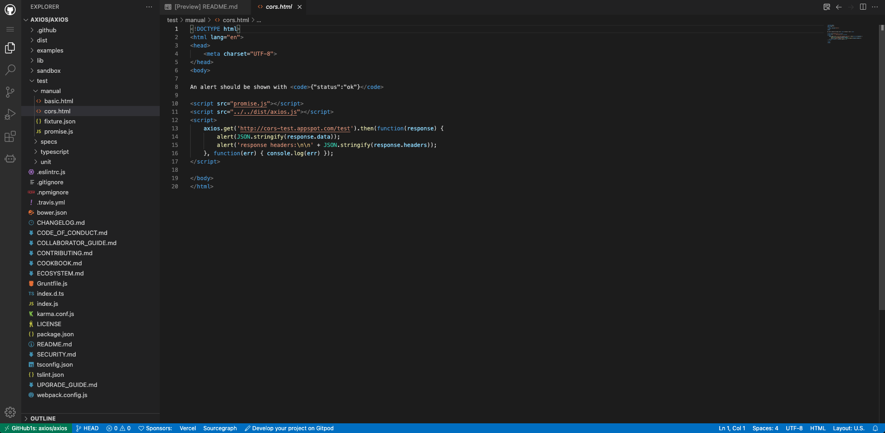

# 源码学习工具

## 在github上直接查看源码

> 在每一个`github`项目中的`url域名`里直接加上`1s`,就能在网页版`vscode`中查看源码了（不过貌似现在只能查看，不能调试，调试的话还是要把源码`clone`到本地）。

```js
// 原链接
https://github.com/axios

// 域名添加1s后
https://github1s.com/axios
```

效果：


