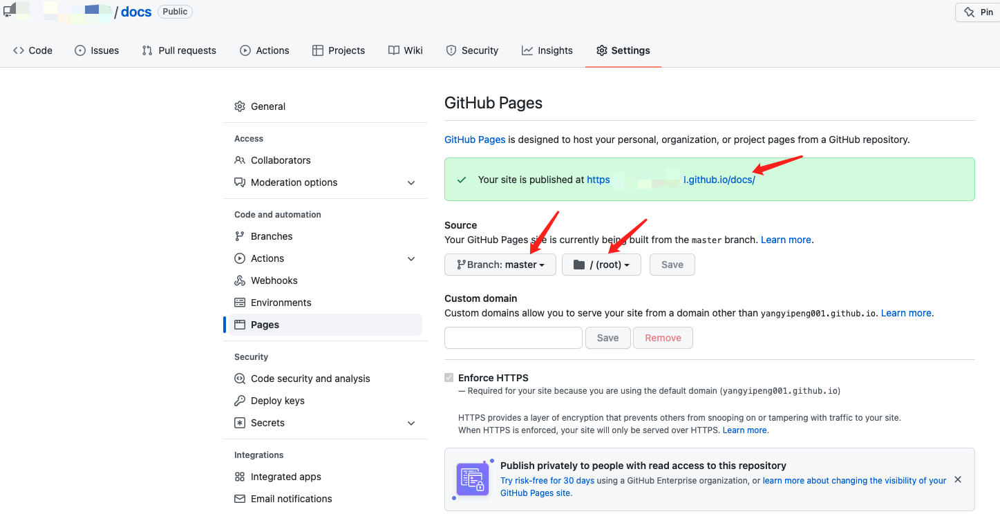

# 个人笔记搭建

## 搭建

### 安装

```bash
npm i docsify-cli -g
```

### 初始化一个项目

```bash
docsify init ./docs
```

```bash
# 会生成三个文件
# 入口文件
index.html

# 会做为主页内容渲染
README.md 

# 用于阻止 GitHub Pages 会忽略掉下划线开头的文件
.nojekyll 
```

### 启动项目

```bash
docsify serve docs
```

### 配置

#### 配置左侧导航栏

在`docs`目录下新建一个`_sidebar.md`的md文件：

```md
- js
    - [前端模块化](notes/js/前端模块化.md)
    - [js-正则学习](notes/js/js-正则学习.md)
    - [typescript](notes/js/typescript.md)
    - [promise原理](notes/js/promise原理.md)
    - [创建Object区别](notes/js/创建Object区别.md)
    - [forIn-forof-区别](notes/js/forIn-forof-区别.md)
    - [练习题](notes/js/练习题.md)

- nodejs
```

在index.html文件中添加一下代码，否则不生效：

```js
window.$docsify = {
    // 文档标题
    name: '',

    // 右上角Github图标链接
    repo: '',

    // 右侧导航
    loadSidebar： true,
}
```

具体配置：

```js
<script>
    window.$docsify = {
      name: 'myNotes',

      // 在页面右上角显示一个到 GitHub 的链接
      repo: 'https://github.com/yangyipeng001/docs',

      // 左边侧边栏
      loadSidebar: true,
      // subMaxLevel: 3
      // coverpage: true

      // 侧边栏目录的最大层数
      // subMaxLevel: 4,  

      // 切换显示的文档时，自动跳转到页面顶部
      auto2top: true,

      // 搜索框-即可在侧边栏上方显示一个搜索框，可对所有页面进行全文搜索：
      search: {
          paths: 'auto',
          placeholder: '搜索',
          noData: '找不到结果',
          depth: 3,
      },

      // 外链打开方式
      externalLinkTarget: '_blank',
    }
</script>
```

插件：

```html
<!-- Docsify v4 -->
  <script src="//cdn.jsdelivr.net/npm/docsify@4"></script>

  <!-- 图片缩放 -->
  <script src="//cdn.jsdelivr.net/npm/docsify/lib/plugins/zoom-image.min.js"></script>

  <!-- 搜索框 -->
  <script src="//unpkg.com/docsify/lib/plugins/search.js"></script>

  <!-- 代码高亮 -->
  <!-- https://cdn.jsdelivr.net/npm/prismjs@1/components/ -->
  <script src="//unpkg.com/prismjs/components/prism-bash.min.js"></script>
  <script src="//unpkg.com/prismjs/components/prism-python.min.js"></script> 
  <script src="//unpkg.com/prismjs/components/prism-typescript.min.js"></script>
  <script src="//unpkg.com/prismjs/components/prism-docker.min.js"></script>
  <script src="//unpkg.com/prismjs/components/prism-ejs.min.js"></script>
  <script src="//unpkg.com/prismjs/components/prism-git.min.js"></script>
  <script src="//unpkg.com/prismjs/components/prism-graphql.min.js"></script>
  <script src="//unpkg.com/prismjs/components/prism-json.min.js"></script>
  <script src="//unpkg.com/prismjs/components/prism-less.min.js"></script>
  <script src="//unpkg.com/prismjs/components/prism-scss.min.js"></script> 
  <script src="//unpkg.com/prismjs/components/prism-rust.min.js"></script> 
  <script src="//unpkg.com/prismjs/components/prism-tsx.min.js"></script>
  <script src="//unpkg.com/prismjs/components/prism-jsx.min.js"></script> 

  <!-- 分页按钮 - 即可在每个页面的底部显示跳转到前一文件、后一文件的按钮 -->
  <script src="//unpkg.com/docsify-pagination/dist/docsify-pagination.min.js"></script>

  <!-- 复制到剪贴板 -->
  <!-- <script src="//cdn.jsdelivr.net/npm/docsify-copy-code"></script> -->

  <!-- 表情插件 -->
  <script src="//cdn.jsdelivr.net/npm/docsify/lib/plugins/emoji.min.js"></script>

  <!-- 侧边栏扩展与折叠 -->
  <script src="//cdn.jsdelivr.net/npm/docsify-sidebar-collapse/dist/docsify-sidebar-collapse.min.js"></script>
```

### Github部署发布

- 整个文件夹push到`Github`仓库。
- `Settings` - `Pages` - `Save`。
- 生成专属链接。
  

```bash
# 如果github pages 部署失败，请选择为 /root 进行部署
```

## 资料

[docsify](https://docsify.js.org/#/zh-cn/)
[docsify-themeable](https://jhildenbiddle.github.io/docsify-themeable/#/)
