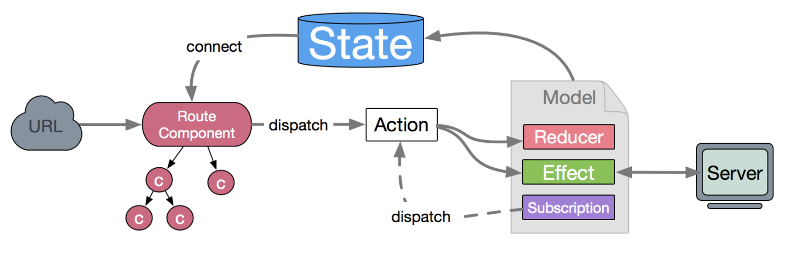

## 对比

### redux-saga的一些方法：

```javascript
tackEvery: 监听每一个INCREMENT_ASYNC事件
tackLastest: 监听最新的事件，如果该事件未完成，就不执行其他的。
put: 发action

// 如同 obj.method(arg1, arg2 ...)
call: call([obj, obj.method], arg1, arg2, ...) 

apply: apply(obj, obj.method, [arg1, arg2, ...])
```

### dva的effect的三个方法：

```javascript
select: 从全局state中获取数据
call: 调用函数
put: 发送action
```

## dva的数据流向

### 图谱：



### 异步：

view层dispatch操作action

-->  触发model层effect中的相应方法

-->  触发call发起services层请求，获取接口数据

-->  触发put发起reducer处理相应的action更新数据

-->  更新model层中state

-->  触发view层的render方法进行重新渲染

-->  页面更新

## Connect 用法

用法1：

```javascript
const mapStateToProps = (state) =>{
    return {
        // 这里的example表示后面用this.props.example获取state（根节点）中exmpale命名空间（model的example.js中的state所有数据）的数据
        example：state.example
    }
}

// 通过这种方式来把model层的数据传递到当前组件了
// Counter ui组件
export default connect(mapStateToProps)(Counter) 
```

用法2：

```javascript
// 通过这种方式来把model层的数据传递到当前组件了，默认这面的也是example属性，通过this.props.example可以获取到model（example.js）中state的数据了
export default connect ({example})(Counter) 
```
