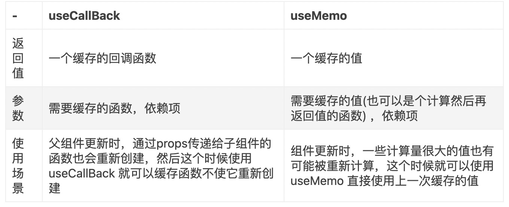

# react hooks 使用

## 闭包陷阱

https://juejin.cn/post/6972893133243695141

- **React Hooks** 存在“闭包渲染”的问题，每次 render 都会闭包缓存当前render对应的 state

- 可以通过 **useRef**、**state 更新时的回调函数**来解决这个问题

- 使用 **EffectHook** 依赖时要注意取消副作用

## useMemo和useCallBack的区别

