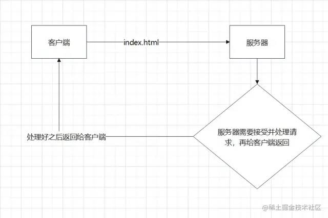
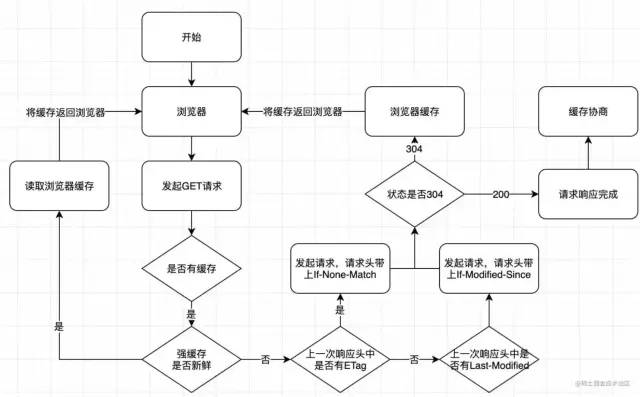

# 前端缓存

几个问题：

- 什么是web缓存（前端缓存）

- 缓存可以解决什么问题？他的缺点是什么？

- 强制缓存原理讲解
  
  - 基于Expires字段实现的强缓存
  
  - 基于Cache-control实现的强缓存

- 协商缓存原理讲解
  
  - 基于last-modified实现的协商缓存
  
  - 基于ETag实现的协商缓存

## 什么是web缓存？

**web缓存主要指的是两部分：浏览器缓存和http缓存。**

**其中http缓存是web缓存的核心，是最难懂的那一部分,也是最重要的那一部分。**

浏览器缓存：比如,localStorage,sessionStorage,cookie等等。这些功能主要用于缓存一些必要的数据，比如用户信息。比如需要携带到后端的参数。亦或者是一些列表数据等等。

不过这里需要注意。**像localStorage，sessionStorage这种用户缓存数据的功能，他只能保存5M左右的数据，多了不行。cookie则更少，大概只能有4kb的数据**。不要担心，这些概念对于未来会称为前端大牛的你来说都不是什么问题，非常的简单。因为太简单，数据缓存不再这篇文章的介绍中，这里一笔带过，需要了解的小伙伴，***可以移步我的另一篇文章前端新能优化篇之localStorage和sessionStorage的区别及其使用方式 \- 掘金 \(juejin.cn\)[1]***。

这篇文章重点讲解的是：前端http缓存。

http缓存

> 官方介绍:Web 缓存是可以自动保存常见文档副本的 HTTP 设备。当 Web 请求抵达缓存时， 如果本地有“已缓存的”副本，就可以从本地存储设备而不是原始服务器中提取这 个文档。

举个例子：



看图，问题就是出在，**服务器需要处理http的请求，并且http去传输数据，需要带宽，带宽是要钱买的啊。而我们缓存，就是为了让服务器不去处理这个请求，客户端也可以拿到数据。**

> 注意，我们的缓存主要是针对html,css,img等静态资源，常规情况下，我们不会去缓存一些动态资源，因为缓存动态资源的话，数据的实时性就不会不太好，所以我们一般都只会去缓存一些不太容易被改变的静态资源。

## 缓存可以解决什么问题？他的缺点是什么？

先说说，缓存可以解决什么问题。

- **减少不必要的网络传输，节约宽带（就是省钱）**

- **更快的加载页面（就是加速）**

- **减少服务器负载，避免服务器过载的情况出现。（就是减载）**

再说说缺点

- 占内存（有些缓存会被存到内存中）

其实日常的开发中，我们最最最最关心的，还是"更快的加载页面";尤其是对于react/vue等SPA（单页面）应用来说，首屏加载是老生常谈的问题。这个时候，缓存就显得非常重要。不需要往后端请求，直接在缓存中读取。速度上，会有显著的提升。是一种提升网站性能与用户体验的有效策略。

http缓存又分为两种两种缓存，**强制缓存**和**协商缓存**,我们来深度剖析一下**强制缓存和协商缓存各自的优劣以及他们的使用场景以及使用原理**

**http缓存流程图:**



## 强制缓存

强制缓存，我们简称强缓存。

从强制缓存的角度触发，如果浏览器判断请求的目标资源有效命中强缓存，如果命中，则可以直接从内存中读取目标资源，无需与服务器做任何通讯。

### 基于Expires字段实现的强缓存

在以前，我们通常会使用响应头的`Expires`字段去实现强缓存。如下图:


`Expires`字段的作用是，设定一个强缓存时间。在此时间范围内，则从内存（或磁盘）中读取缓存返回。

比如说将某一资源设置响应头为:Expires:new Date("2022-7-30 23:59:59")；

那么，该资源在2022-7-30 23:59:59 之前，都会去本地的磁盘（或内存）中读取，不会去服务器请求。

但是，**`Expires`已经被废弃了**。对于强缓存来说，`Expires`已经不是实现强缓存的首选。

**因为Expires判断强缓存是否过期的机制是:获取本地时间戳，并对先前拿到的资源文件中的`Expires`字段的时间做比较。来判断是否需要对服务器发起请求。这里有一个巨大的漏洞：“如果我本地时间不准咋办？”**

**是的，`Expires`过度依赖本地时间，如果本地与服务器时间不同步，就会出现资源无法被缓存或者资源永远被缓存的情况。所以，`Expires`字段几乎不被使用了。现在的项目中，我们并不推荐使用`Expires`，强缓存功能通常使用`cache-control`字段来代替`Expires`字段。**

### 基于Cache-control实现的强缓存（代替Expires的强缓存实现方法）

`Cache-control`这个字段在http1.1中被增加，`Cache-control`完美解决了`Expires`本地时间和服务器时间不同步的问题。是当下的项目中实现强缓存的最常规方法。

`Cache-control`的使用方法页很简单，只要在资源的响应头上写上需要缓存多久就好了，单位是秒。比如:

```js
//往响应头中写入需要缓存的时间
res.writeHead(200,{
    'Cache-Control':'max-age=10'
});
```

下图的意思就是，从该资源第一次返回的时候开始，往后的10秒钟内如果该资源被再次请求，则从缓存中读取。


**Cache-Control:max-age=N，N就是需要缓存的秒数。从第一次请求资源的时候开始，往后N秒内，资源若再次请求，则直接从磁盘（或内存中读取），不与服务器做任何交互。**

`Cache-control`中因为max-age后面的值是一个滑动时间，从服务器第一次返回该资源时开始倒计时。所以也就不需要比对客户端和服务端的时间，解决了`Expires`所存在的巨大漏洞。

`Cache-control`有**max-age**、**s-maxage**、**no-cache**、**no-store**、**private**、**public**这六个属性。

- **max-age**决定客户端资源被缓存多久。

- **s-maxage**决定代理服务器缓存的时长。

- **no-cache**表示是强制进行协商缓存。

- **no-store**是表示禁止任何缓存策略。

- **public**表示资源即可以被浏览器缓存也可以被代理服务器缓存。

- **private**表示资源只能被浏览器缓存。

### no-cache和no-store

**no_cache**是`Cache-control`的一个属性。它并不像字面意思一样禁止缓存，实际上，**no-cache**的意思是强制进行协商缓存。如果某一资源的`Cache-control`中设置了**no-cache**，那么该资源会直接跳过强缓存的校验，直接去服务器进行协商缓存。而**no-store**就是禁止所有的缓存策略了。

> 注意，no-cache和no-store是一组互斥属性，这两个属性不能同时出现在`Cache-Control`中。

### public和private

一般请求是从客户端直接发送到服务端，如下:


但有些情况下是例外的：比如，出现代理服务器，如下:


而**public**和**private**就是决定资源是否可以在代理服务器进行缓存的属性。

其中，**public**表示资源在客户端和代理服务器都可以被缓存。

**private**则表示资源只能在客户端被缓存，拒绝资源在代理服务器缓存。

如果这两个属性值都没有被设置，则默认为**private**

> 注意，**public**和**private**也是一组互斥属性。他们两个不能同时出现在响应头的`cache-control`字段中。

### max-age和s-maxage

**max-age**表示的时间资源在客户端缓存的时长，而**s-maxage**表示的是资源在代理服务器可以缓存的时长。

在一般的项目架构中**max-age**就够用。

而**s-maxage**因为是代理服务端的缓存时长，他必须和上面说的**public**属性一起使用（public属性表示资源可以在代理服务器中缓存）。

> 注意，**max-age**和**s-maxage**并不互斥。他们可以一起使用。

那么,Cache-control如何设置多个值呢？用逗号分割，如下↓

`Cache-control:max-age=10000,s-maxage=200000,public`

**强制缓存就是以上这两种方法了。现在我们回过头来聊聊，`Expires`难道就一点用都没有了吗？也不是，虽然`Cache-control是Expires`的完全替代品，但是如果要考虑向下兼容的话，在`Cache-control`不支持的时候，还是要使用`Expires`，这也是我们当前使用的这个属性的唯一理由。**

## 协商缓存

> 温馨提示:协商缓存的内容会有一点点绕。需要仔细阅读。

### 基于last-modified的协商缓存

基于last-modified的协商缓存实现方式是:

1. 首先需要在服务器端读出文件修改时间，

2. 将读出来的修改时间赋给响应头的`last-modified`字段。

3. 最后设置`Cache-control:no-cache`

三步缺一不可。

如下图:


注意圈出来的三行。

第一行，读出修改时间。

第二行，给该资源响应头的`last-modified`字段赋值修改时间

第三行，给该资源响应头的`Cache-Control`字段值设置为:no-cache.(上文有介绍，Cache-control:no-cache的意思是跳过强缓存校验，直接进行协商缓存。)

**还没完。到这里还无法实现协商缓存**

当客户端读取到`last-modified`的时候，会在下次的请求标头中携带一个字段:`If-Modified-Since`。


而这个请求头中的`If-Modified-Since`就是服务器第一次修改时候给他的时间，也就是上图中的


这一行。

**那么之后每次对该资源的请求，都会带上`If-Modified-Since`这个字段，而务端就需要拿到这个时间并再次读取该资源的修改时间，让他们两个做一个比对来决定是读取缓存还是返回新的资源。**

如图:


这样，就是协商缓存的所有操作了。

用一张图来解释下协商缓存。


**使用以上方式的协商缓存已经存在两个非常明显的漏洞。这两个漏洞都是基于文件是通过比较修改时间来判断是否更改而产生的。**

**1.因为是更具文件修改时间来判断的，所以，在文件内容本身不修改的情况下，依然有可能更新文件修改时间（比如修改文件名再改回来），这样，就有可能文件内容明明没有修改，但是缓存依然失效了。**

**2.当文件在极短时间内完成修改的时候（比如几百毫秒）。因为文件修改时间记录的最小单位是秒，所以，如果文件在几百毫秒内完成修改的话，文件修改时间不会改变，这样，即使文件内容修改了，依然不会 返回新的文件。**

**为了解决上述的这两个问题。从`http1.1`开始新增了一个头信息，`ETag`(Entity 实体标签)**

### 基础ETag的协商缓存

不用太担心，如果你已经理解了上面比较时间戳形式的协商缓存的话，`ETag`对你来说不会有难度。

`ETag`就是将原先协商缓存的比较**时间戳**的形式修改成了比较**文件指纹**。

> 文件指纹:根据文件内容计算出的唯一哈希值。文件内容一旦改变则指纹改变。

我们来看一下流程：

1.第一次请求某资源的时候，服务端读取文件并计算出文件指纹，将文件指纹放在响应头的`etag`字段中跟资源一起返回给客户端。

2.第二次请求某资源的时候，客户端自动从缓存中读取出上一次服务端返回的`ETag`也就是文件指纹。并赋给请求头的`if-None-Match`字段，让上一次的文件指纹跟随请求一起回到服务端。

3.服务端拿到请求头中的`if-None-Match`字段值（也就是上一次的文件指纹），并再次读取目标资源并生成文件指纹，两个指纹做对比。如果两个文件指纹完全吻合，说明文件没有被改变，则直接返回304状态码和一个空的响应体并return。如果两个文件指纹不吻合，则说明文件被更改，那么将新的文件指纹重新存储到响应头的`ETag`中并返回给客户端

代码图例：


流程示例图：


从校验流程上来说，协商缓存的修改时间比对和文件指纹比对，几乎是一样的。

### ETag也有缺点

- **ETag需要计算文件指纹这样意味着，服务端需要更多的计算开销。。如果文件尺寸大，数量多，并且计算频繁，那么ETag的计算就会影响服务器的性能。显然，ETag在这样的场景下就不是很适合。**

- **ETag有强验证和弱验证，所谓将强验证，ETag生成的哈希码深入到每个字节。哪怕文件中只有一个字节改变了，也会生成不同的哈希值，它可以保证文件内容绝对的不变。但是，强验证非常消耗计算量。ETag还有一个弱验证，弱验证是提取文件的部分属性来生成哈希值。因为不必精确到每个字节，所以他的整体速度会比强验证快，但是准确率不高。会降低协商缓存的有效性。**

> 值得注意的一点是，不同于`cache-control`是`expires`的完全替代方案(说人话:能用`cache-control`就不要用`expiress`)。`ETag`并不是`last-modified`的完全替代方案。而是`last-modified`的补充方案（说人话：项目中到底是用`ETag`还是`last-modified`完全取决于业务场景，这两个没有谁更好谁更坏）。

## 如何设置缓存

**从前端的角度来说:**

你什么都不用干，缓存是缓存在前端，但实际上代码是后端的同学来写的。如果你需要实现前端缓存的话啊，通知后端的同学加响应头就好了。

**从后端的角度来说**

请参考文章，虽然文章里的后端是使用node.js写的，但我写了详细的注释。对于后端的同学来说。应该不难看懂。

## 哪些文件对应哪些缓存

有哈希值的文件设置强缓存即可。没有哈希值的文件（比如index.html）设置协商缓存

**为什么有哈希值的文件设置强缓存?**


这是我打完包之后的css文件。大家是否注意到。我划了红线的部分。明显，这绝不是我的文件名。这串和乱码一样的字符串叫`哈希值`。每次打包之后都会生产一串新的`哈希值`并追加到我们的文件名中。哈希值是打包后的文件名的一部分。

我们给css设置强缓存，哪怕缓存1W年。只要我们重新打包，生产新的哈希值。那么文件名就更改了。对于机器来说，更改了文件名的文件，就是一个新的文件。

*举个例子👇*

比如，有一个css文件a1

第一次打包a1.css文件追加哈希值变成了 a1.aaaaa.css,我们给a1.aaaaa.css设置了强缓存1W年。

然后项目改动，我们又打包了一次。打包后生产新的哈希值，a1.aaaaa.css变成了a1.bbbbb.css文件。那么当我们第一次访问a1.bbbbb.css文件的时候是不会被缓存。因为1W年的缓存是给a1.aaaaa.css文件做的。关我a1.bbbbb.css文件什么事？这样我们也就能拿到最新的改动。

其他可以被webpack生成哈希值的文件同理。

**为什么index.html使用协商缓存**

既然img/css这些文件都可以用强缓存。通过更改文件名的方式来获取最新的数据，为什么我堂堂index.html就要用协商呢？

我给大家看个图:


因为一般情况下，index.html是不会设置哈希值的。（具体得看自己项目下的dist文件夹）

> 注意：哈希值是需要webpack生成的。不是天生的。不过有些框架会自带（比如我使用的umi.js）,设置缓存前务必看下自己的dist文件。因为如果没有配置的话，你可能所有文件都不带哈希值。

# 总结一下

- http缓存可以减少宽带流量，加快响应速度。

- 关于强缓存，`cache-control`是`Expires`的完全替代方案，在可以使用`cache-control`的情况下不要使用`expires`

- 关于协商缓存,`etag`并不是`last-modified`的完全替代方案，而是补充方案，具体用哪一个，取决于业务场景。

- 有些缓存是从磁盘读取，有些缓存是从内存读取，有什么区别？答：从内存读取的缓存更快。

- 所有带304的资源都是协商缓存，所有标注（从内存中读取/从磁盘中读取）的资源都是强缓存。
