# 输入URL开始建立你的前端知识体系

## 浏览器主要进程

浏览器是多进程的，主要分为：

- 浏览器主进程：只有一个，主要控制页面的创建、销毁、网络资源管理、下载等。

- 第三方插件进程：每一种类型的插件对应一个进程，仅当使用该插件时才创建。

- GPU进程：最多一个，用于3D绘制等。

- 浏览器渲染进程(浏览器内核)：每个Tab页对应一个进程，互不影响。

## 第一部分 输入网址并解析

只考虑输入的是一个URL 结构字符串，如果是非 URL 结构的字符串，则会用浏览器默认的搜索引擎搜索该字符串。

### URL的组成

URL 主要由 `协议`、`主机`、`端口`、`路径`、`查询参数`、`锚点`6部分组成！


### 解析URL

输入URL后，浏览器会解析出协议、主机、端口、路径等信息，并构造一个HTTP请求。

1. 浏览器发送请求前，根据请求头的`expires`和`cache-control`判断是否命中（包括是否过期）强缓存策略，如果命中，直接从缓存获取资源，并不会发送请求。如果没有命中，则进入下一步。

2. 没有命中强缓存规则，浏览器会发送请求，根据请求头的`If-Modified-Since`和`If-None-Match`判断是否命中协商缓存，如果命中，直接从缓存获取资源。如果没有命中，则进入下一步。

3. 如果前两步都没有命中，则直接从服务端获取资源。

#### HSTS

由于安全隐患，会使用 HSTS 强制客户端使用 HTTPS 访问页面。详见：你所不知道的 HSTS[1]。当你的网站均采用 HTTPS，并符合它的安全规范，就可以申请加入 HSTS 列表，之后用户不加 HTTPS 协议再去访问你的网站，浏览器都会定向到 HTTPS。无论匹配到没有，都要开始 DNS 查询工作了。

### 浏览器缓存

#### 强缓存

强制缓存就是向浏览器缓存查找该请求结果，并根据该结果的缓存规则来决定是否使用该缓存结果的过程。强缓存又分为两种`Expires`和`Cache-Control`

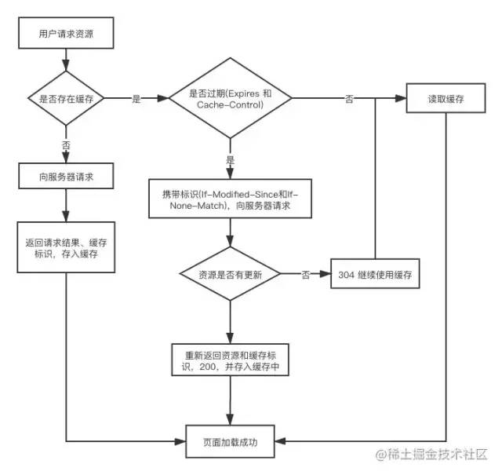

##### Expires

- 版本：HTTP/1.0

- 来源：存在于服务端返回的响应头中

- 语法：Expires: Wed, 22 Nov 2019 08:41:00 GMT

- 缺点：服务器的时间和浏览器的时间可能并不一致导致失效

##### Cache-Control

- 版本：HTTP/1.1

- 来源：响应头和请求头

- 语法：Cache-Control:max-age=3600

- 缺点：时间最终还是会失效

请求头：

| 字段名称                      | 说明                                                                        |
| ------------------------- | ------------------------------------------------------------------------- |
| no-cache                  | 告知(代理)服务器不直接使用缓存，要求向原服务器发起请求                                              |
| no-store                  | 所有内容都不会被保存到缓存或Internet临时文件中                                               |
| max-age=delta-seconds     | 告知服务器客户端希望接收一个存在时间不大于delta-secconds秒的资源                                   |
| max-stale[=delta-seconds] | 告知(代理)服务器客户端愿意接收一个超过缓存时间的资源，若有定义delta-seconds则为delta-seconds秒，若没有则为任意超出时间 |
| min-fresh=delta-seconds   | 告知(代理)服务器客户端希望接收一个在小于delta-seconds秒内被更新过的资源                               |
| no-transform              | 告知(代理)服务器客户端希望获取实体数据没有被转换(比如压缩)过的资源                                       |
| noly-if-cached            | 告知(代理)服务器客户端希望获取缓存的内容(若有),而不用向原服务器发去请求                                    |
| cache-extension           | 自定义扩展值，若服务器不识别该值将被忽略掉                                                     |

响应头：

> 在HTTP/1.1中，Cache-Control是最重要的规则，主要用于控制网页缓存，主要取值为： - public：所有内容都将被缓存（客户端和代理服务器都可缓存） - private：所有内容只有客户端可以缓存，`Cache-Control`的默认取值 - no-cache：客户端缓存内容，但是是否使用缓存则需要经过**协商缓存**来验证决定 - no-store：所有内容都不会被缓存，即不使用强制缓存，也不使用协商缓存 - max-age=xxx (xxx is numeric)：缓存内容将在xxx秒后失效。

| 字段名称                   | 说明                                                                                                |
| ---------------------- | ------------------------------------------------------------------------------------------------- |
| public                 | 表明任何情况下都得缓存该资源(即使是需要HTTP认证的资源)                                                                    |
| Private=[field-name]   | 表明返回报文中全部或部分(若指定了field-name则为field-name的字段数据)仅开放给某些用户(服务器指定的share-user，如代理服务器)做缓存使用，其他用户则不能缓存这些数据 |
| no-cache               | 不直接使用缓存，要求向服务器发起(新鲜度校验)请求                                                                         |
| no-store               | 所以内容都不会被保存到缓存或Internet临时文件中                                                                       |
| no-transform           | 告知客户端缓存文件时不得对实体数据做任何改变                                                                            |
| noly-if-cached         | 告知(代理)服务器客户端希望获取缓存的内容(若有),而不用向原服务器发去请求                                                            |
| must-revalidate        | 当前资源一定是向原方法服务器发去验证请求的，如请求是吧会返回504(而非代理服务器上的缓存)                                                    |
| proxy-revalidate       | 与must-revalidate类似，但仅能应用于共享缓存(如代理)                                                                |
| max-age=delta-seconds  | 告知客户端该资源在delta-seconds秒内是新鲜的，无需向服务器发请求                                                            |
| s-maxage=delta-seconds | 同max-age，但仅能应用于共享缓存(如代理)                                                                          |
| cache-extension        | 自定义扩展值，若服务器不识别该值将被忽略掉                                                                             |

#### 协商缓存

协商缓存就是强制缓存失效后，浏览器携带缓存标识向服务器发起请求，由服务器根据缓存标识决定是否使用缓存的过程。

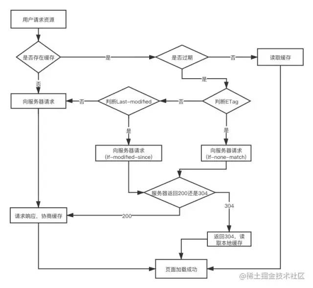

##### Last-Modified(响应头)，If-Modified-Since(请求头)

在浏览器第一次给服务器发送请求后，服务器会在响应头中加上这个字段。浏览器接收到后，如果再次请求，会在请求头中携带`If-Modified-Since`字段，这个字段的值也就是服务器传来的最后修改时间。

服务器拿到请求头中的`If-Modified-Since`的字段后，其实会和这个服务器中该资源的最后修改时间`Last-Modified`对比,询问服务器在该日期后资源是否有更新，有更新的话就会将新的资源发送回来。

但是如果在本地打开缓存文件，就会造成 `Last-Modified` 被修改，所以在 `HTTP / 1.1` 出现了 `ETag`。

##### ETag(响应头)、If-None-Match(请求头)

`ETag`是服务器根据当前文件的内容，给文件生成的唯一标识，只要里面的内容有改动，这个值就会变。服务器通过响应头把这个值给浏览器。浏览器接收到ETag的值，会在下次请求时，将这个值作为`If-None-Match`这个字段的内容，并放到请求头中，然后发给服务器。

> 如果两种方式都支持的话，服务器会优先考虑ETag

##### 存储位置

###### Service Worker

`Service Worker` 是运行在浏览器背后的独立线程，一般可以用来实现缓存功能。使用 `Service Worker`的话，传输协议必须为 `HTTPS`。因为 `Service Worker` 中涉及到请求拦截，所以必须使用 `HTTPS` 协议来保障安全。`Service Worker` 的缓存与浏览器其他内建的缓存机制不同，它可以让我们自由控制缓存哪些文件、如何匹配缓存、如何读取缓存，并且缓存是持续性的。

`Service Worker` 实现缓存功能一般分为三个步骤：首先需要先注册 `Service Worker`，然后监听到 `install` 事件以后就可以缓存需要的文件，那么在下次用户访问的时候就可以通过拦截请求的方式查询是否存在缓存，存在缓存的话就可以直接读取缓存文件，否则就去请求数据。

当 `Service Worker` 没有命中缓存的时候，我们需要去调用 `fetch` 函数获取数据。也就是说，如果我们没有在 `Service Worker` 命中缓存的话，会根据缓存查找优先级去查找数据。但是不管我们是从 `Memory Cache` 中还是从网络请求中获取的数据，浏览器都会显示我们是从 `Service Worker`中获取的内容。

###### Memory Cache

`Memory Cache` 也就是内存中的缓存，主要包含的是当前中页面中已经抓取到的资源,例如页面上已经下载的样式、脚本、图片等。读取内存中的数据肯定比磁盘快,内存缓存虽然读取高效，可是缓存持续性很短，会随着进程的释放而释放。一旦我们关闭Tab页面，内存中的缓存也就被释放了。

那么既然内存缓存这么高效，我们是不是能让数据都存放在内存中呢？这是不可能的。计算机中的内存一定比硬盘容量小得多，操作系统需要精打细算内存的使用，所以能让我们使用的内存必然不多。

> 需要注意的事情是，内存缓存在缓存资源时并不关心返回资源的HTTP缓存头`Cache-Control`是什么值，同时资源的匹配也并非仅仅是对URL做匹配，还可能会对`Content-Type`，CORS等其他特征做校验。

###### Disk Cache

`Disk Cache` 也就是存储在硬盘中的缓存，读取速度慢点，但是什么都能存储到磁盘中，比之 `Memory Cache` 胜在容量和存储时效性上。

###### Push Cache

`Push Cache`（推送缓存）是 `HTTP/2` 中的内容，当以上三种缓存都没有命中时，它才会被使用。它只在会话（Session）中存在，一旦会话结束就被释放，并且缓存时间也很短暂，在Chrome浏览器中只有5分钟左右，同时它也并非严格执行HTTP头中的缓存指令。

1. 所有的资源都能被推送，并且能够被缓存,但是 `Edge` 和 `Safari` 浏览器支持相对比较差

2. 可以推送 `no-cache` 和 `no-store` 的资源

3. 一旦连接被关闭，`Push Cache` 就被释放

4. 多个页面可以使用同一个`HTTP/2`的连接，也就可以使用同一个`Push Cache`。这主要还是依赖浏览器的实现而定，出于对性能的考虑，有的浏览器会对相同域名但不同的tab标签使用同一个HTTP连接。

5. `Push Cache` 中的缓存只能被使用一次

6. 浏览器可以拒绝接受已经存在的资源推送

7. 你可以给其他域名推送资源

### DNS域名解析

在发起http请求之前，浏览器首先要做去获得我们想访问网页的IP地址，浏览器会发送一个UDP的包给DNS域名解析服务器。

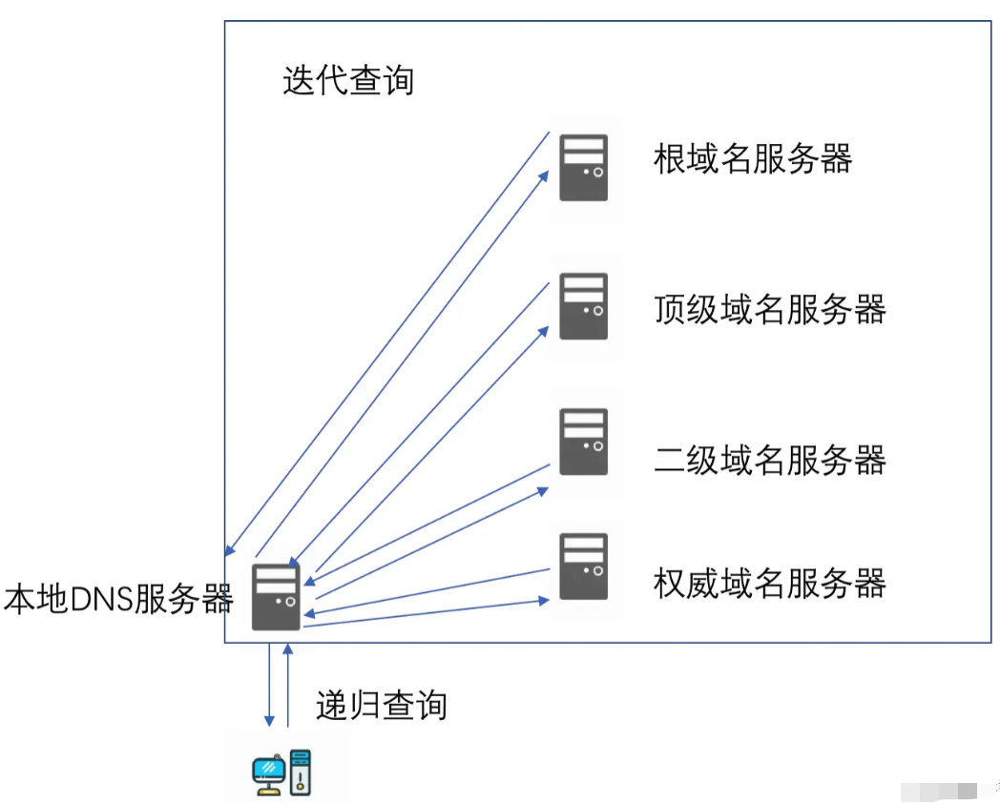

#### 递归查询

我们的浏览器、操作系统、路由器都会缓存一些URL对应的IP地址，统称为DNS高速缓存。这是为了加快DNS解析速度，使得不必每次都到根域名服务器中去查询。


#### 迭代查询

迭代查询的方式就是，局部的DNS服务器并不会自己向其他服务器进行查询，而是把能够解析该域名的服务器IP地址返回给客户端，客户端会不断的向这些服务器进行查询，直到查询到了位置，迭代的话只会帮你找到相关的服务器，然后说我现在比较忙，你自己去找吧。

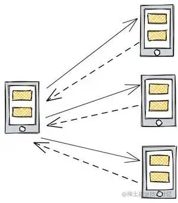

#### DNS负载均衡

DNS还有负载均衡的作用，现在很多网站都有多个服务器，当一个网站访问量过大的时候，如果所有请求都请求在同一个服务器上，可能服务器就会崩掉，这时候就用到了DNS负载均衡技术，当一个网站有多个服务器地址时，在应答DNS查询的时候，DNS服务器会对每个查询返回不同的解析结果，也就是返回不同的IP地址，从而把访问引导到不同的服务器上去，来达到负载均衡的目的。例如可以根据每台机器的负载量，或者该机器距离用户的地理位置距离等等条件。

#### DNS预解析

大型网站，有多个不同服务器资源的情况下，都可采取DNS预解析，提前解析，减少页面卡顿。

## 第二部分 TCP/IP连接：三次握手

### 网络协议分层

### TCP/IP协议

TCP(Transmission Control Protocol)传输控制协议。TCP/IP协议将应用层、表示层、会话层合并为应用层，物理层和数据链路层合并为网络接口层。

> TCP/IP协议不仅仅指的是TCP和IP两个协议，⽽是指的⼀个由FTP,SMTP,TCP,UDP,IP,ARP等等协议构成的协议集合。

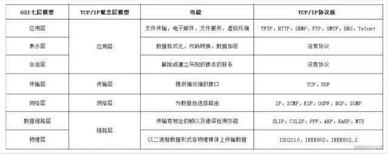

### 三次握手

客服端和服务端在进行http请求和返回的工程中，需要创建一个`TCP connection`（由客户端发起）,`http`不存在连接这个概念，它只有请求和响应。请求和响应都是数据包，它们之间的传输通道就是`TCP connection`。

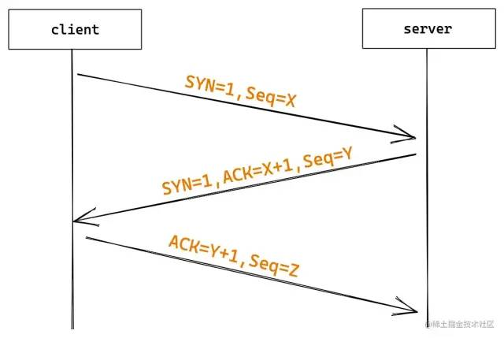

位码即tcp标志位，有6种标志：

- SYN(synchronous建立联机)

- ACK(acknowledgement 确认)

- PSH(push传送)

- FIN(finish结束)

- RST(reset重置)

- URG(urgent紧急)

第一次握手：主机A发送位码为`SYN＝1`，随机产生`Seq number=1234567`的数据包到服务器，主机B由`SYN=1`知道，A要求建立联机；（第一次握手，由浏览器发起，告诉服务器我要发送请求了）。

第二次握手：主机B收到请求后要确认联机信息，向A发送`ack number=(主机A的seq+1)`，`SYN=1，ACK=1234567 + 1`，随机产生`Seq=7654321`的包；（第二次握手，由服务器发起，告诉浏览器我准备接受了，你赶紧发送吧）。

第三次握手：主机A收到后检查`ack number`是否正确，即第一次发送的`seq number+1`，以及位码`SYN`是否为1，若正确，主机A会再发送`ack number=(主机B的seq+1)`，`ack=7654321 + 1`，主机B收到后确认`Seq`值与`ACK=7654321+ 1`则连接建立成功；（第三次握手，由浏览器发送，告诉服务器，我马上就发了，准备接受吧）。

> 总是要问：为什么需要三次握手，两次不行吗？其实这是由TCP的自身特点**可靠传输**决定的。客户端和服务端要进行可靠传输，那么就需要**确认双方的`接收`和`发送`能力**。第一次握手可以确认客服端的`发送能力`,第二次握手，服务端`SYN=1,Seq=Y`就确认了`发送能力`,`ACK=X+1`就确认了`接收能力`,所以第三次握手才可以确认客户端的`接收能力`。不然容易出现丢包的现象。

#### 第三次握手的必要性？

试想如果是用两次握手，则会出现下面这种情况：如客户端发出连接请求，但因连接请求报文丢失而未收到确认，于是客户端再重传一次连接请求。后来收到了确认，建立了连接。

数据传输完毕后，就释放了连接，客户端共发出了两个连接请求报文段，其中第一个丢失，第二个到达了服务端，但是第一个丢失的报文段只是在某些网络结点长时间滞留了，延误到连接释放以后的某个时间才到达服务端，此时服务端误认为客户端又发出一次新的连接请求，于是就向客户端发出确认报文段，同意建立连接，不采用三次握手，只要服务端发出确认，就建立新的连接了，此时客户端忽略服务端发来的确认，也不发送数据，则服务端一致等待客户端发送数据，浪费资源。

#### 什么是半连接队列？

服务器第一次收到客户端的 SYN 之后，就会处于 SYN_RCVD 状态，此时双方还没有完全建立其连接，服务器会把此种状态下请求连接放在一个队列里，我们把这种队列称之为半连接队列。

当然还有一个全连接队列，就是已经完成三次握手，建立起连接的就会放在全连接队列中。如果队列满了就有可能会出现丢包现象。

这里在补充一点关于SYN-ACK 重传次数的问题：服务器发送完SYN-ACK包，如果未收到客户确认包，服务器进行首次重传，等待一段时间仍未收到客户确认包，进行第二次重传。如果重传次数超过系统规定的最大重传次数，系统将该连接信息从半连接队列中删除。

注意，每次重传等待的时间不一定相同，一般会是指数增长，例如间隔时间为 1s，2s，4s，8s…

#### ISN是固定的吗？

当一端为建立连接而发送它的SYN时，它为连接选择一个初始序号。ISN随时间而变化，因此每个连接都将具有不同的ISN。ISN可以看作是一个32比特的计数器，每4ms加1 。这样选择序号的目的在于防止在网络中被延迟的分组在以后又被传送，而导致某个连接的一方对它做错误的解释。

三次握手的其中一个重要功能是客户端和服务端交换 ISN(Initial Sequence Number)，以便让对方知道接下来接收数据的时候如何按序列号组装数据。如果 ISN 是固定的，攻击者很容易猜出后续的确认号，因此 ISN 是动态生成的。

#### 三次握手过程中可以携带数据吗？

其实第三次握手的时候，是可以携带数据的。但是，第一次、第二次握手不可以携带数据。

为什么这样呢?大家可以想一个问题，假如第一次握手可以携带数据的话，如果有人要恶意攻击服务器，那他每次都在第一次握手中的 SYN 报文中放入大量的数据。因为攻击者根本就不理服务器的接收、发送能力是否正常，然后疯狂着重复发 SYN 报文的话，这会让服务器花费很多时间、内存空间来接收这些报文。

也就是说，第一次握手不可以放数据，其中一个简单的原因就是会让服务器更加容易受到攻击了。而对于第三次的话，此时客户端已经处于 ESTABLISHED 状态。对于客户端来说，他已经建立起连接了，并且也已经知道服务器的接收、发送能力是正常的了，所以能携带数据也没啥毛病。

#### SYN攻击？

服务器端的资源分配是在二次握手时分配的，而客户端的资源是在完成三次握手时分配的，所以服务器容易受到SYN洪泛攻击。

SYN攻击就是Client在短时间内伪造大量不存在的IP地址，并向Server不断地发送SYN包，Server则回复确认包，并等待Client确认，由于源地址不存在，因此Server需要不断重发直至超时，这些伪造的SYN包将长时间占用未连接队列，导致正常的SYN请求因为队列满而被丢弃，从而引起网络拥塞甚至系统瘫痪。SYN 攻击是一种典型的 DoS/DDoS 攻击。

检测 SYN 攻击非常的方便，当你在服务器上看到大量的半连接状态时，特别是源IP地址是随机的，基本上可以断定这是一次SYN攻击。在 Linux/Unix 上可以使用系统自带的 netstats 命令来检测 SYN 攻击。

```bash
netstat -n -p TCP | grep SYN_RECV
```

常见的防御 SYN 攻击的方法有如下几种：

- 缩短超时（SYN Timeout）时间

- 增加最大半连接数

- 过滤网关防护

- SYN cookies技术

## 第三部分 HTTP请求

### HTTP 发展历史

HTTP/0.9

- 只有一个命令GET

- 响应类型: 仅 超文本

- 没有header等描述数据的信息

- 服务器发送完毕，就关闭TCP连接

HTTP/1.0

- 增加了很多命令（post HESD ）

- 增加`status code` 和 `header`

- 多字符集支持、多部分发送、权限、缓存等

- 响应：不再只限于超文本 (Content-Type 头部提供了传输 HTML 之外文件的能力 — 如脚本、样式或媒体文件)

HTTP/1.1

- 持久连接。TCP三次握手会在任何连接被建立之前发生一次。最终，当发送了所有数据之后，服务器发送一个消息，表示不会再有更多数据向客户端发送了；则客户端才会关闭连接（断开 TCP）

- 支持的方法: `GET` , `HEAD` , `POST` , `PUT` ,`DELETE` , `TRACE` , `OPTIONS`

- 进行了重大的性能优化和特性增强，分块传输、压缩/解压、内容缓存磋商、虚拟主机（有单个IP地址的主机具有多个域名）、更快的响应，以及通过增加缓存节省了更多的带宽

HTTP2

- 所有数据以二进制传输。HTTP1.x是基于文本的，无法保证健壮性，HTTP2.0绝对使用新的二进制格式，方便且健壮

- 同一个连接里面发送多个请求不再需要按照顺序来

- 头信息压缩以及推送等提高效率的功能

HTTP3

- QUIC“快速UDP互联网连接”（Quick UDP Internet Connections）

HTTP3 的主要改进在传输层上。传输层不会再有我前面提到的那些繁重的 TCP 连接了。现在，一切都会走 UDP。

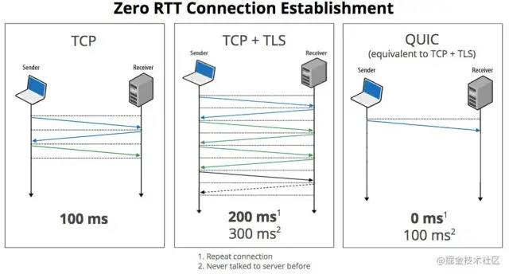

### HTTP协议特点

1. 支持客户/服务器模式。

2. 简单快速客户向服务器请求服务时，只需传送请求方法和路径。请求方法常用的有 GET、HEAD、POST。每种方法规定了客户与服务器联系的类型不同。由于 HTTP协议简单，使得HTTP服务器的程序规模小，因而通信速度很快。

3. 灵活：HTTP允许传输任意类型的数据对象。正在传输的类型由Content-Type（Content-Type是HTTP包中用来表示内容类型的标识）加以标记。

4. 无连接：无连接的含义是限制每次连接只处理一个请求。服务器处理完客户的请求，并收到客户的应答后，即断开连接。采用这种方式可以节省传输时间。

5. 无状态：HTTP协议是无状态协议。无状态是指协议对于事务处理没有记忆能力。缺少状态意味着如果后续处理需要前面的信息，则它必须重传，这样可能导致每次连接传送的数据量增大。另一方面，在服务器不需要先前信息时它的应答就较快。

> 现在 HTTP3 最快！

### HTTP报文

- [ ] 补充具体的http报文内容？？2022-02-24

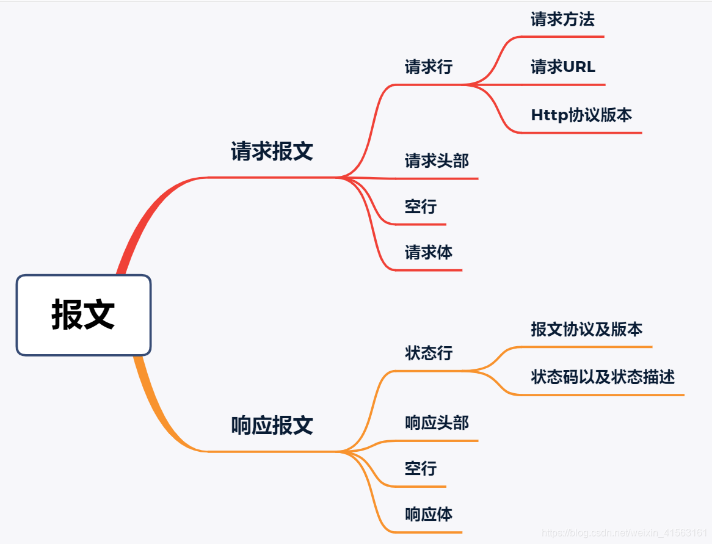

请求报文：

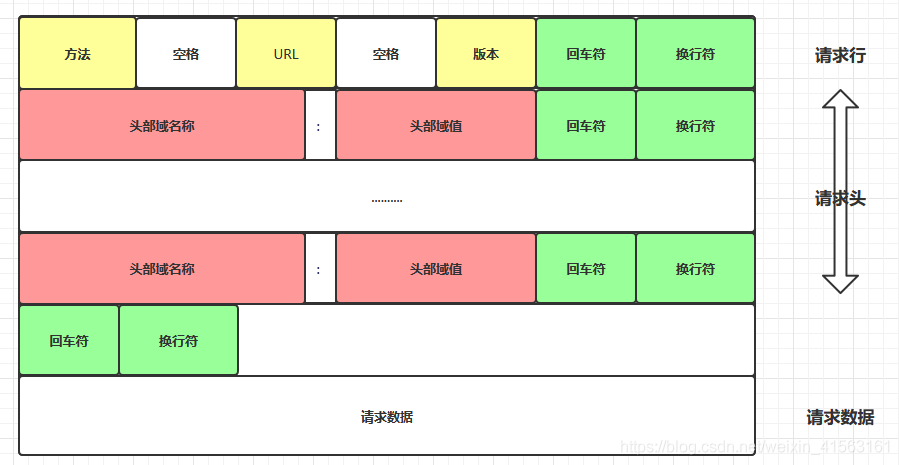

响应报文：

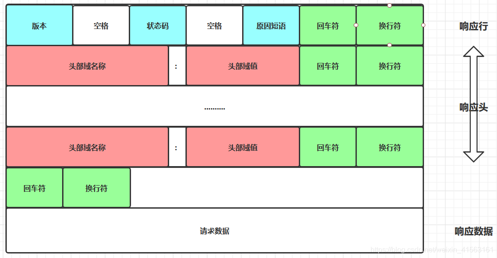

### 各协议与HTTP协议关系

- DNS 服务：解析域名至对应的IP地址

- HTTP 协议：生成针对目标Web服务器的HTTP请求报文

- TCP 协议：将请求报文按序号分割成多个报文段

- IP 协议：搜索对方的地址，一边中转一边传送

- TCP 协议：按序号以原来的顺序重组请求报文请求的处理结果也同样利用TCP/IP协议向用户进行回传
  
  > TCP是底层通讯协议，定义的是数据传输和连接方式的规范；

- HTTP是应用层协议，定义的是传输数据的内容的规范；

- HTTP协议中的数据是利用TCP协议传输的，所以支持HTTP也就一定支持TCP。

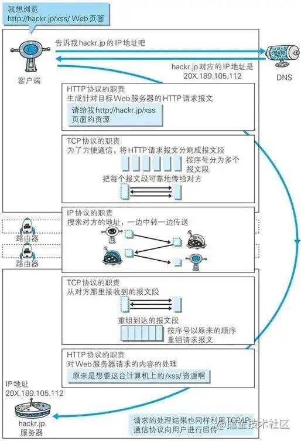

### HTTPS

在HTTP的基础上再加一层TLS（传输层安全性协议）或者SSL（安全套接层），就构成了HTTPS协议。

HTTPS 默认工作在 TCP 协议443端口，它的工作流程一般如以下方式：

1. TCP 三次同步握手

2. 客户端验证服务器数字证书

3. DH 算法协商对称加密算法的密钥、hash 算法的密钥

4. SSL 安全加密隧道协商完成

5. 网页以加密的方式传输，用协商的对称加密算法和密钥加密，保证数据机密性；用协商的hash算法进行数据完整性保护，保证数据不被篡改。

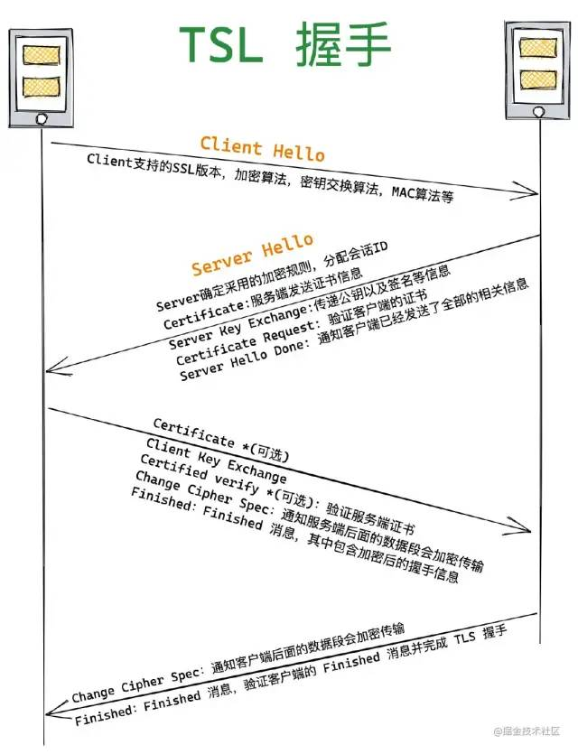

1. 客户端向服务端发送 `Client Hello` 消息，其中携带客户端支持的协议版本、加密算法、压缩算法以及客户端生成的随机数；

2. 服务端收到客户端支持的协议版本、加密算法等信息后；
   
   - 向客户端发送 `Server Hello` 消息，并携带选择特定的协议版本、加密方法、会话 ID 以及服务端生成的随机数；
   
   - 向客户端发送 `Certificate` 消息，即服务端的证书链，其中包含证书支持的域名、发行方和有效期等信息；
   
   - 向客户端发送 `Server Key Exchange` 消息，传递公钥以及签名等信息；
   
   - 向客户端发送可选的消息 `Certificate Request`，验证客户端的证书；
   
   - 向客户端发送 `Server Hello Done` 消息，通知服务端已经发送了全部的相关信息；

3. 客户端收到服务端的协议版本、加密方法、会话 ID 以及证书等信息后，验证服务端的证书；
   
   - 向服务端发送 `Client Key Exchange` 消息，包含使用服务端公钥加密后的随机字符串，即预主密钥（`Pre Master Secret`）；
   
   - 向服务端发送 `Change Cipher Spec` 消息，通知服务端后面的数据段会加密传输；
   
   - 向服务端发送 `Finished` 消息，其中包含加密后的握手信息；

4. 服务端收到 `Change Cipher Spec`和 `Finished`消息后；
   
   - 向客户端发送 `Change Cipher Spec` 消息，通知客户端后面的数据段会加密传输；
   
   - 向客户端发送 `Finished` 消息，验证客户端的 `Finished` 消息并完成 TLS 握手；

TLS 握手的关键在于利用通信双方生成的随机字符串和服务端的证书公钥生成一个双方经过协商后的对称密钥，这样通信双方就可以使用这个对称密钥在后续的数据传输中加密消息数据，防止中间人的监听和攻击，保证通讯安全。

> HTTPS连接 需要7次握手，3次TCP + 4次TLS。

## 第四部分 服务器处理请求并返回 HTTP 报文

每台服务器上都会安装处理请求的应用——Web Server。常见的Web Server 产品有 `apache`、`nginx`、`IIS` 或 `Lighttpd` 等。

HTTP请求一般可以分为两类，静态资源 和 动态资源。

请求访问静态资源，这个就直接根据url地址去服务器里找就好了。

请求动态资源的话，就需要web server把不同请求，委托给服务器上处理相应请求的程序进行处理（例如 CGI 脚本，JSP 脚本，servlets，ASP 脚本，服务器端 JavaScript，或者一些其它的服务器端技术等），然后返回后台程序处理产生的结果作为响应，发送到客户端。

服务器在处理请求的时候主要有三种方式：

- 第一种：是用一个线程来处理所有的请求，并且同时只能处理一个请求，但是这样的话性能是非常的低的。

- 第二种：是每一个请求都给他分配一个线程但是当链接和请求比较多的时候就会导致服务器的cpu不堪重负。

- 第三种：就是采用复用I/O的方式来处理例如通过epoll方式监视所有链接当链接状态发生改变的时候才去分配空间进行处理。

## 第五部分 浏览器渲染页面

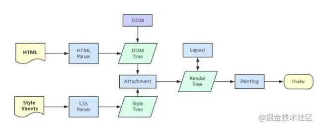

### DOM树

字节 → 字符 → 令牌 → 节点 → 对象模型。

```html
<!DOCTYPE html>
<html>
  <head>
    <meta name="viewport" content="width=device-width,initial-scale=1">
    <link href="style.css" rel="stylesheet">
    <title>Critical Path</title>
  </head>
  <body>
    <p>Hello <span>web performance</span> students!</p>
    <div></div>
  </body>
</html>
```

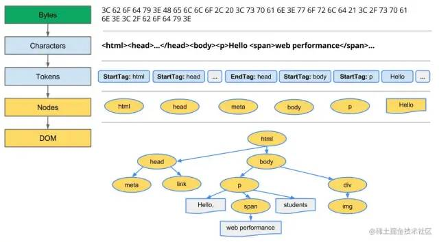

- 转换:  浏览器从磁盘或网络读取 HTML 的原始字节，并根据文件的指定编码（例如 UTF-8）将它们转换成各个字符。

- 令牌化: 浏览器将字符串转换成 W3C HTML5 标准规定的各种令牌，例如，“”、“”，以及其他尖括号内的字符串。每个令牌都具有特殊含义和一组规则。

- 词法分析:  发出的令牌转换成定义其属性和规则的“对象”。

- DOM 构建:  最后，由于 HTML 标记定义不同标记之间的关系（一些标记包含在其他标记内），创建的对象链接在一个树数据结构内，此结构也会捕获原始标记中定义的父项-子项关系: HTML 对象是 body 对象的父项，body 是 paragraph 对象的父项，依此类推。

### CSS 对象模型 (CSSOM)

```css
body { font-size: 16px }
p { font-weight: bold }
span { color: red }
p span { display: none }
img { float: right }
```

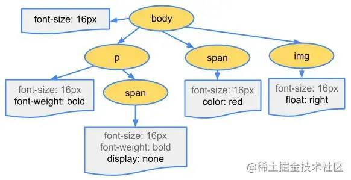

### 布局树Layout Tree

- DOM 树与 CSSOM 树合并后形成渲染树。

- 渲染树只包含渲染网页所需的节点。

- 布局计算每个对象的精确位置和大小。

- 最后一步是绘制，使用最终渲染树将像素渲染到屏幕上。

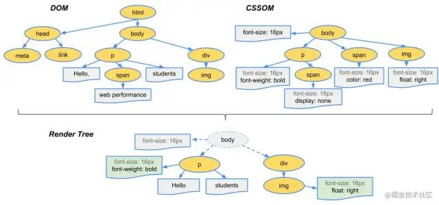

### 渲染

渲染流程：

1. 获取DOM后分割为多个图层

2. 对每个图层的节点计算样式结果 （Recalculate style--样式重计算）

3. 为每个节点生成图形和位置 （Layout--重排,回流）

4. 将每个节点绘制填充到图层位图中 （Paint--重绘）

5. 图层作为纹理上传至GPU

6. 组合多个图层到页面上生成最终屏幕图像 （Composite Layers--图层重组）

#### 创建图层

```html
<div class="position_">position</div>
<div class="box_3d">3d变换</div>
<div class="will-change">will-change</div>
<div class="transform"></div>
<iframe src="https://www.baidu.com"></iframe>


div {width: 100px;height: 100px;}
.position_ {background: pink;position: fixed;z-index: 20;}
.box_3d {background: red;transform:  translate3d(100px,30px,10px);}
.will-change {background: #f12312;will-change: transform;}
.transform {background: #302912;transform: skew(30deg, 20deg);}
```

在 chrome 上查看 Layers.

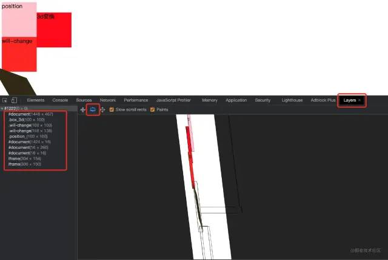


如果没有打开Layers,按下图打开：

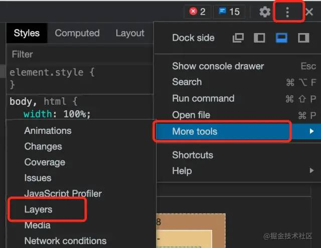

> 知道图层的存在，我们可以手动打开一个图层，通过添加`transform: translateZ(0)` 这样回流和重绘的代价就小了，效率就会大大提高。但是不要滥用这个属性，否则会大大增加内存消耗。—— 开启GPU加速。

#### 回流和重绘

- 重绘

当页面中元素样式的改变并不影响它在文档流中的位置时（例如：color、background-color、visibility等），浏览器会将新样式赋予给元素并重新绘制它，这个过程称为重绘。

- 回流

当Render Tree中部分或全部元素的尺寸、结构、或某些属性发生改变时，浏览器重新渲染部分或全部文档的过程称为回流。

> 回流必将引起重绘，而重绘不一定会引起回流。

引起回流：

1. 页面首次渲染

2. 浏览器窗口大小发生改变

3. 元素尺寸或位置发生改变

4. 元素内容变化（文字数量或图片大小等等）

5. 元素字体大小变化

6. 添加或者删除可见的DOM元素

7. 激活CSS伪类（例如：:hover）

8. 查询某些属性或调用某些方法

引起回流的属性和方法：

- clientWidth、clientHeight、clientTop、clientLeft

- offsetWidth、offsetHeight、offsetTop、offsetLeft

- scrollWidth、scrollHeight、scrollTop、scrollLeft

- scrollIntoView()、scrollIntoViewIffNeeded()

- getComputedStyle()

- getBoundingClientRect()

- scrollTo()

##### 如何减少回流

- css
1. 避免使用table布局;

2. 尽可能在DOM树的最末端改变class;

3. 避免设置多层内联样式;

4. 将动画效果应用到position属性为absolute或fixed的元素上;

5. 避免使用CSS表达式（例如：calc()）。
- JS
1. 避免频繁操作样式，最好一次性重写style属性，或者将样式列表定义为class并一次性更改class属性。

2. 避免频繁操作DOM，创建一个documentFragment，在它上面应用所有DOM操作，最后再把它添加到文档中。

3. 也可以先为元素设置display: none，操作结束后再把它显示出来。因为在display属性为none的元素上进行的DOM操作不会引发回流和重绘。

4. 避免频繁读取会引发回流/重绘的属性，如果确实需要多次使用，就用一个变量缓存起来。

5. 对具有复杂动画的元素使用绝对定位，使它脱离文档流，否则会引起父元素及后续元素频繁回流。

## 第六部分 断开连接：TCP 四次分手

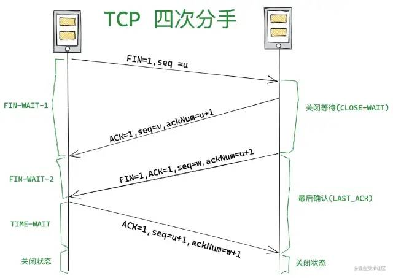

1. 刚开始双方都处于established状态，假如是客户端先发起关闭请求

2. 第一次挥手：客户端发送一个FIN报文，报文中会指定一个序列号。此时客户端处于FIN_WAIT1状态

3. 第二次挥手：服务端收到FIN之后，会发送ACK报文，且把客户端的序列号值+1作为ACK报文的序列号值，表明已经收到客户端的报文了，此时服务端处于CLOSE_WAIT状态

4. 第三次挥手：如果服务端也想断开连接了，和客户端的第一次挥手一样，发送FIN报文，且指定一个序列号。此时服务端处于LAST_ACK的状态

5. 需要过一阵子以确保服务端收到自己的ACK报文之后才会进入CLOSED状态，服务端收到ACK报文之后，就处于关闭连接了，处于CLOSED状态。

### 挥手为什么需要四次？

因为当服务端收到客户端的SYN连接请求报文后，可以直接发送SYN+ACK报文。其中ACK报文是用来应答的，SYN报文是用来同步的。但是关闭连接时，当服务端收到FIN报文时，很可能并不会立即关闭SOCKET，所以只能先回复一个ACK报文，告诉客户端，“你发的FIN报文我收到了”。

只有等到我服务端所有的报文都发送完了，我才能发送FIN报文，因此不能一起发送。故需要四次挥手。

### 为什么客户端发送ACK之后不直接关闭，而是要等一阵子才关闭？

客户端收到服务端的连接释放报文段后，对此发出确认报文段（ACK=1，seq=u+1，ack=w+1），客户端进入TIME_WAIT（时间等待）状态。此时TCP未释放掉，需要经过时间等待计时器设置的时间2MSL后，客户端才进入CLOSED状态。

如果不等待，客户端直接跑路，当服务端还有很多数据包要给客户端发，且还在路上的时候，若客户端的端口此时刚好被新的应用占用，那么就接收到了无用数据包，造成数据包混乱。

### 为什么TIME_WAIT状态需要经过2MSL（最大报文生存时间）才能返回到CLOSE状态？

理论上，四个报文都发送完毕，就可以直接进入CLOSE状态了，但是可能网络是不可靠的，有可能最后一个ACK丢失。所以TIME_WAIT状态就是用来重发可能丢失的ACK报文。1 个 MSL 确保四次挥手中主动关闭方最后的 ACK 报文最终能达到对端；1 个 MSL 确保对端没有收到 ACK 重传的 FIN 报文可以到达。


