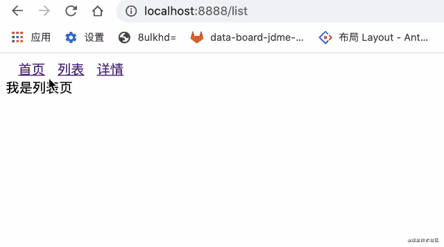
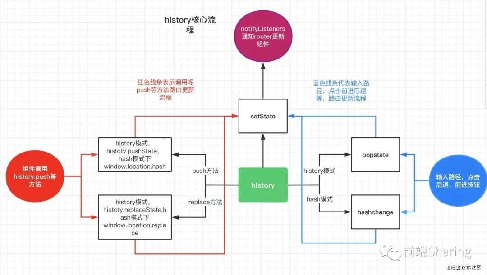
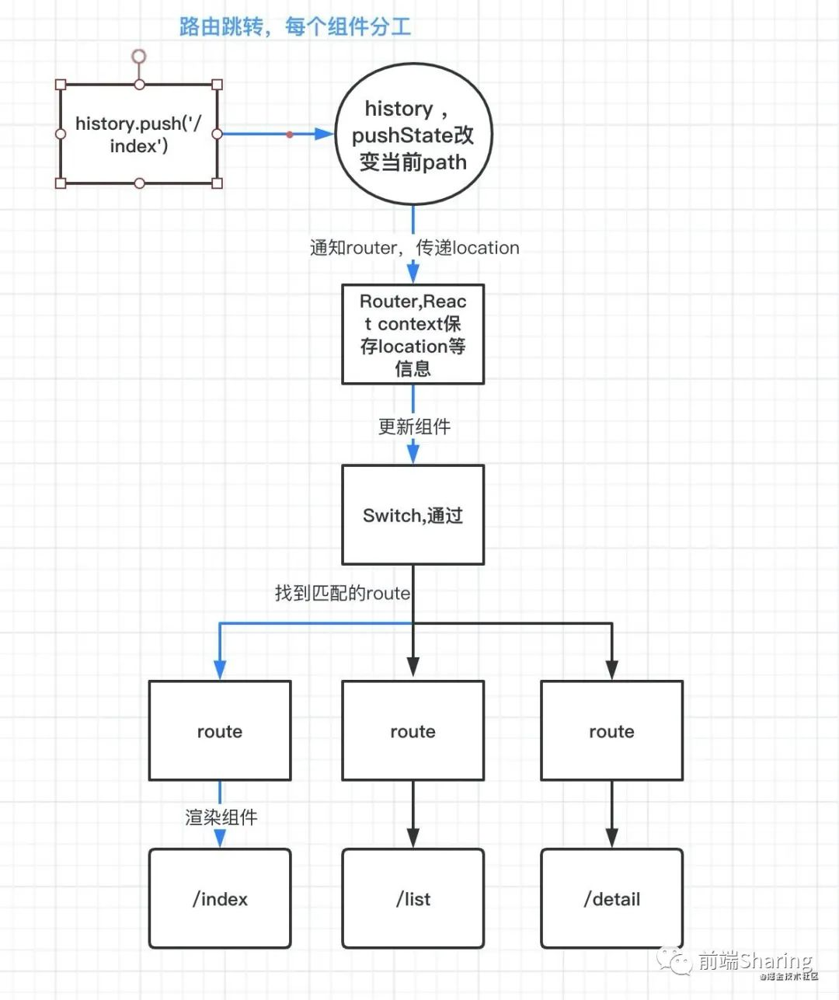

# react-router路由原理

## 正确理解react-router

### 理解单页面应用

什么是单页面应用？

个人理解，单页面应用是使用一个html下，一次性加载js, css等资源，所有页面都在一个容器页面下，页面切换实质是组件的切换。

### react-router初探，揭露路由原理面纱

#### ①`react-router-dom`和`react-router`和`history`库三者什么关系

`history` 可以理解为`react-router`的核心，也是整个路由原理的核心，里面集成了`popState,history.pushState`等底层路由实现的原理方法，接下来我们会一一解释。

`react-router`可以理解为是`react-router-dom`的核心，里面封装了`Router，Route，Switch`等核心组件,实现了从路由的改变到组件的更新的核心功能,在我们的项目中只要一次性引入`react-router-dom`就可以了。

`react-router-dom`,在`react-router`的核心基础上，添加了用于跳转的`Link`组件，和histoy模式下的`BrowserRouter`和hash模式下的`HashRouter`组件等。所谓`BrowserRouter和HashRouter，也只不过用了history库中createBrowserHistory和createHashHistory方法`。

`react-router-dom` 我们不多说了，这里我们重点看一下`react-router`。

#### ②来个小demo尝尝鲜?

```js
import { BrowserRouter as Router, Switch, Route, Redirect,Link } from 'react-router-dom'

import Detail from '../src/page/detail'
import List from '../src/page/list'
import Index from '../src/page/home/index'

const menusList = [
  {
    name: '首页',
    path: '/index'
  },
  {
    name: '列表',
    path: '/list'
  },
  {
    name: '详情',
    path: '/detail'
  },
]
const index = () => {
  return <div >
    <div >

      <Router  >
      <div>{
        /* link 路由跳转 */
         menusList.map(router=><Link key={router.path} to={ router.path } >
           <span className="routerLink" >{router.name}</span>
         </Link>)
      }</div>
        <Switch>
          <Route path={'/index'} component={Index} ></Route>
          <Route path={'/list'} component={List} ></Route>
          <Route path={'/detail'} component={Detail} ></Route>
          {/*  路由不匹配，重定向到/index  */}
          <Redirect from='/*' to='/index' />
        </Switch>
      </Router>
    </div>
  </div>
}
```

效果如下:



## 单页面实现核心原理

单页面应用路由实现原理是，切换url，监听url变化，从而渲染不同的页面组件。

主要的方式有`history`模式和`hash`模式。

### history模式原理

#### ①改变路由

`history.pushState`

```js
history.pushState(state, title, path)
```

-  `state`：一个与指定网址相关的状态对象， popstate 事件触发时，该对象会传入回调函数。如果不需要可填 null。

-  `title`：新页面的标题，但是所有浏览器目前都忽略这个值，可填 null。

-  `path`：新的网址，必须与当前页面处在同一个域。浏览器的地址栏将显示这个地址。

`history.replaceState`

```js
history.replaceState(state, title, path)
```

参数和`pushState`一样，这个方法会修改当前的 `history` 对象记录， `history.length` 的长度不会改变。

#### ②监听路由

`popstate事件`

```js
window.addEventListener('popstate', function(e){
    /* 监听改变 */
})
```

同一个文档的 `history` 对象出现变化时，就会触发 `popstate` 事件 `history.pushState` 可以使浏览器地址改变，但是无需刷新页面。注意⚠️的是：用 `history.pushState()` 或者 `history.replaceState()` 不会触发 `popstate` 事件。 `popstate` 事件只会在浏览器某些行为下触发, 比如点击后退、前进按钮或者调用 `history.back()、history.forward()、history.go()`方法。

### hash模式原理

#### ①改变路由

`window.location.hash`

通过`window.location.hash` 属性获取和设置 `hash` 值。

#### ②监听路由

`onhashchange`

```js
window.addEventListener('hashchange',function(e){
    /* 监听改变 */
})
```

## 理解history库

`react-router`路由离不开`history`库，history专注于记录路由history状态，以及path改变了，我们应该做写什么， 在history模式下用`popstate`监听路由变化，在hash模式下用`hashchange`监听路由的变化。

接下来我们看 `Browser`模式下的`createBrowserHistory` 和 `Hash`模式下的 `createHashHistory`方法。

### createBrowserHistory

Browser模式下路由的运行 ，一切都从`createBrowserHistory`开始。这里我们参考的history-4.7.2版本，最新版本中api可能有些出入，但是原理都是一样的，在解析history过程中，我们重点关注`setState, push, handlePopState, listen`方法

```js
const PopStateEvent = 'popstate'
const HashChangeEvent = 'hashchange'
/* 这里简化了createBrowserHistory，列出了几个核心api及其作用 */
function createBrowserHistory(){
    /* 全局history  */
    const globalHistory = window.history
    /* 处理路由转换，记录了listens信息。*/
    const transitionManager = createTransitionManager()
    /* 改变location对象，通知组件更新 */
    const setState = () => { /* ... */ }

    /* 处理当path改变后，处理popstate变化的回调函数 */
    const handlePopState = () => { /* ... */ }

    /* history.push方法，改变路由，通过全局对象history.pushState改变url, 通知router触发更新，替换组件 */
    const push=() => { /*...*/ }

    /* 底层应用事件监听器，监听popstate事件 */
    const listen=()=>{ /*...*/ } 
    return {
       push,
       listen,
       /* .... */ 
    }
}
```

下面逐一分析各个api,和他们之前的相互作用

```js
const PopStateEvent = 'popstate'
const HashChangeEvent = 'hashchange'
```

`popstate` 和`hashchange`是监听路由变化底层方法。

#### ①setState

```js
const setState = (nextState) => {
    /* 合并信息 */
    Object.assign(history, nextState)
    history.length = globalHistory.length
    /* 通知每一个listens 路由已经发生变化 */
    transitionManager.notifyListeners(
      history.location,
      history.action
    )
}
```

代码很简单：统一每个`transitionManager`管理的`listener`路由状态已经更新。

什么时候绑定`litener`， 我们在接下来的`React-Router`代码中会介绍。

#### ②listen

```js
const listen = (listener) => {
    /* 添加listen */
    const unlisten = transitionManager.appendListener(listener)
    checkDOMListeners(1)

    return () => {
      checkDOMListeners(-1)
      unlisten()
    }
}
```

checkDOMListeners

```js
const checkDOMListeners = (delta) => {
    listenerCount += delta
    if (listenerCount === 1) {
      addEventListener(window, PopStateEvent, handlePopState)
      if (needsHashChangeListener)
        addEventListener(window, HashChangeEvent, handleHashChange)
    } else if (listenerCount === 0) {
      removeEventListener(window, PopStateEvent, handlePopState)
      if (needsHashChangeListener) 
        removeEventListener(window, HashChangeEvent, handleHashChange)
    }
}
```

listen本质通过`checkDOMListeners`的参数 1 或 -1 来绑定/解绑 `popstate` 事件，当路由发生改变的时候，调用处理函数`handlePopState` 。

接下来我们看看`push`方法。

#### push

```js
const push = (path, state) => {
    const action = 'PUSH'
    /* 1 创建location对象 */
    const location = createLocation(path, state, createKey(), history.location)
    /* 确定是否能进行路由转换，还在确认的时候又开始了另一个转变 ,可能会造成异常 */
    transitionManager.confirmTransitionTo(location, action, getUserConfirmation, (ok) => {
      if (!ok)
        return
      const href = createHref(location)
      const { key, state } = location
      if (canUseHistory) {
        /* 改变 url */
        globalHistory.pushState({ key, state }, null, href)
        if (forceRefresh) {
          window.location.href = href
        } else {
          /* 改变 react-router location对象, 创建更新环境 */
          setState({ action, location })
        }
      } else {
        window.location.href = href
      }
    })
  }
```

`push ( history.push )` 流程大致是 首先生成一个最新的`location`对象，然后通过`window.history.pushState`方法改变浏览器当前路由(即当前的path),最后通过`setState`方法通知`React-Router`更新，并传递当前的location对象，由于这次url变化的，是`history.pushState`产生的，并不会触发`popState`方法，所以需要手动`setState`，触发组件更新。

#### ④handlePopState

最后我们来看看当`popState`监听的函数，当`path`改变的时候会发生什么，

```js
// 我们简化一下handlePopState
const handlePopState = (event)=>{
     // 获取当前location对象
    const location = getDOMLocation(event.state)
    const action = 'POP'

    transitionManager.confirmTransitionTo(location, action, getUserConfirmation, (ok) => {
        if (ok) {
          setState({ action, location })
        } else {
          revertPop(location)
        }
    })
}
```

`handlePopState` 代码很简单 ，判断一下`action类型为pop`,然后 `setState` ，从新加载组件。

### createHashHistory

hash 模式和 history API类似，我们重点讲一下 hash模式下，怎么监听路由，和`push , replace`方法是怎么改变改变路径的。

#### 监听哈希路由变化

```js
  const HashChangeEvent = 'hashchange'
  const checkDOMListeners = (delta) => {
    listenerCount += delta
    if (listenerCount === 1) {
      addEventListener(window, HashChangeEvent, handleHashChange)
    } else if (listenerCount === 0) {
      removeEventListener(window, HashChangeEvent, handleHashChange)
    }
  }
```

和之前所说的一样，就是用`hashchange`来监听hash路由的变化。

#### 改变哈希路由

```js
/* 对应 push 方法 */
const pushHashPath = (path) =>
  window.location.hash = path

/* 对应replace方法 */
const replaceHashPath = (path) => {
  const hashIndex = window.location.href.indexOf('#')

  window.location.replace(
    window.location.href.slice(0, hashIndex >= 0 ? hashIndex : 0) + '#' + path
  )
}
```

在`hash`模式下 ，`history.push` 底层是调用了`window.location.href`来改变路由。`history.replace`底层是掉用 `window.location.replace`改变路由。

### 总结

我们用一幅图来描述了一下`history`库整体流程。

## 四 核心api

### Router-接收location变化，派发更新流

`Router` 作用是把 `history location` 等路由信息 传递下去

```js
/* Router 作用是把 history location 等路由信息 传递下去  */
class Router extends React.Component {
  static computeRootMatch(pathname) {
    return { path: '/', url: '/', params: {}, isExact: pathname === '/' };
  }
  constructor(props) {
    super(props);
    this.state = {
      location: props.history.location
    };
    //记录pending位置
    //如果存在任何<Redirect>，则在构造函数中进行更改
    //在初始渲染时。如果有，它们将在
    //在子组件身上激活，我们可能会
    //在安装<Router>之前获取一个新位置。
    this._isMounted = false;
    this._pendingLocation = null;
    /* 此时的history，是history创建的history对象 */
    if (!props.staticContext) {
      /* 这里判断 componentDidMount 和 history.listen 执行顺序 然后把 location复制 ，防止组件重新渲染 */
      this.unlisten = props.history.listen(location => {
        /* 创建监听者 */
        if (this._isMounted) {

          this.setState({ location });
        } else {
          this._pendingLocation = location;
        }
      });
    }
  }
  componentDidMount() {
    this._isMounted = true;
    if (this._pendingLocation) {
      this.setState({ location: this._pendingLocation });
    }
  }
  componentWillUnmount() {
    /* 解除监听 */
    if (this.unlisten) this.unlisten();
  }
  render() {
    return (
      /*  这里可以理解 react.createContext 创建一个 context上下文 ，保存router基本信息。children */
      <RouterContext.Provider
          children={this.props.children || null}
          value={{
          history: this.props.history,
          location: this.state.location,
          match: Router.computeRootMatch(this.state.location.pathname),
          staticContext: this.props.staticContext
        }}
      />
    );
  }
}
```

总结：

初始化绑定listen, 路由变化,通知改变`location`,改变组件。react的history路由状态是保存在`React.Content`上下文之间, 状态更新。

一个项目应该有一个根`Router` ， 来产生切换路由组件之前的更新作用。 如果存在多个`Router`会造成，会造成切换路由，页面不更新的情况。

### Switch-匹配正确的唯一的路由

根据router更新流，来渲染当前组件。

```js
/* switch组件 */
class Switch extends React.Component {
  render() {
    return (
      <RouterContext.Consumer>
        {/* 含有 history location 对象的 context */}
        {context => {
          invariant(context, 'You should not use <Switch> outside a <Router>');
          const location = this.props.location || context.location;
          let element, match;
          //我们使用React.Children.forEach而不是React.Children.toArray（）.find（）
          //这里是因为toArray向所有子元素添加了键，我们不希望
          //为呈现相同的两个<Route>s触发卸载/重新装载
          //组件位于不同的URL。
          //这里只需然第一个 含有 match === null 的组件
          React.Children.forEach(this.props.children, child => {
            if (match == null && React.isValidElement(child)) {
              element = child;
              // 子组件 也就是 获取 Route中的 path 或者 rediect 的 from
              const path = child.props.path || child.props.from;
              match = path
                ? matchPath(location.pathname, { ...child.props, path })
                : context.match;
            }
          });
          return match
            ? React.cloneElement(element, { location, computedMatch: match })
            : null;
        }}
      </RouterContext.Consumer>
    );
  }
}
```

找到与当前path,匹配的组件进行渲染。通过`pathname`和组件的`path`进行匹配。找到符合path的router组件。

#### matchPath

```js
function matchPath(pathname, options = {}) {
  if (typeof options === "string" || Array.isArray(options)) {
    options = { path: options };
  }

  const { path, exact = false, strict = false, sensitive = false } = options;

  const paths = [].concat(path);

  return paths.reduce((matched, path) => {
    if (!path && path !== "") return null;
    if (matched) return matched;

    const { regexp, keys } = compilePath(path, {
      end: exact,
      strict,
      sensitive
    });
    const match = regexp.exec(pathname);
    /* 匹配不成功，返回null */
    if (!match) return null;

    const [url, ...values] = match;
    const isExact = pathname === url;

    if (exact && !isExact) return null;

    return {
      path, // the path used to match
      url: path === "/" && url === "" ? "/" : url, // the matched portion of the URL
      isExact, // whether or not we matched exactly
      params: keys.reduce((memo, key, index) => {
        memo[key.name] = values[index];
        return memo;
      }, {})
    };
  }, null);
}
```

匹配符合的路由。

### Route-组件页面承载容器

```js
/**
 * The public API for matching a single path and rendering.
 */
class Route extends React.Component {
  render() {
    return (
      <RouterContext.Consumer>
        {context => {
          /* router / route 会给予警告警告 */
          invariant(context, "You should not use <Route> outside a <Router>");
          // computedMatch 为 经过 swich处理后的 path
          const location = this.props.location || context.location;
          const match = this.props.computedMatch 
            ? this.props.computedMatch // <Switch> already computed the match for us
            : this.props.path
            ? matchPath(location.pathname, this.props)
            : context.match;
          const props = { ...context, location, match };
          let { children, component, render } = this.props;

          if (Array.isArray(children) && children.length === 0) {
            children = null;
          }

          return (
            <RouterContext.Provider value={props}>
              {props.match
                ? children
                  ? typeof children === "function"
                    ? __DEV__
                      ? evalChildrenDev(children, props, this.props.path)
                      : children(props)
                    : children
                  : component
                  ? React.createElement(component, props)
                  : render
                  ? render(props)
                  : null
                : typeof children === "function"
                ? __DEV__
                  ? evalChildrenDev(children, props, this.props.path)
                  : children(props)
                : null}
            </RouterContext.Provider>
          );
        }}
      </RouterContext.Consumer>
    );
  }
}
```

匹配path,渲染组件。作为路由组件的容器,可以根据将实际的组件渲染出来。通过`RouterContext.Consume` 取出当前上一级的`location,match`等信息。作为prop传递给页面组件。使得我们可以在页面组件中的props中获取`location ,match`等信息。

### Redirect-没有符合的路由，那么重定向

重定向组件， 如果来路由匹配上，会重定向对应的路由。

```js
function Redirect({ computedMatch, to, push = false }) {
  return (
    <RouterContext.Consumer>
      {context => {
        const { history, staticContext } = context;
        /* method就是路由跳转方法。*/
        const method = push ? history.push : history.replace;
        /* 找到符合match的location ，格式化location */
        const location = createLocation(
          computedMatch
            ? typeof to === 'string'
              ? generatePath(to, computedMatch.params)
              : {
                  ...to,
                  pathname: generatePath(to.pathname, computedMatch.params)
                }
            : to
        )
        /* 初始化的时候进行路由跳转，当初始化的时候，mounted执行push方法，当组件更新的时候，如果location不相等。同样会执行history方法重定向 */
        return (
          <Lifecycle
              onMount={() => {
              method(location);
            }}
              onUpdate={(self, prevProps) => {
              const prevLocation = createLocation(prevProps.to);
              if (
                !locationsAreEqual(prevLocation, {
                  ...location,
                  key: prevLocation.key
                })
              ) {
                method(location);
              } 
            }}
              to={to}
          />
        );
      }}
    </RouterContext.Consumer>
  );
}
```

初始化的时候进行路由跳转，当初始化的时候，`mounted`执行`push`方法，当组件更新的时候，如果`location`不相等。同样会执行`history`方法重定向。

## 总结 + 流程分析

### 总结

`history`提供了核心api，如监听路由，更改路由的方法，已经保存路由状态state。

`react-router`提供路由渲染组件，路由唯一性匹配组件，重定向组件等功能组件。

### 流程分析

当地址栏改变url，组件的更新渲染都经历了什么？😊😊😊 拿history模式做参考。当url改变，首先触发histoy，调用事件监听`popstate`事件， 触发回调函数`handlePopState`，触发history下面的`setstate`方法，产生新的location对象，然后通知Router组件更新`location`并通过context上下文传递，`switch`通过传递的更新流，匹配出符合的Route组件渲染，最后有`Route`组件取出`context`内容，传递给渲染页面，渲染更新。

当我们调用`history.push`方法，切换路由，组件的更新渲染又都经历了什么呢？

我们还是拿history模式作为参考，当我们调用`history.push`方法，首先调用history的`push`方法，通过`history.pushState`来改变当前`url`，接下来触发history下面的`setState`方法，接下来的步骤就和上面一模一样了，这里就不一一说了。

### 我们用一幅图来表示各个路由组件之间的关系。


