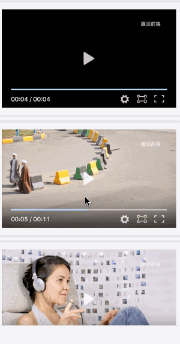
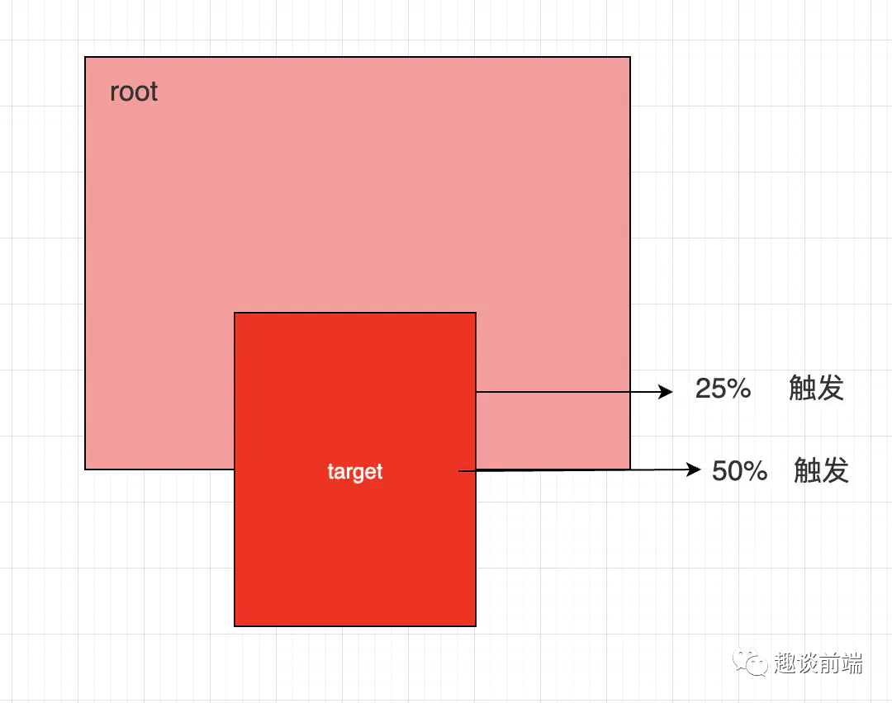
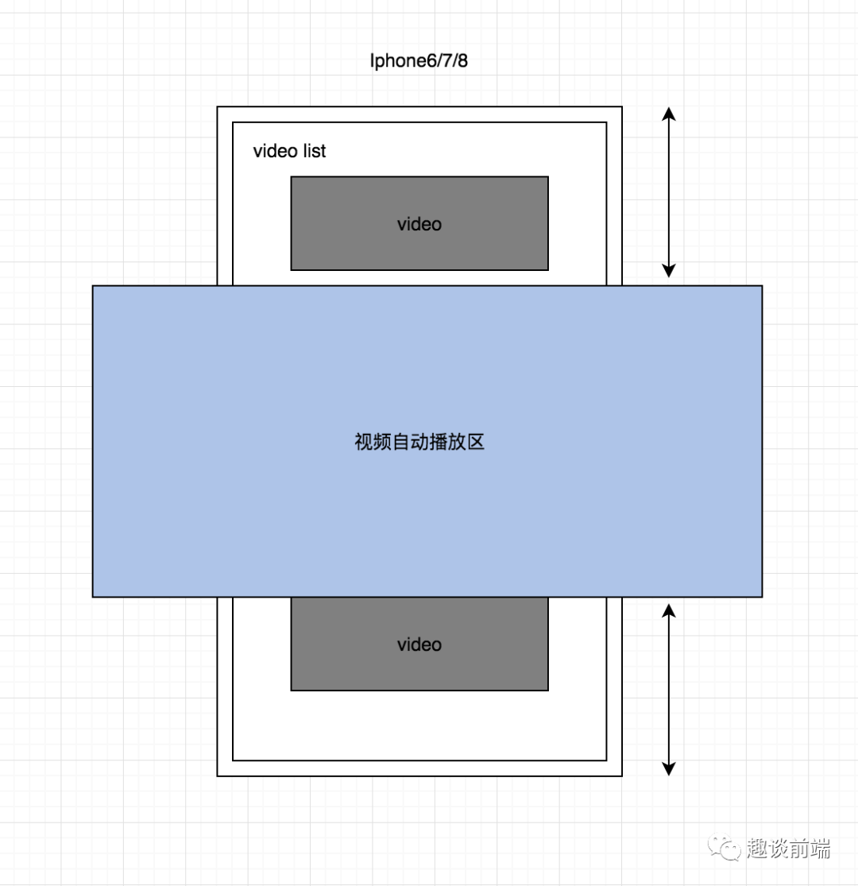
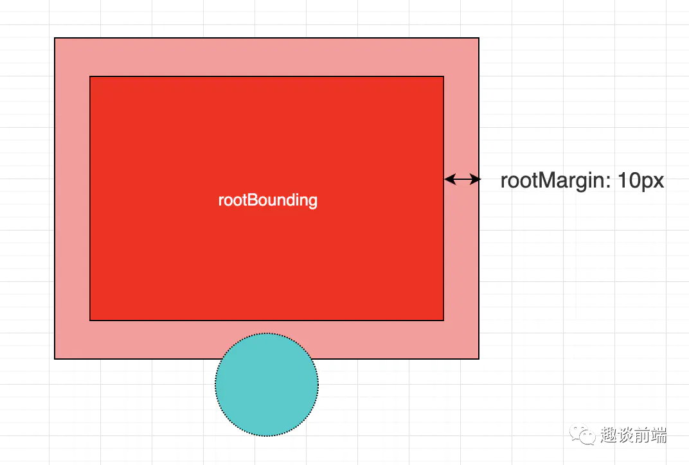
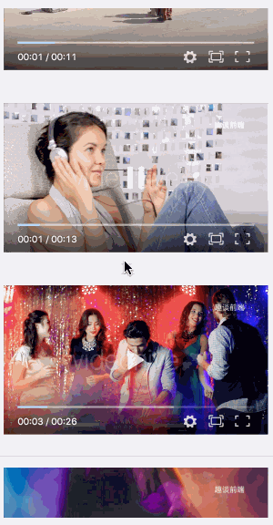

# 使用Intersection Observer API实现视频队列自动播放

文章中详细介绍了3种Observer（观察者）的用法，包括`位置监听`，`dom变化监听`以及`窗口变化监听`，它们有非常多的应用场景，所以很有必要研究明白。

这里有一个很常见的例子，平时喜欢看短视频的朋友可能会注意到，我们在浏览某视频头条时，滚动视频列表，当某一个视频滚动到手机的一定位置时（一般可以看成是屏幕中心），该视频会自动播放，当移出指定区域后视频会自动关闭并播放移入指定区域的下一个视频，如下：



第一思路就是监听滚动位置来判断某个视频元素是否到达指定区域内，但是这种方式需要处理的条件很多，比如边界条件判断，滚动方向判断等，而且频繁触发还会出现性能问题。

之前深入研究过Intersection Observer API，发现可以使用它提供的API，很方便的监听到元素在指定根元素下的位置变化，并做一些自定义操作：



接下来将直接利用Intersection Observer提供的api来实现视频在滚动的过程中自动播放的功能，如果对该api不太熟悉的朋友可以移步

[几个非常有意思的javascript知识点总结](http://mp.weixin.qq.com/s?__biz=MzU2Mzk1NzkwOA==&mid=2247484413&idx=1&sn=c86b6ec393766d6344baf6fa1ebf5a41&chksm=fc531a06cb2493105e01ca6149d5e548f4ea83f1747c2c6c96bff4e34015e1d298c04521ce0a&scene=21#wechat_redirect)

视频播放插件将使用比较流行的Dplayer,它可以很方便的操作视频的展现并实现很好的排他性播放控制，并且支持弹幕。

## 正文

根据以上的介绍我们大致了解了具体的需求，接下来我们就来基于Intersection Observer API实现一下它。思路大致如下图所示：



具体思路就是我们可以把Intersection Observer的根元素的rootMargin（即根元素的外边距）设置为如上图蓝色所示区域，然后当视频完全进入该区域内后（也就是thresholds阈值为1时），触发当前视频的播放即可。因为我们使用的是Dplayer，所以我们只要将其配置属性中的mutex属性设置为true（为true时会阻止多个播放器同时播放，当前播放器播放时暂停其他播放器）。有关设置rootMargin的知识，可以参考下图介绍：



rootMargin接收格式如下："10px 0px 10px 0px",从左到右数字依次代表top(上) right(右) bottom(下) left(左)边距，当然我们单位也可以使用百分比(%),为正值时代表扩大更元素的边距范围，负值代表缩小根元素的边距范围，这里我们应该缩小范围，所以rootMargin我们可以这么设置"-180px 0px -180px 0px",这样上下的边距就会缩小，当然大家也可以根据需求设置不同的值。

有了以上思路之后我们就可以实现上文动图所展示的效果了。笔者将采用react来实现，在实现之前我们先准备几个视频素材，然后实现列表基本框架：

```js
import React, { useEffect, useState } from 'react'
import VideoItem from 'components/VideoItem'
import styles from './videoList.less'

const data = [
    // 视频列表
]

const VideoList = (props) => {
  useEffect(() => {
    let observerVideo = new IntersectionObserver(
        (entries, observer) => {
            entries.forEach(entry => {
                // 当移入指定区域内后，播放视频
                if(entry.intersectionRatio === 1) {
                    // 一些操作
                    return
                }
                // 停止监听
                // observer.unobserve(entry.target);
              });
            },
            {
              root: document.getElementById('scrollView'),
              rootMargin: '-180px 0px -180px 0px',
              threshold: 1
            }
        );
        document.querySelectorAll('.video-item').forEach(video => { observerVideo.observe(video) });
  }, [])
  return <div className={styles.videoWrap}>
    <div className={styles.list} id="scrollView">
        {
            data.map(item => {
                return <VideoItem src={item} groupName="video-item" key={item} />
            })
        }
    </div>
  </div>
}

export default VideoList
```

以上代码中VideoItem组件我们后面会介绍，现在有个问题是我们已经监听到了需要自动播放的视频元素，但是我们如何通知VideoItem组件让其播放呢？这里笔者实现思路是给VideoItem添加一个自定义属性，该属性的值就是当前video的src，我们在监听到某个视频元素需要播放时，我们可以获取到之前设置的自定义属性，然后作为prop传给VideoItem，当VideoItem组件监听到该prop变化时，并且等于自身的src，此时则触发视频播放。代码如下：

```js
// VideoItem.js
import React, { useRef, useEffect } from 'react';
import DPlayer from 'dplayer';

export default (props) => {
    let videoRef = useRef(null)
    let dpRef = useRef(null)
    let { src, groupName, curPlaySrc } = props
    useEffect(() => {
        dpRef.current = new DPlayer({
            container: videoRef.current,
            screenshot: true,
            video: {
                url: src,
                thumbnails: 'logo.png'
            },
            logo: 'logo.png'
        });
    }, [])

    useEffect(() => {
        // 当当当前应该播放的视频url等于当前视频组件的src时，播放视频
        if(curPlaySrc === src) {
            dpRef.current.play()
        }
    }, [curPlaySrc])
    return <div data-src={src}>
        <div ref={videoRef}></div>
    </div>
}
```

此时视频列表页代码如下：

```js
// ...
function VideoList(props) {
  const [curPlaySrc, setCurPlaySrc] = useState('')
  useEffect(() => {
    let observerVideo = new IntersectionObserver(
        (entries, observer) => {
            entries.forEach(entry => {
                // 当移入指定区域内后，播放视频
                if(entry.intersectionRatio === 1) {
                    // 设置当前因该播放的视频url
                    setCurPlaySrc(entry.target.dataset.src)
                    return
                }
              });
            },
            {
              root: document.getElementById('scrollView'),
              rootMargin: '-180px 0px -180px 0px',
              threshold: 1
            }
        );
        document.querySelectorAll('.video-item').forEach(video => { observerVideo.observe(video) });
  }, [])
  return <div className={styles.videoWrap}>
    <div className={styles.list} id="scrollView">
        {
            data.map(item => {
                return <VideoItem src={item} groupName="video-item" key={item} curPlaySrc={curPlaySrc} />
            })
        }
    </div>
  </div>
}
```

以上步骤即完成了基于指定区域自动播放视频的功能，效果如下：


